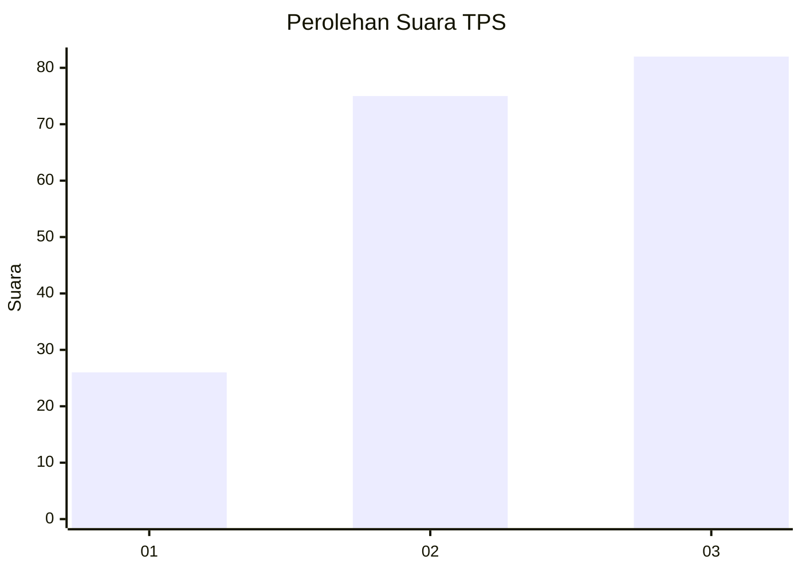
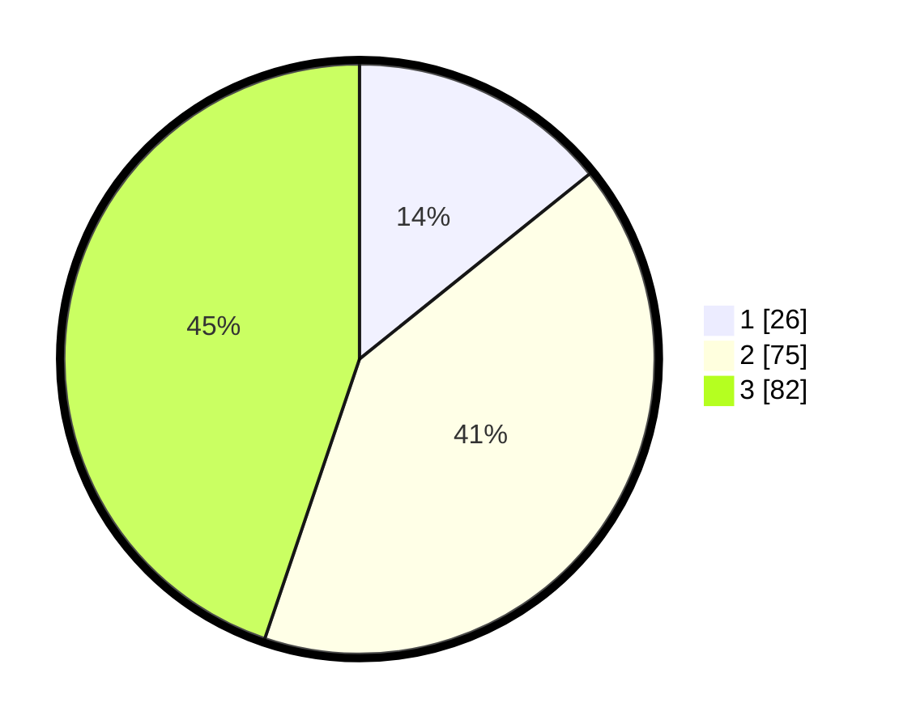

# Hasil

## Grafik

## Tabel

| No. | Nama Paslon    | Suara | Suara (raw) | Persentase |
|:--- |:-------------- | -----:| -----------:| ----------:|
| 1   | ANIES MUHAIMIN | 26    | [26][p-1]   | 14,21      |
| 2   | PRABOWO GIBRAN | 75    | [75][p-2]   | 40,98      |
| 3   | GANJAR MAHFUD  | 82    | [82][p-3]   | 44,81      |

[p-1]: https://github.com/gigit-pemilu/pemilu-2024-33-jawa-tengah/blob/main/pilpres/hitung-suara/sub/33-jawa-tengah/sub/02-banyumas/sub/16-pekuncen/sub/2004-cikawung/sub/004-tps/sub/paslon-1.txt
[p-2]: https://github.com/gigit-pemilu/pemilu-2024-33-jawa-tengah/blob/main/pilpres/hitung-suara/sub/33-jawa-tengah/sub/02-banyumas/sub/16-pekuncen/sub/2004-cikawung/sub/004-tps/sub/paslon-2.txt
[p-3]: https://github.com/gigit-pemilu/pemilu-2024-33-jawa-tengah/blob/main/pilpres/hitung-suara/sub/33-jawa-tengah/sub/02-banyumas/sub/16-pekuncen/sub/2004-cikawung/sub/004-tps/sub/paslon-3.txt

## Foto C Plano

https://sirekap-obj-formc.kpu.go.id/aeab/pemilu/ppwp/33/02/16/20/04/3302162004004-20240215-004305--50c14861-198e-4d40-9648-f19a2b20b1dc.jpg

https://sirekap-obj-formc.kpu.go.id/aeab/pemilu/ppwp/33/02/16/20/04/3302162004004-20240215-004502--ac97c179-d212-4f92-98a8-5d9ea66ed50a.jpg

https://sirekap-obj-formc.kpu.go.id/aeab/pemilu/ppwp/33/02/16/20/04/3302162004004-20240215-004530--516aa385-b79e-4e42-a572-f522b5698e2a.jpg

## Metadata

| Key        | Value               |
| ---------- | ------------------- |
| Time Stamp | 2024-02-16 22:01:00 |

