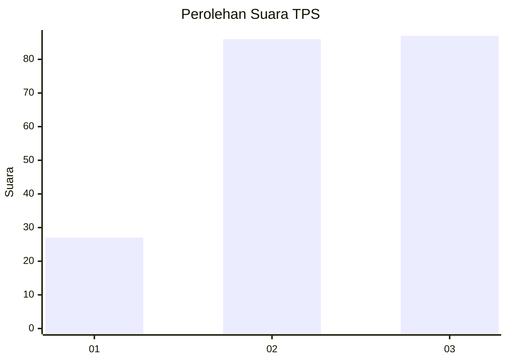
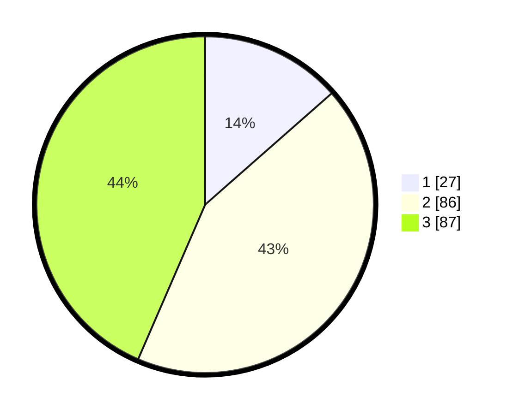

# Hasil

## Grafik

## Tabel

| No. | Nama Paslon    | Suara | Suara (raw) | Persentase |
|:--- |:-------------- | -----:| -----------:| ----------:|
| 1   | ANIES MUHAIMIN | 27    | [27][p-1]   | 13,50      |
| 2   | PRABOWO GIBRAN | 86    | [86][p-2]   | 43,00      |
| 3   | GANJAR MAHFUD  | 87    | [87][p-3]   | 43,50      |

[p-1]: https://github.com/gigit-pemilu/pemilu-2024/blob/main/pilpres/hitung-suara/sub/33-jawa-tengah/sub/02-banyumas/sub/16-pekuncen/sub/2004-cikawung/sub/009-tps/sub/paslon-1.txt
[p-2]: https://github.com/gigit-pemilu/pemilu-2024/blob/main/pilpres/hitung-suara/sub/33-jawa-tengah/sub/02-banyumas/sub/16-pekuncen/sub/2004-cikawung/sub/009-tps/sub/paslon-2.txt
[p-3]: https://github.com/gigit-pemilu/pemilu-2024/blob/main/pilpres/hitung-suara/sub/33-jawa-tengah/sub/02-banyumas/sub/16-pekuncen/sub/2004-cikawung/sub/009-tps/sub/paslon-3.txt

## Foto C Plano

https://sirekap-obj-formc.kpu.go.id/e458/pemilu/ppwp/33/02/16/20/04/3302162004009-20240215-015249--61460764-2be5-48a3-baf5-ee44f1b58d17.jpg

https://sirekap-obj-formc.kpu.go.id/e458/pemilu/ppwp/33/02/16/20/04/3302162004009-20240215-015410--78ce674d-51cf-4875-b553-bc1bb0975451.jpg

https://sirekap-obj-formc.kpu.go.id/e458/pemilu/ppwp/33/02/16/20/04/3302162004009-20240215-015458--f6505fc9-b9f5-4667-b6c2-97f47fd259e8.jpg

## Metadata

| Key        | Value               |
| ---------- | ------------------- |
| Time Stamp | 2024-02-16 22:01:00 |

