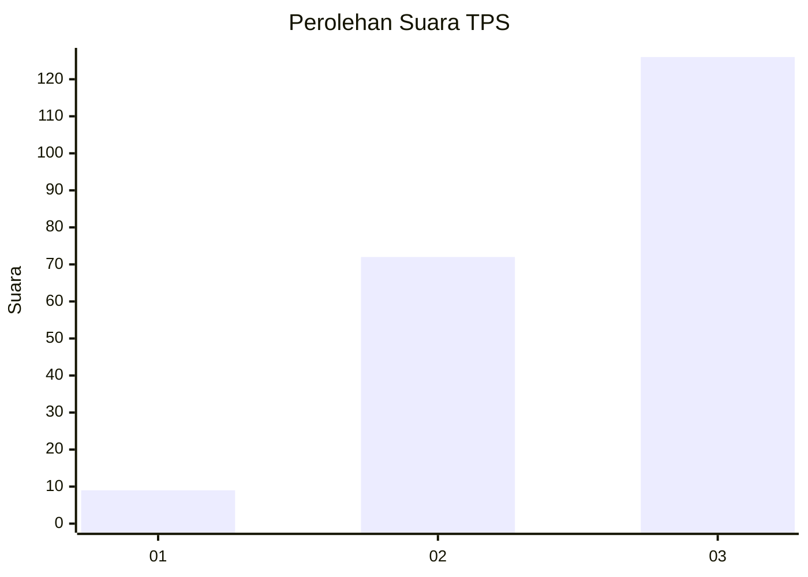
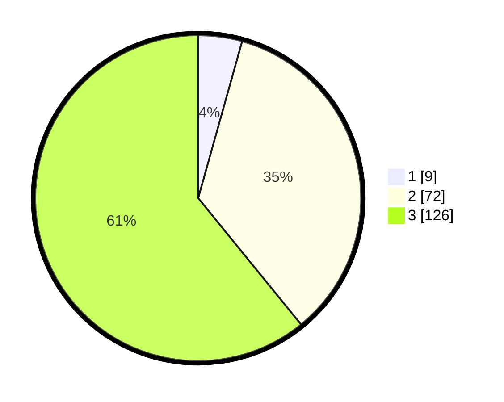

# Hasil

## Grafik

## Tabel

| No. | Nama Paslon    | Suara | Suara (raw) | Persentase |
|:--- |:-------------- | -----:| -----------:| ----------:|
| 1   | ANIES MUHAIMIN | 9     | [9][p-1]    | 4,35       |
| 2   | PRABOWO GIBRAN | 72    | [72][p-2]   | 34,78      |
| 3   | GANJAR MAHFUD  | 126   | [126][p-3]  | 60,87      |

[p-1]: https://github.com/gigit-pemilu/pemilu-2024/blob/main/pilpres/hitung-suara/sub/33-jawa-tengah/sub/02-banyumas/sub/16-pekuncen/sub/2004-cikawung/sub/012-tps/sub/paslon-1.txt
[p-2]: https://github.com/gigit-pemilu/pemilu-2024/blob/main/pilpres/hitung-suara/sub/33-jawa-tengah/sub/02-banyumas/sub/16-pekuncen/sub/2004-cikawung/sub/012-tps/sub/paslon-2.txt
[p-3]: https://github.com/gigit-pemilu/pemilu-2024/blob/main/pilpres/hitung-suara/sub/33-jawa-tengah/sub/02-banyumas/sub/16-pekuncen/sub/2004-cikawung/sub/012-tps/sub/paslon-3.txt

## Foto C Plano

https://sirekap-obj-formc.kpu.go.id/7077/pemilu/ppwp/33/02/16/20/04/3302162004012-20240215-003642--2569409c-6ca3-4e2b-9ade-4318aaa98a48.jpg

https://sirekap-obj-formc.kpu.go.id/7077/pemilu/ppwp/33/02/16/20/04/3302162004012-20240215-003742--a2aefc27-cdf6-4b4f-9719-51c5d61a6c3b.jpg

https://sirekap-obj-formc.kpu.go.id/7077/pemilu/ppwp/33/02/16/20/04/3302162004012-20240215-003854--7fd7fea2-a80e-45db-8e77-36d81d3101d6.jpg

## Metadata

| Key        | Value               |
| ---------- | ------------------- |
| Time Stamp | 2024-02-15 09:00:24 |

