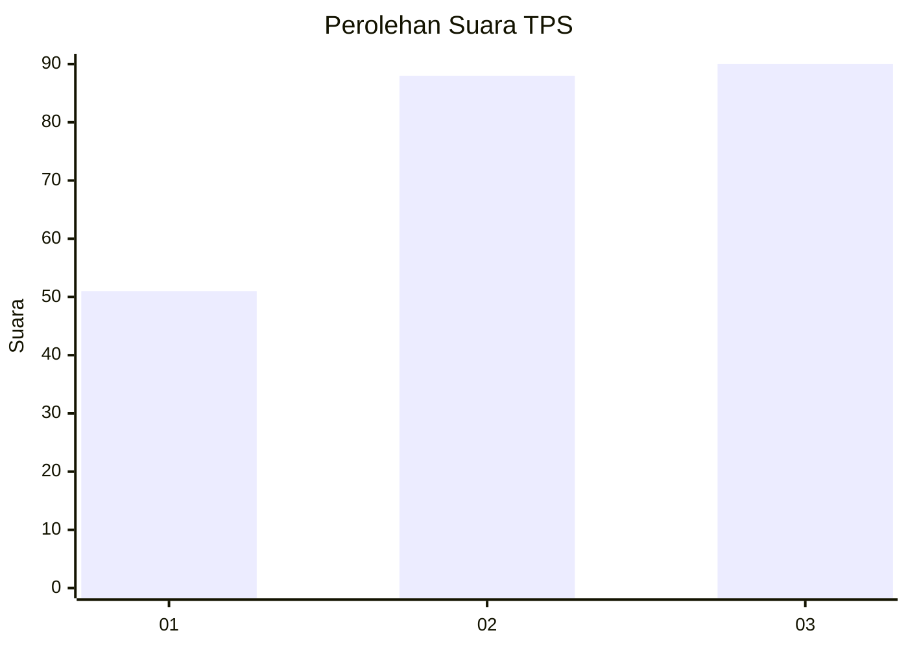
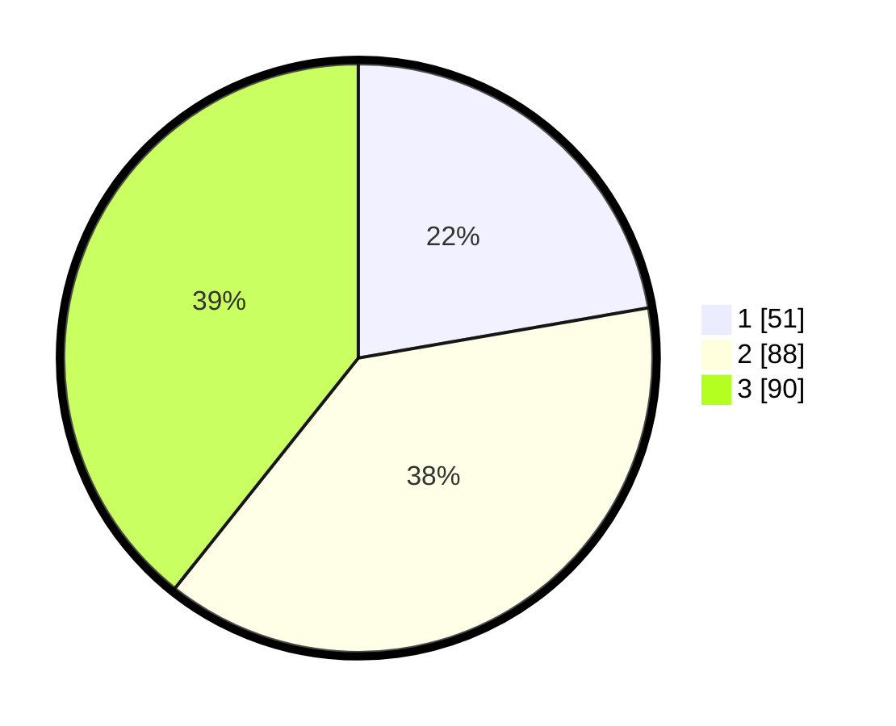

# Hasil

## Grafik

## Tabel

| No. | Nama Paslon    | Suara | Suara (raw) | Persentase |
|:--- |:-------------- | -----:| -----------:| ----------:|
| 1   | ANIES MUHAIMIN | 51    | [51][p-1]   | 22,27      |
| 2   | PRABOWO GIBRAN | 88    | [88][p-2]   | 38,43      |
| 3   | GANJAR MAHFUD  | 90    | [90][p-3]   | 39,30      |

[p-1]: https://github.com/gigit-pemilu/pemilu-2024-33-jawa-tengah/blob/main/pilpres/hitung-suara/sub/33-jawa-tengah/sub/02-banyumas/sub/16-pekuncen/sub/2006-petahunan/sub/008-tps/sub/paslon-1.txt
[p-2]: https://github.com/gigit-pemilu/pemilu-2024-33-jawa-tengah/blob/main/pilpres/hitung-suara/sub/33-jawa-tengah/sub/02-banyumas/sub/16-pekuncen/sub/2006-petahunan/sub/008-tps/sub/paslon-2.txt
[p-3]: https://github.com/gigit-pemilu/pemilu-2024-33-jawa-tengah/blob/main/pilpres/hitung-suara/sub/33-jawa-tengah/sub/02-banyumas/sub/16-pekuncen/sub/2006-petahunan/sub/008-tps/sub/paslon-3.txt

## Foto C Plano

https://sirekap-obj-formc.kpu.go.id/9397/pemilu/ppwp/33/02/16/20/06/3302162006008-20240215-023030--df09c920-cdf0-4174-8d0b-9b6738e46849.jpg

https://sirekap-obj-formc.kpu.go.id/9397/pemilu/ppwp/33/02/16/20/06/3302162006008-20240214-230413--82023ad8-f672-4646-8e60-9deea76af967.jpg

https://sirekap-obj-formc.kpu.go.id/9397/pemilu/ppwp/33/02/16/20/06/3302162006008-20240214-222108--db7f933d-ec27-47f2-80f8-08dfa989bc75.jpg

## Metadata

| Key        | Value               |
| ---------- | ------------------- |
| Time Stamp | 2024-02-16 17:00:00 |

