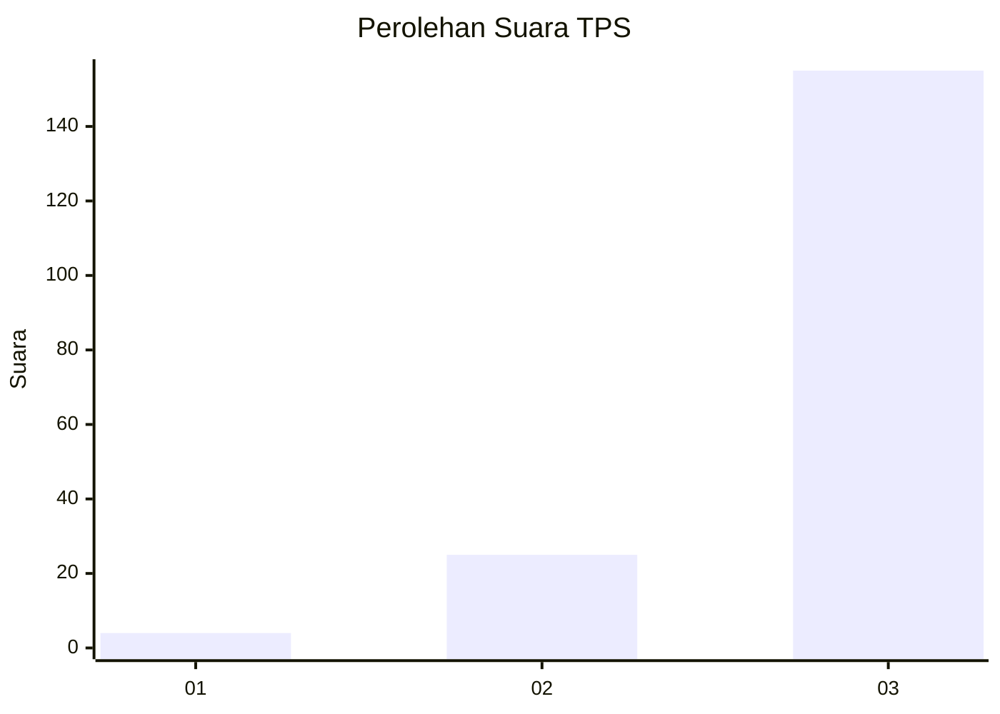
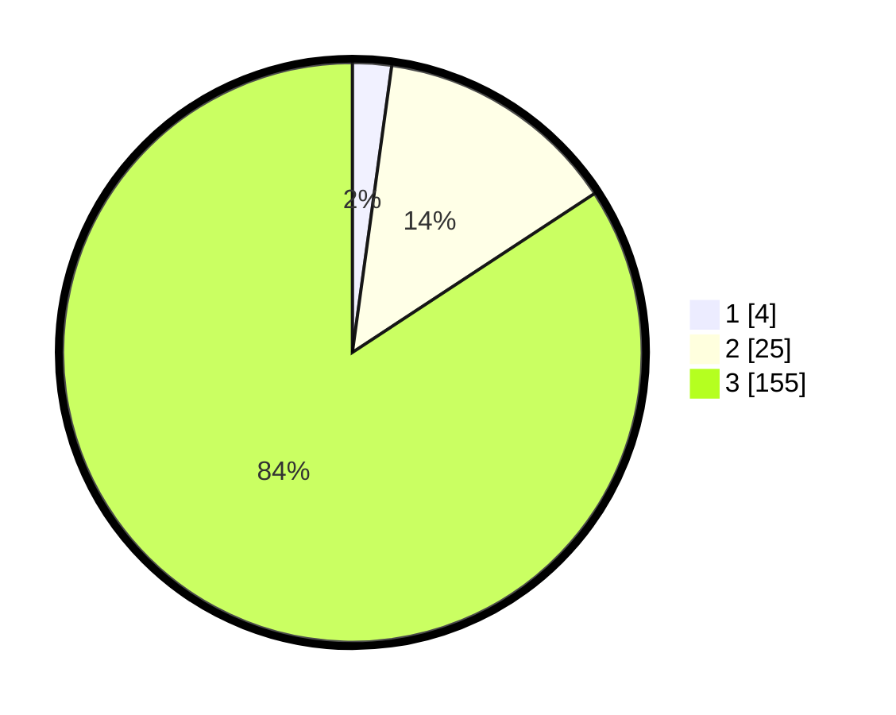

# Hasil

## Grafik

## Tabel

| No. | Nama Paslon    | Suara | Suara (raw) | Persentase |
|:--- |:-------------- | -----:| -----------:| ----------:|
| 1   | ANIES MUHAIMIN | 4     | [4][p-1]    | 2,17       |
| 2   | PRABOWO GIBRAN | 25    | [25][p-2]   | 13,59      |
| 3   | GANJAR MAHFUD  | 155   | [155][p-3]  | 84,24      |

[p-1]: https://github.com/gigit-pemilu/pemilu-2024/blob/main/pilpres/hitung-suara/sub/33-jawa-tengah/sub/02-banyumas/sub/16-pekuncen/sub/2006-petahunan/sub/011-tps/sub/paslon-1.txt
[p-2]: https://github.com/gigit-pemilu/pemilu-2024/blob/main/pilpres/hitung-suara/sub/33-jawa-tengah/sub/02-banyumas/sub/16-pekuncen/sub/2006-petahunan/sub/011-tps/sub/paslon-2.txt
[p-3]: https://github.com/gigit-pemilu/pemilu-2024/blob/main/pilpres/hitung-suara/sub/33-jawa-tengah/sub/02-banyumas/sub/16-pekuncen/sub/2006-petahunan/sub/011-tps/sub/paslon-3.txt

## Foto C Plano

https://sirekap-obj-formc.kpu.go.id/50ec/pemilu/ppwp/33/02/16/20/06/3302162006011-20240215-033709--b8099630-6225-4108-92a7-69c39bf2533c.jpg

https://sirekap-obj-formc.kpu.go.id/50ec/pemilu/ppwp/33/02/16/20/06/3302162006011-20240215-033912--323940ef-dd48-48a0-a628-5ea0a02095fe.jpg

https://sirekap-obj-formc.kpu.go.id/50ec/pemilu/ppwp/33/02/16/20/06/3302162006011-20240215-034310--e5740da8-d7c9-4fbc-934d-21acdf06535d.jpg

## Metadata

| Key        | Value               |
| ---------- | ------------------- |
| Time Stamp | 2024-02-16 21:01:00 |

