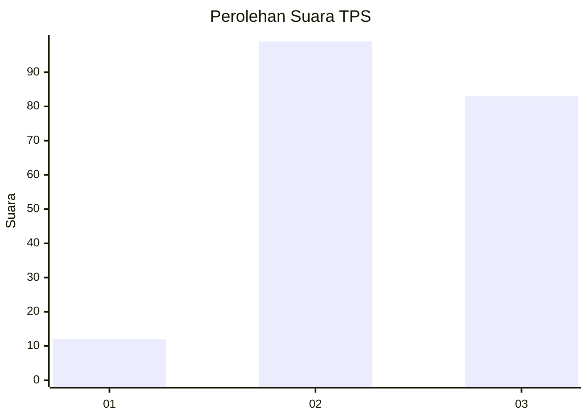
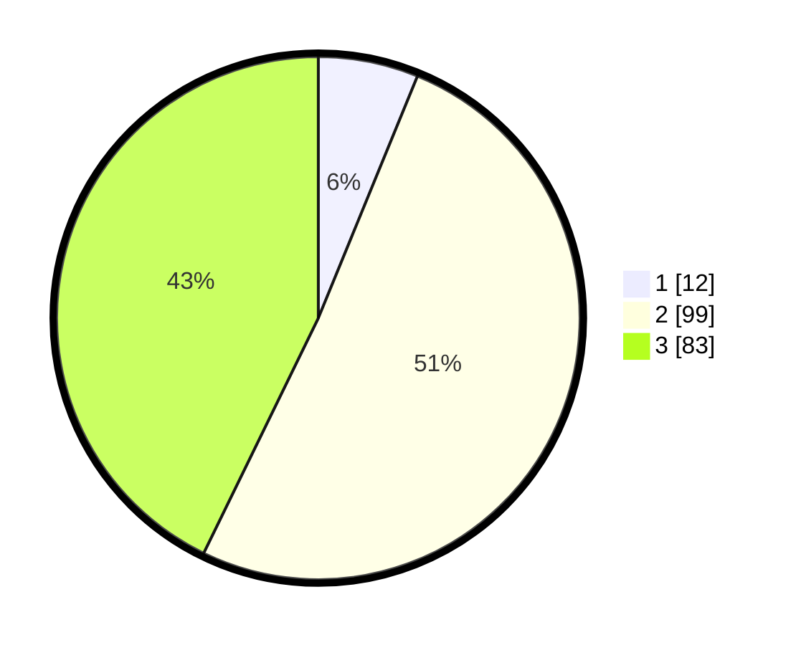

# Hasil

## Grafik

## Tabel

| No. | Nama Paslon    | Suara | Suara (raw) | Persentase |
|:--- |:-------------- | -----:| -----------:| ----------:|
| 1   | ANIES MUHAIMIN | 12    | [12][p-1]   | 6,19       |
| 2   | PRABOWO GIBRAN | 99    | [99][p-2]   | 51,03      |
| 3   | GANJAR MAHFUD  | 83    | [83][p-3]   | 42,78      |

[p-1]: https://github.com/gigit-pemilu/pemilu-2024/blob/main/pilpres/hitung-suara/sub/33-jawa-tengah/sub/02-banyumas/sub/16-pekuncen/sub/2007-semedo/sub/004-tps/sub/paslon-1.txt
[p-2]: https://github.com/gigit-pemilu/pemilu-2024/blob/main/pilpres/hitung-suara/sub/33-jawa-tengah/sub/02-banyumas/sub/16-pekuncen/sub/2007-semedo/sub/004-tps/sub/paslon-2.txt
[p-3]: https://github.com/gigit-pemilu/pemilu-2024/blob/main/pilpres/hitung-suara/sub/33-jawa-tengah/sub/02-banyumas/sub/16-pekuncen/sub/2007-semedo/sub/004-tps/sub/paslon-3.txt

## Foto C Plano

https://sirekap-obj-formc.kpu.go.id/5812/pemilu/ppwp/33/02/16/20/07/3302162007004-20240214-141438--7b6aff2a-f60d-4e67-9605-190e66f551c4.jpg

https://sirekap-obj-formc.kpu.go.id/5812/pemilu/ppwp/33/02/16/20/07/3302162007004-20240214-141709--0399f9cd-0e0d-4835-a7c7-7f01c3661940.jpg

https://sirekap-obj-formc.kpu.go.id/5812/pemilu/ppwp/33/02/16/20/07/3302162007004-20240214-141827--cc4a5b87-92e1-4c08-8711-8a83eb013840.jpg

## Metadata

| Key        | Value               |
| ---------- | ------------------- |
| Time Stamp | 2024-02-16 22:01:00 |

