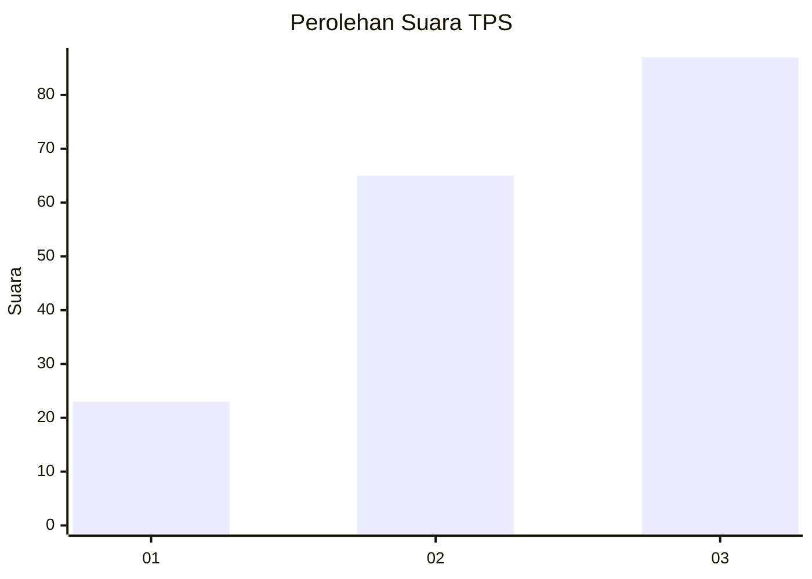
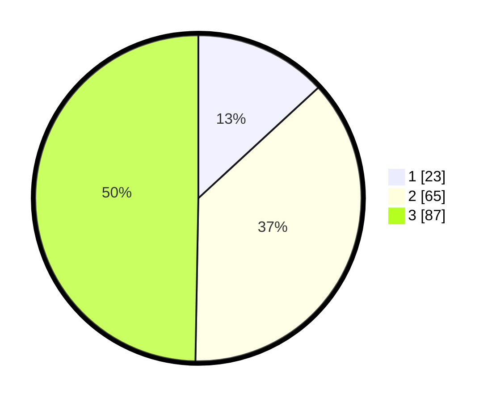

# Hasil

## Grafik

## Tabel

| No. | Nama Paslon    | Suara | Suara (raw) | Persentase |
|:--- |:-------------- | -----:| -----------:| ----------:|
| 1   | ANIES MUHAIMIN | 23    | [23][p-1]   | 13,14      |
| 2   | PRABOWO GIBRAN | 65    | [65][p-2]   | 37,14      |
| 3   | GANJAR MAHFUD  | 87    | [87][p-3]   | 49,71      |

[p-1]: https://github.com/gigit-pemilu/pemilu-2024/blob/main/pilpres/hitung-suara/sub/33-jawa-tengah/sub/02-banyumas/sub/16-pekuncen/sub/2008-banjaranyar/sub/008-tps/sub/paslon-1.txt
[p-2]: https://github.com/gigit-pemilu/pemilu-2024/blob/main/pilpres/hitung-suara/sub/33-jawa-tengah/sub/02-banyumas/sub/16-pekuncen/sub/2008-banjaranyar/sub/008-tps/sub/paslon-2.txt
[p-3]: https://github.com/gigit-pemilu/pemilu-2024/blob/main/pilpres/hitung-suara/sub/33-jawa-tengah/sub/02-banyumas/sub/16-pekuncen/sub/2008-banjaranyar/sub/008-tps/sub/paslon-3.txt

## Foto C Plano

https://sirekap-obj-formc.kpu.go.id/733b/pemilu/ppwp/33/02/16/20/08/3302162008008-20240214-224433--b5122881-e30a-4aae-8a97-c7bacd128e30.jpg

https://sirekap-obj-formc.kpu.go.id/733b/pemilu/ppwp/33/02/16/20/08/3302162008008-20240214-224529--99073efd-e101-41f0-a3ed-b6dc1668591e.jpg

https://sirekap-obj-formc.kpu.go.id/733b/pemilu/ppwp/33/02/16/20/08/3302162008008-20240214-224648--7726a3ed-2434-4577-865c-8403d27a6367.jpg

## Metadata

| Key        | Value               |
| ---------- | ------------------- |
| Time Stamp | 2024-02-16 22:01:00 |

