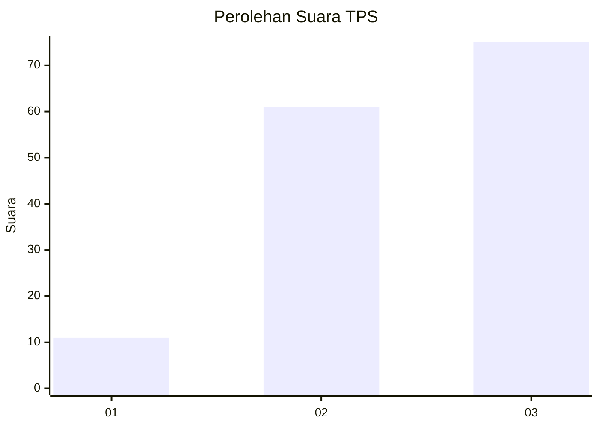
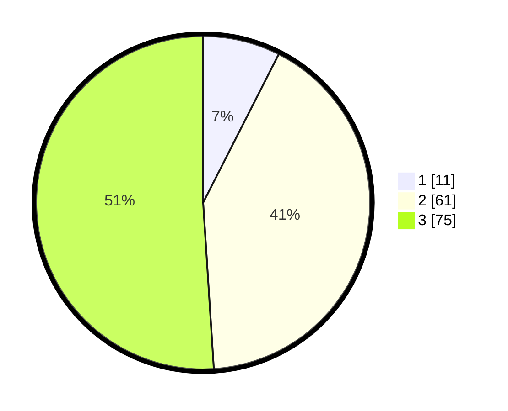

# Hasil

## Grafik

## Tabel

| No. | Nama Paslon    | Suara | Suara (raw) | Persentase |
|:--- |:-------------- | -----:| -----------:| ----------:|
| 1   | ANIES MUHAIMIN | 11    | [11][p-1]   | 7,48       |
| 2   | PRABOWO GIBRAN | 61    | [61][p-2]   | 41,50      |
| 3   | GANJAR MAHFUD  | 75    | [75][p-3]   | 51,02      |

[p-1]: https://github.com/gigit-pemilu/pemilu-2024/blob/main/pilpres/hitung-suara/sub/33-jawa-tengah/sub/02-banyumas/sub/16-pekuncen/sub/2009-pasiraman-lor/sub/003-tps/sub/paslon-1.txt
[p-2]: https://github.com/gigit-pemilu/pemilu-2024/blob/main/pilpres/hitung-suara/sub/33-jawa-tengah/sub/02-banyumas/sub/16-pekuncen/sub/2009-pasiraman-lor/sub/003-tps/sub/paslon-2.txt
[p-3]: https://github.com/gigit-pemilu/pemilu-2024/blob/main/pilpres/hitung-suara/sub/33-jawa-tengah/sub/02-banyumas/sub/16-pekuncen/sub/2009-pasiraman-lor/sub/003-tps/sub/paslon-3.txt

## Foto C Plano

https://sirekap-obj-formc.kpu.go.id/81f9/pemilu/ppwp/33/02/16/20/09/3302162009003-20240214-225110--cc64fa60-0852-4202-85bc-229e223212c1.jpg

https://sirekap-obj-formc.kpu.go.id/81f9/pemilu/ppwp/33/02/16/20/09/3302162009003-20240215-015902--a489ba47-4b2a-4c4d-885e-aaff73be546d.jpg

https://sirekap-obj-formc.kpu.go.id/81f9/pemilu/ppwp/33/02/16/20/09/3302162009003-20240214-225752--38ff99db-bbb6-45ec-ac23-0353471ae0d4.jpg

## Metadata

| Key        | Value               |
| ---------- | ------------------- |
| Time Stamp | 2024-02-16 21:01:00 |

