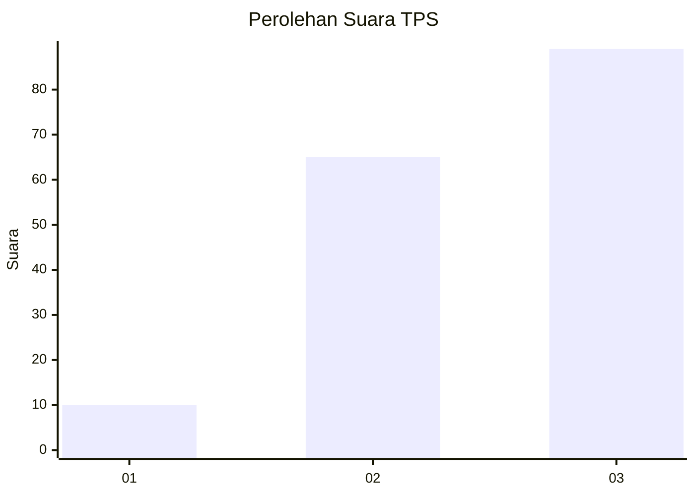
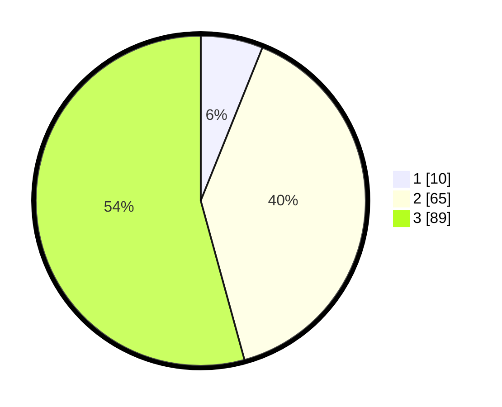

# Hasil

## Grafik

## Tabel

| No. | Nama Paslon    | Suara | Suara (raw) | Persentase |
|:--- |:-------------- | -----:| -----------:| ----------:|
| 1   | ANIES MUHAIMIN | 10    | [10][p-1]   | 6,10       |
| 2   | PRABOWO GIBRAN | 65    | [65][p-2]   | 39,63      |
| 3   | GANJAR MAHFUD  | 89    | [89][p-3]   | 54,27      |

[p-1]: https://github.com/gigit-pemilu/pemilu-2024/blob/main/pilpres/hitung-suara/sub/33-jawa-tengah/sub/02-banyumas/sub/16-pekuncen/sub/2012-glempang/sub/003-tps/sub/paslon-1.txt
[p-2]: https://github.com/gigit-pemilu/pemilu-2024/blob/main/pilpres/hitung-suara/sub/33-jawa-tengah/sub/02-banyumas/sub/16-pekuncen/sub/2012-glempang/sub/003-tps/sub/paslon-2.txt
[p-3]: https://github.com/gigit-pemilu/pemilu-2024/blob/main/pilpres/hitung-suara/sub/33-jawa-tengah/sub/02-banyumas/sub/16-pekuncen/sub/2012-glempang/sub/003-tps/sub/paslon-3.txt

## Foto C Plano

https://sirekap-obj-formc.kpu.go.id/8a75/pemilu/ppwp/33/02/16/20/12/3302162012003-20240215-025840--05dd49c2-82d1-4c58-962a-92b10a16093d.jpg

https://sirekap-obj-formc.kpu.go.id/8a75/pemilu/ppwp/33/02/16/20/12/3302162012003-20240215-004704--503555ec-6be4-4cd0-8f60-58d94ca2e0bb.jpg

https://sirekap-obj-formc.kpu.go.id/8a75/pemilu/ppwp/33/02/16/20/12/3302162012003-20240215-004802--42de9faa-912c-4ac6-9aa1-f606b4347ac9.jpg

## Metadata

| Key        | Value               |
| ---------- | ------------------- |
| Time Stamp | 2024-02-16 21:01:00 |

