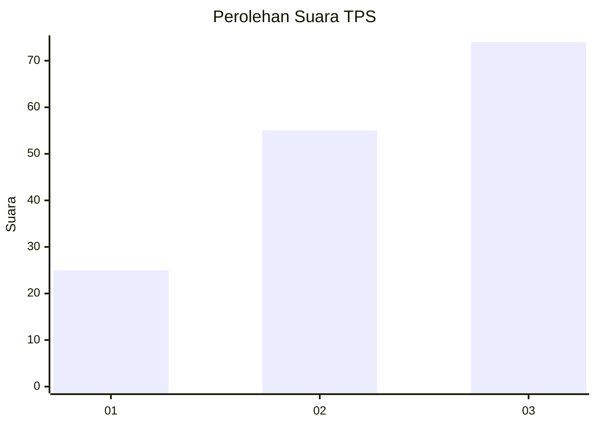
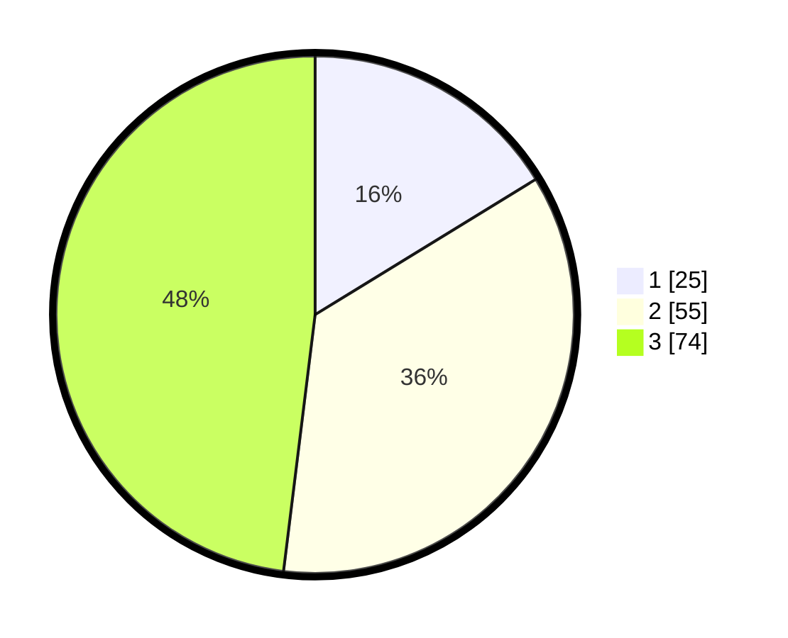

# Hasil

## Grafik

## Tabel

| No. | Nama Paslon    | Suara | Suara (raw) | Persentase |
|:--- |:-------------- | -----:| -----------:| ----------:|
| 1   | ANIES MUHAIMIN | 25    | [25][p-1]   | 16,23      |
| 2   | PRABOWO GIBRAN | 55    | [55][p-2]   | 35,71      |
| 3   | GANJAR MAHFUD  | 74    | [74][p-3]   | 48,05      |

[p-1]: https://github.com/gigit-pemilu/pemilu-2024-33-jawa-tengah/blob/main/pilpres/hitung-suara/sub/33-jawa-tengah/sub/02-banyumas/sub/16-pekuncen/sub/2012-glempang/sub/005-tps/sub/paslon-1.txt
[p-2]: https://github.com/gigit-pemilu/pemilu-2024-33-jawa-tengah/blob/main/pilpres/hitung-suara/sub/33-jawa-tengah/sub/02-banyumas/sub/16-pekuncen/sub/2012-glempang/sub/005-tps/sub/paslon-2.txt
[p-3]: https://github.com/gigit-pemilu/pemilu-2024-33-jawa-tengah/blob/main/pilpres/hitung-suara/sub/33-jawa-tengah/sub/02-banyumas/sub/16-pekuncen/sub/2012-glempang/sub/005-tps/sub/paslon-3.txt

## Foto C Plano

https://sirekap-obj-formc.kpu.go.id/388b/pemilu/ppwp/33/02/16/20/12/3302162012005-20240214-191801--69db5c51-2b27-444f-8339-4e6665110ccb.jpg

https://sirekap-obj-formc.kpu.go.id/388b/pemilu/ppwp/33/02/16/20/12/3302162012005-20240214-191846--ecabfb0c-52e4-4832-b177-a02360d666d5.jpg

https://sirekap-obj-formc.kpu.go.id/388b/pemilu/ppwp/33/02/16/20/12/3302162012005-20240214-191918--712c10c5-cb85-46d0-bfdf-6b5449e24622.jpg

## Metadata

| Key        | Value               |
| ---------- | ------------------- |
| Time Stamp | 2024-02-16 22:30:00 |

