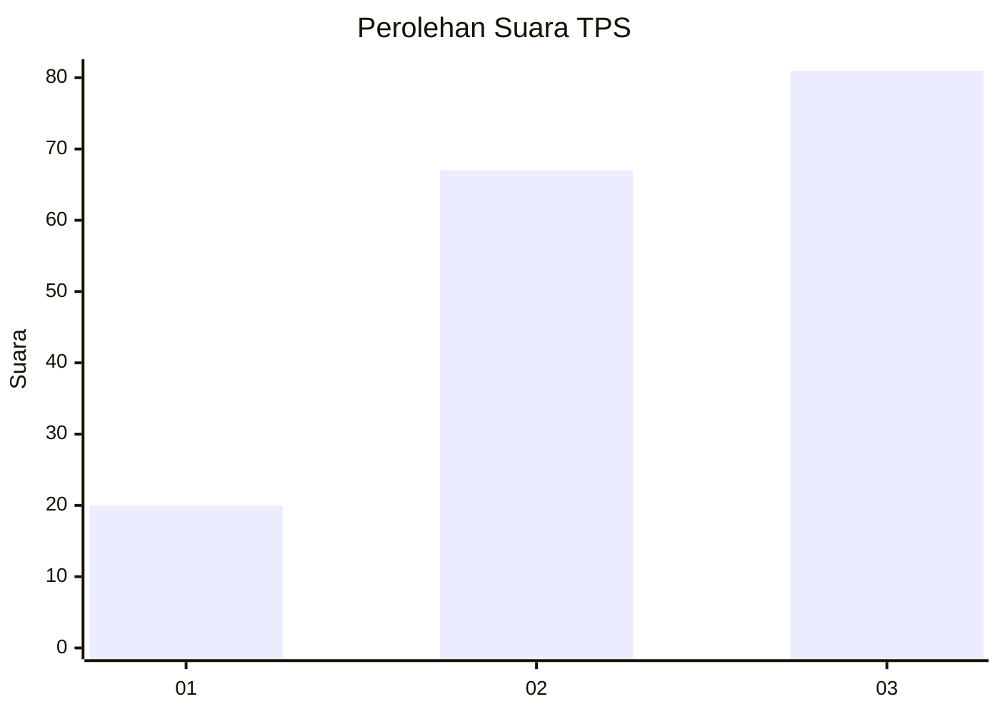
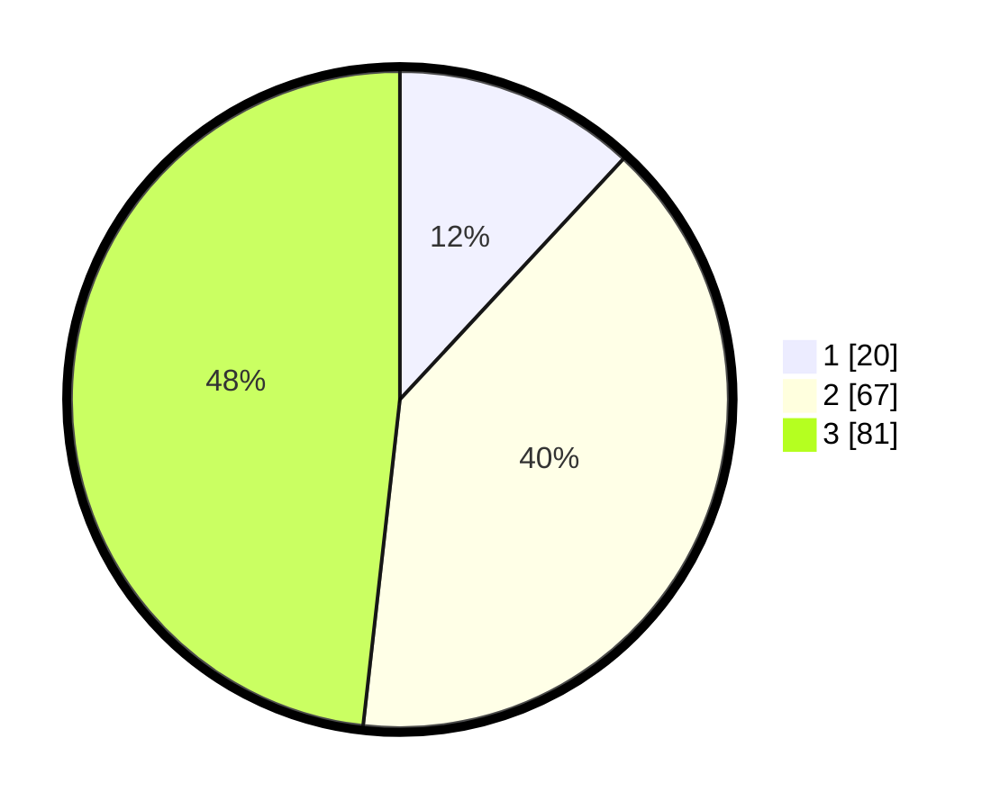

# Hasil

## Grafik

## Tabel

| No. | Nama Paslon    | Suara | Suara (raw) | Persentase |
|:--- |:-------------- | -----:| -----------:| ----------:|
| 1   | ANIES MUHAIMIN | 20    | [20][p-1]   | 11,90      |
| 2   | PRABOWO GIBRAN | 67    | [67][p-2]   | 39,88      |
| 3   | GANJAR MAHFUD  | 81    | [81][p-3]   | 48,21      |

[p-1]: https://github.com/gigit-pemilu/pemilu-2024/blob/main/pilpres/hitung-suara/sub/33-jawa-tengah/sub/02-banyumas/sub/16-pekuncen/sub/2012-glempang/sub/006-tps/sub/paslon-1.txt
[p-2]: https://github.com/gigit-pemilu/pemilu-2024/blob/main/pilpres/hitung-suara/sub/33-jawa-tengah/sub/02-banyumas/sub/16-pekuncen/sub/2012-glempang/sub/006-tps/sub/paslon-2.txt
[p-3]: https://github.com/gigit-pemilu/pemilu-2024/blob/main/pilpres/hitung-suara/sub/33-jawa-tengah/sub/02-banyumas/sub/16-pekuncen/sub/2012-glempang/sub/006-tps/sub/paslon-3.txt

## Foto C Plano

https://sirekap-obj-formc.kpu.go.id/c869/pemilu/ppwp/33/02/16/20/12/3302162012006-20240215-010224--6e83ab11-0fc3-482d-8382-2c9ade312836.jpg

https://sirekap-obj-formc.kpu.go.id/c869/pemilu/ppwp/33/02/16/20/12/3302162012006-20240215-010257--a3fa6be3-d5ee-4655-9f1f-6791d312b3cc.jpg

https://sirekap-obj-formc.kpu.go.id/c869/pemilu/ppwp/33/02/16/20/12/3302162012006-20240215-010334--36dae418-e061-4e1d-b839-d6257984e25d.jpg

## Metadata

| Key        | Value               |
| ---------- | ------------------- |
| Time Stamp | 2024-02-16 22:30:00 |

