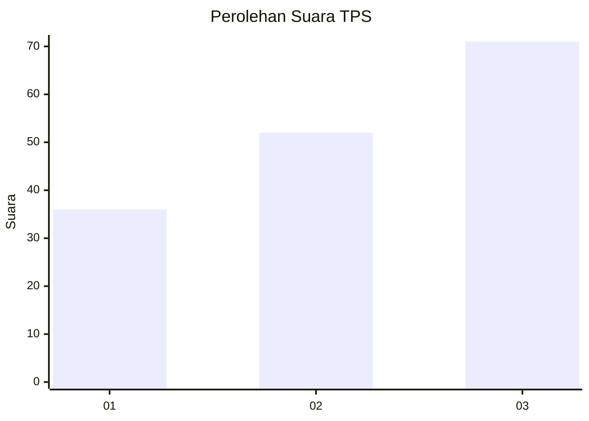
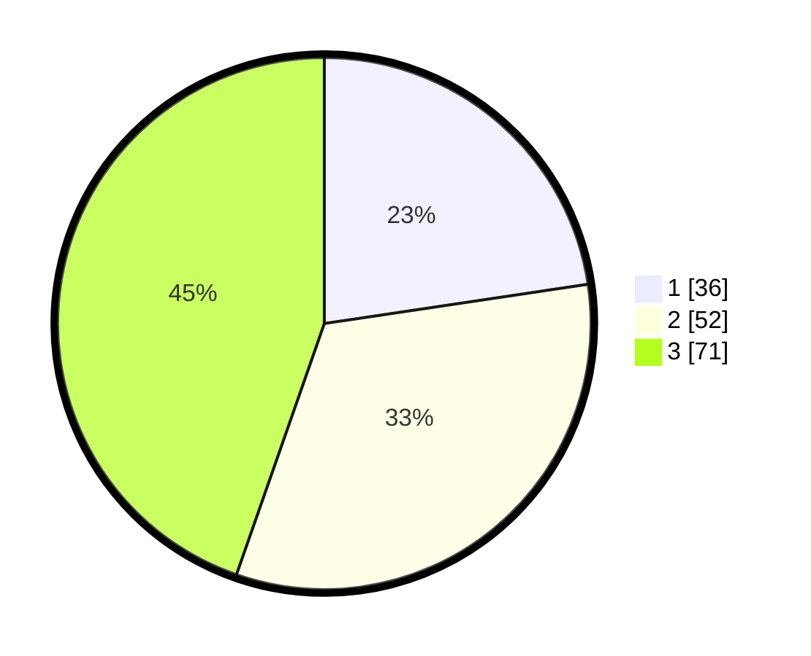

# Hasil

## Grafik

## Tabel

| No. | Nama Paslon    | Suara | Suara (raw) | Persentase |
|:--- |:-------------- | -----:| -----------:| ----------:|
| 1   | ANIES MUHAIMIN | 36    | [36][p-1]   | 22,64      |
| 2   | PRABOWO GIBRAN | 52    | [52][p-2]   | 32,70      |
| 3   | GANJAR MAHFUD  | 71    | [71][p-3]   | 44,65      |

[p-1]: https://github.com/gigit-pemilu/pemilu-2024/blob/main/pilpres/hitung-suara/sub/33-jawa-tengah/sub/02-banyumas/sub/16-pekuncen/sub/2013-pekuncen/sub/020-tps/sub/paslon-1.txt
[p-2]: https://github.com/gigit-pemilu/pemilu-2024/blob/main/pilpres/hitung-suara/sub/33-jawa-tengah/sub/02-banyumas/sub/16-pekuncen/sub/2013-pekuncen/sub/020-tps/sub/paslon-2.txt
[p-3]: https://github.com/gigit-pemilu/pemilu-2024/blob/main/pilpres/hitung-suara/sub/33-jawa-tengah/sub/02-banyumas/sub/16-pekuncen/sub/2013-pekuncen/sub/020-tps/sub/paslon-3.txt

## Foto C Plano

https://sirekap-obj-formc.kpu.go.id/01a8/pemilu/ppwp/33/02/16/20/13/3302162013020-20240214-220054--cafd5f5c-1735-41b9-a754-0eef2b84fac9.jpg

https://sirekap-obj-formc.kpu.go.id/01a8/pemilu/ppwp/33/02/16/20/13/3302162013020-20240214-220310--bd4b8e34-1af1-4dc1-8bbb-9515eb71174c.jpg

https://sirekap-obj-formc.kpu.go.id/01a8/pemilu/ppwp/33/02/16/20/13/3302162013020-20240214-220502--681d7103-31f3-4b34-8013-a00517771fd4.jpg

## Metadata

| Key        | Value               |
| ---------- | ------------------- |
| Time Stamp | 2024-02-16 21:01:00 |

