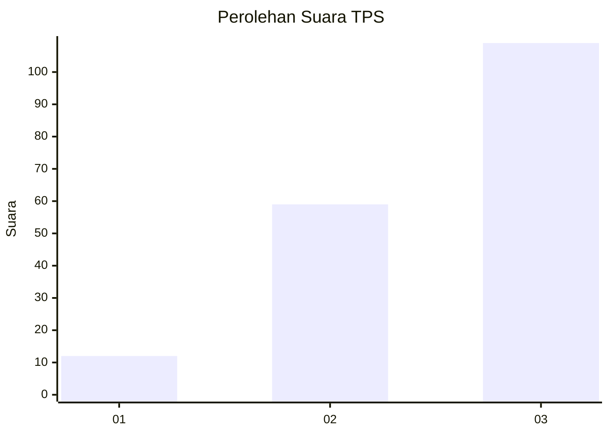
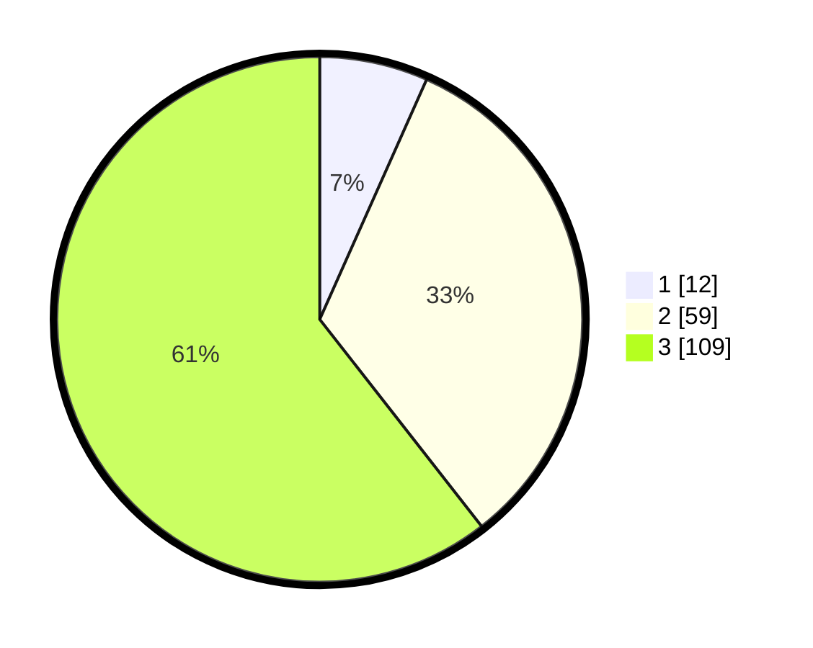

# Hasil

## Grafik

## Tabel

| No. | Nama Paslon    | Suara | Suara (raw) | Persentase |
|:--- |:-------------- | -----:| -----------:| ----------:|
| 1   | ANIES MUHAIMIN | 12    | [12][p-1]   | 6,67       |
| 2   | PRABOWO GIBRAN | 59    | [59][p-2]   | 32,78      |
| 3   | GANJAR MAHFUD  | 109   | [109][p-3]  | 60,56      |

[p-1]: https://github.com/gigit-pemilu/pemilu-2024-33-jawa-tengah/blob/main/pilpres/hitung-suara/sub/33-jawa-tengah/sub/02-banyumas/sub/16-pekuncen/sub/2013-pekuncen/sub/021-tps/sub/paslon-1.txt
[p-2]: https://github.com/gigit-pemilu/pemilu-2024-33-jawa-tengah/blob/main/pilpres/hitung-suara/sub/33-jawa-tengah/sub/02-banyumas/sub/16-pekuncen/sub/2013-pekuncen/sub/021-tps/sub/paslon-2.txt
[p-3]: https://github.com/gigit-pemilu/pemilu-2024-33-jawa-tengah/blob/main/pilpres/hitung-suara/sub/33-jawa-tengah/sub/02-banyumas/sub/16-pekuncen/sub/2013-pekuncen/sub/021-tps/sub/paslon-3.txt

## Foto C Plano

https://sirekap-obj-formc.kpu.go.id/7a1f/pemilu/ppwp/33/02/16/20/13/3302162013021-20240215-081757--2965325c-ea06-4019-b580-4446fe70f807.jpg

https://sirekap-obj-formc.kpu.go.id/7a1f/pemilu/ppwp/33/02/16/20/13/3302162013021-20240215-081807--c2f5cde0-8830-47e7-8799-7a07f4adcbfc.jpg

https://sirekap-obj-formc.kpu.go.id/7a1f/pemilu/ppwp/33/02/16/20/13/3302162013021-20240215-081813--df76da53-3af8-44ee-927b-3f40c6031ae0.jpg

## Metadata

| Key        | Value               |
| ---------- | ------------------- |
| Time Stamp | 2024-02-16 22:30:00 |

