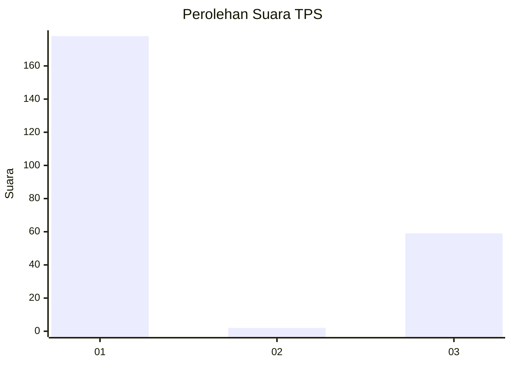
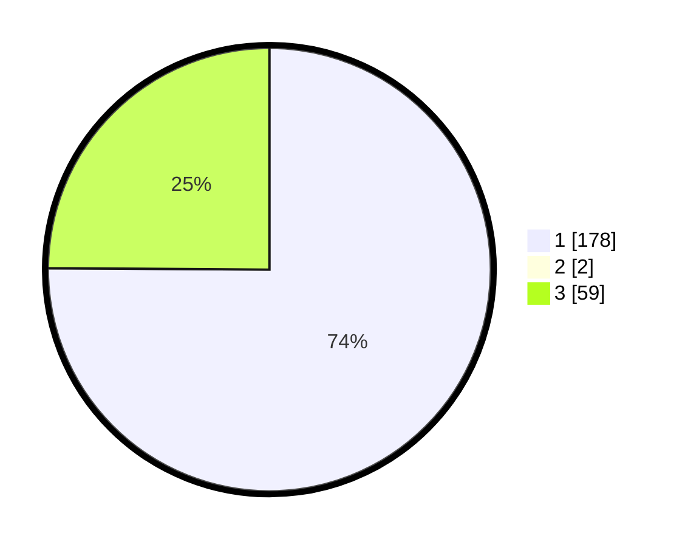

# Hasil

## Grafik

## Tabel

| No. | Nama Paslon    | Suara | Suara (raw) | Persentase |
|:--- |:-------------- | -----:| -----------:| ----------:|
| 1   | ANIES MUHAIMIN | 178   | [178][p-1]  | 74,48      |
| 2   | PRABOWO GIBRAN | 2     | [2][p-2]    | 0,84       |
| 3   | GANJAR MAHFUD  | 59    | [59][p-3]   | 24,69      |

[p-1]: https://github.com/gigit-pemilu/pemilu-2024-33-jawa-tengah/blob/main/pilpres/hitung-suara/sub/33-jawa-tengah/sub/02-banyumas/sub/16-pekuncen/sub/2015-kranggan/sub/007-tps/sub/paslon-1.txt
[p-2]: https://github.com/gigit-pemilu/pemilu-2024-33-jawa-tengah/blob/main/pilpres/hitung-suara/sub/33-jawa-tengah/sub/02-banyumas/sub/16-pekuncen/sub/2015-kranggan/sub/007-tps/sub/paslon-2.txt
[p-3]: https://github.com/gigit-pemilu/pemilu-2024-33-jawa-tengah/blob/main/pilpres/hitung-suara/sub/33-jawa-tengah/sub/02-banyumas/sub/16-pekuncen/sub/2015-kranggan/sub/007-tps/sub/paslon-3.txt

## Foto C Plano

https://sirekap-obj-formc.kpu.go.id/4f1e/pemilu/ppwp/33/02/16/20/15/3302162015007-20240215-004452--f4dae445-32fd-446d-8550-b05a3d804999.jpg

https://sirekap-obj-formc.kpu.go.id/4f1e/pemilu/ppwp/33/02/16/20/15/3302162015007-20240215-004858--888ecd49-9ab5-49d9-9051-eecef6b85d90.jpg

https://sirekap-obj-formc.kpu.go.id/4f1e/pemilu/ppwp/33/02/16/20/15/3302162015007-20240214-141915--dc0026ec-f2b4-4426-8b8d-e035848b3fa2.jpg

## Metadata

| Key        | Value               |
| ---------- | ------------------- |
| Time Stamp | 2024-02-24 22:31:28 |

