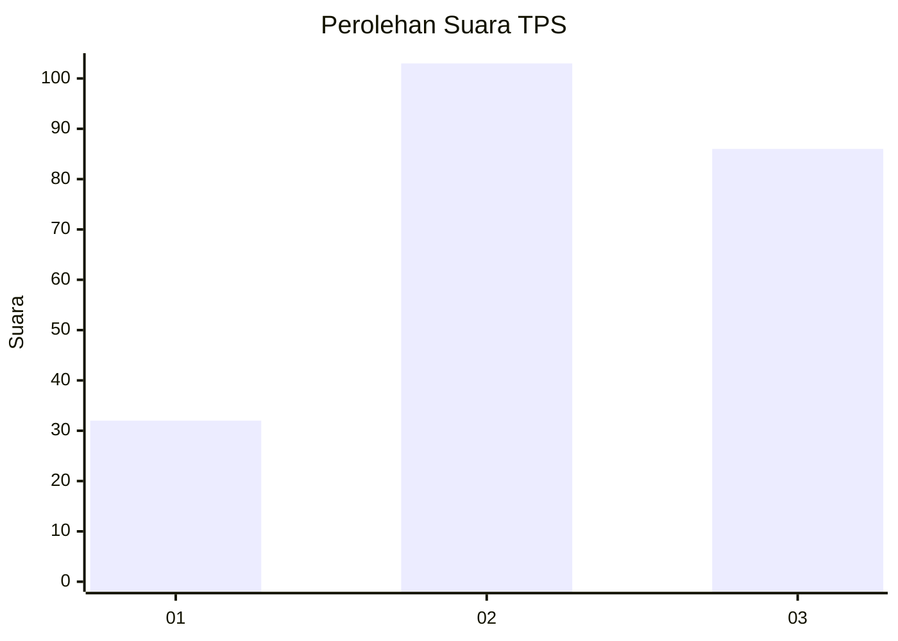
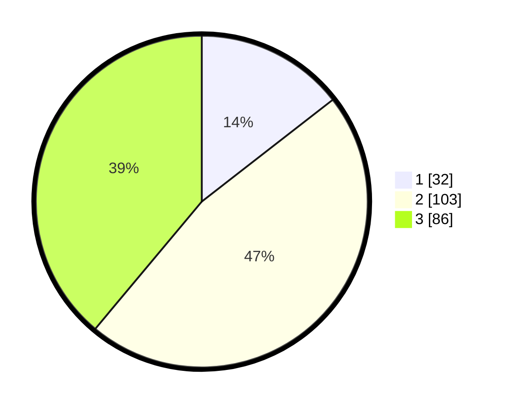

# Hasil

## Grafik

## Tabel

| No. | Nama Paslon    | Suara | Suara (raw) | Persentase |
|:--- |:-------------- | -----:| -----------:| ----------:|
| 1   | ANIES MUHAIMIN | 32    | [32][p-1]   | 14,48      |
| 2   | PRABOWO GIBRAN | 103   | [103][p-2]  | 46,61      |
| 3   | GANJAR MAHFUD  | 86    | [86][p-3]   | 38,91      |

[p-1]: https://github.com/gigit-pemilu/pemilu-2024-33-jawa-tengah/blob/main/pilpres/hitung-suara/sub/33-jawa-tengah/sub/02-banyumas/sub/17-cilongok/sub/2001-panusupan/sub/003-tps/sub/paslon-1.txt
[p-2]: https://github.com/gigit-pemilu/pemilu-2024-33-jawa-tengah/blob/main/pilpres/hitung-suara/sub/33-jawa-tengah/sub/02-banyumas/sub/17-cilongok/sub/2001-panusupan/sub/003-tps/sub/paslon-2.txt
[p-3]: https://github.com/gigit-pemilu/pemilu-2024-33-jawa-tengah/blob/main/pilpres/hitung-suara/sub/33-jawa-tengah/sub/02-banyumas/sub/17-cilongok/sub/2001-panusupan/sub/003-tps/sub/paslon-3.txt

## Foto C Plano

https://sirekap-obj-formc.kpu.go.id/babd/pemilu/ppwp/33/02/17/20/01/3302172001003-20240214-231659--4e51a9f4-f537-4fa8-bf69-5c9a4c2482f5.jpg

https://sirekap-obj-formc.kpu.go.id/babd/pemilu/ppwp/33/02/17/20/01/3302172001003-20240214-231927--f9048078-f10d-4f6f-8c49-dd7bc0e88b95.jpg

https://sirekap-obj-formc.kpu.go.id/babd/pemilu/ppwp/33/02/17/20/01/3302172001003-20240214-232037--ba42fef9-7956-43bf-84c2-2f6d568eef1a.jpg

## Metadata

| Key        | Value               |
| ---------- | ------------------- |
| Time Stamp | 2024-02-15 23:29:50 |

