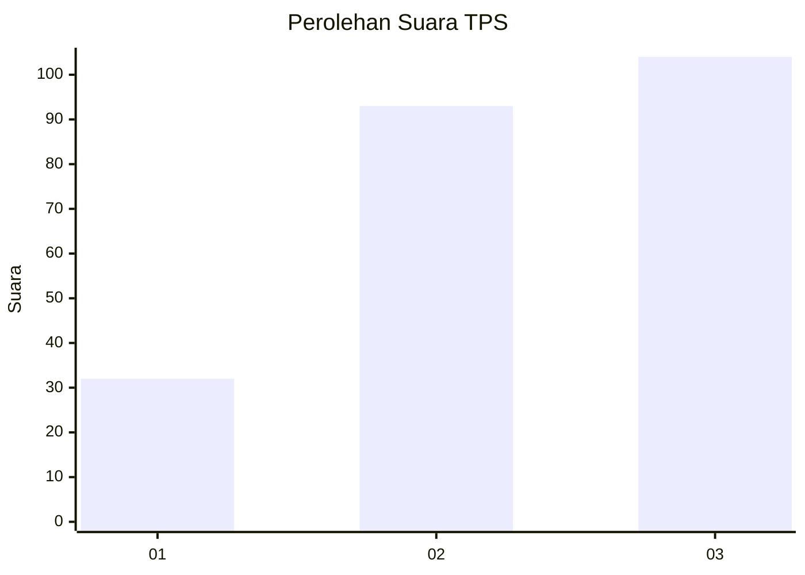
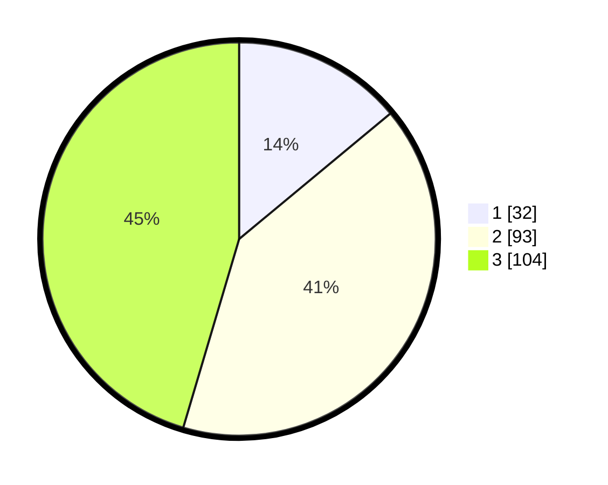

# Hasil

## Grafik

## Tabel

| No. | Nama Paslon    | Suara | Suara (raw) | Persentase |
|:--- |:-------------- | -----:| -----------:| ----------:|
| 1   | ANIES MUHAIMIN | 32    | [32][p-1]   | 13,97      |
| 2   | PRABOWO GIBRAN | 93    | [93][p-2]   | 40,61      |
| 3   | GANJAR MAHFUD  | 104   | [104][p-3]  | 45,41      |

[p-1]: https://github.com/gigit-pemilu/pemilu-2024/blob/main/pilpres/hitung-suara/sub/33-jawa-tengah/sub/02-banyumas/sub/17-cilongok/sub/2004-pejogol/sub/011-tps/sub/paslon-1.txt
[p-2]: https://github.com/gigit-pemilu/pemilu-2024/blob/main/pilpres/hitung-suara/sub/33-jawa-tengah/sub/02-banyumas/sub/17-cilongok/sub/2004-pejogol/sub/011-tps/sub/paslon-2.txt
[p-3]: https://github.com/gigit-pemilu/pemilu-2024/blob/main/pilpres/hitung-suara/sub/33-jawa-tengah/sub/02-banyumas/sub/17-cilongok/sub/2004-pejogol/sub/011-tps/sub/paslon-3.txt

## Foto C Plano

https://sirekap-obj-formc.kpu.go.id/01f7/pemilu/ppwp/33/02/17/20/04/3302172004011-20240214-195538--9546a5a6-e7bc-448a-9e9f-e50f147f36ba.jpg

https://sirekap-obj-formc.kpu.go.id/01f7/pemilu/ppwp/33/02/17/20/04/3302172004011-20240214-195603--94e0cbd0-cc59-41ab-a5c6-d59154bc428d.jpg

https://sirekap-obj-formc.kpu.go.id/01f7/pemilu/ppwp/33/02/17/20/04/3302172004011-20240214-195606--ded6e523-6df7-43c5-b627-32166253867d.jpg

## Metadata

| Key        | Value               |
| ---------- | ------------------- |
| Time Stamp | 2024-02-16 22:01:00 |

