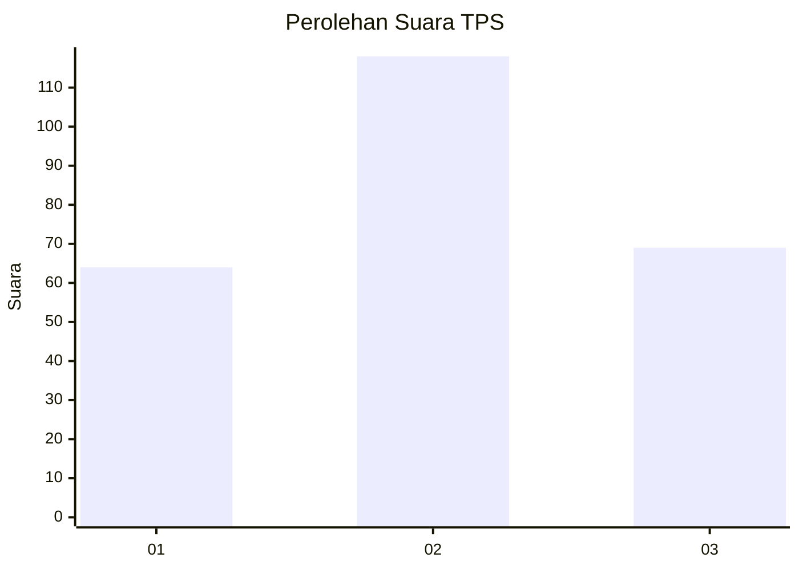
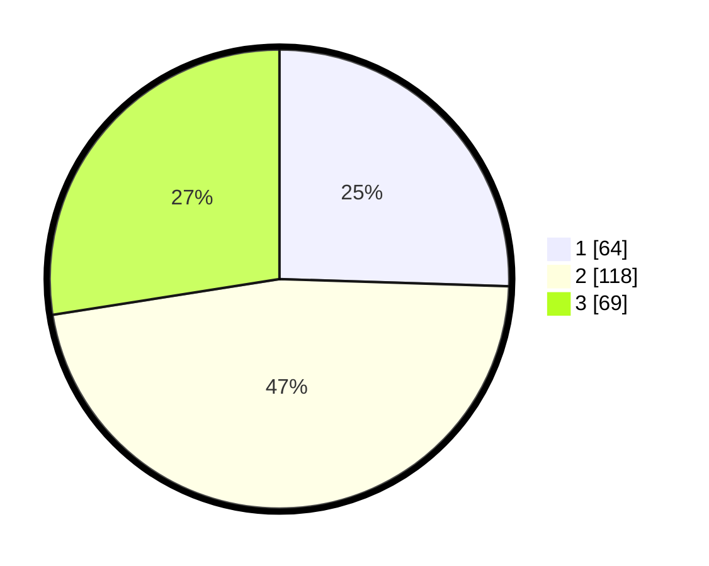

# Hasil

## Grafik

## Tabel

| No. | Nama Paslon    | Suara | Suara (raw) | Persentase |
|:--- |:-------------- | -----:| -----------:| ----------:|
| 1   | ANIES MUHAIMIN | 64    | [64][p-1]   | 25,50      |
| 2   | PRABOWO GIBRAN | 118   | [118][p-2]  | 47,01      |
| 3   | GANJAR MAHFUD  | 69    | [69][p-3]   | 27,49      |

[p-1]: https://github.com/gigit-pemilu/pemilu-2024/blob/main/pilpres/hitung-suara/sub/33-jawa-tengah/sub/02-banyumas/sub/17-cilongok/sub/2004-pejogol/sub/014-tps/sub/paslon-1.txt
[p-2]: https://github.com/gigit-pemilu/pemilu-2024/blob/main/pilpres/hitung-suara/sub/33-jawa-tengah/sub/02-banyumas/sub/17-cilongok/sub/2004-pejogol/sub/014-tps/sub/paslon-2.txt
[p-3]: https://github.com/gigit-pemilu/pemilu-2024/blob/main/pilpres/hitung-suara/sub/33-jawa-tengah/sub/02-banyumas/sub/17-cilongok/sub/2004-pejogol/sub/014-tps/sub/paslon-3.txt

## Foto C Plano

https://sirekap-obj-formc.kpu.go.id/3dd7/pemilu/ppwp/33/02/17/20/04/3302172004014-20240214-213420--1e2a8770-3842-402b-8429-2a2f3e28322e.jpg

https://sirekap-obj-formc.kpu.go.id/3dd7/pemilu/ppwp/33/02/17/20/04/3302172004014-20240214-213733--b3fab530-8954-49a6-8ba6-4edc27d3a3a6.jpg

https://sirekap-obj-formc.kpu.go.id/3dd7/pemilu/ppwp/33/02/17/20/04/3302172004014-20240214-214038--9ff043e7-97b5-4b35-a446-35f2c96dc70f.jpg

## Metadata

| Key        | Value               |
| ---------- | ------------------- |
| Time Stamp | 2024-02-15 17:00:25 |

