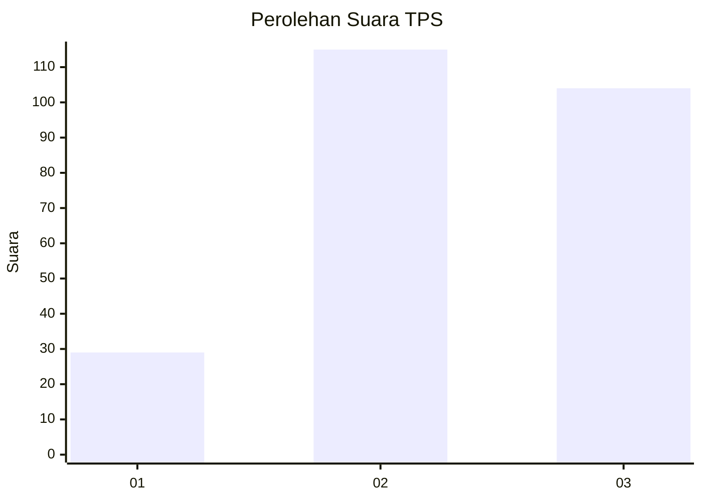
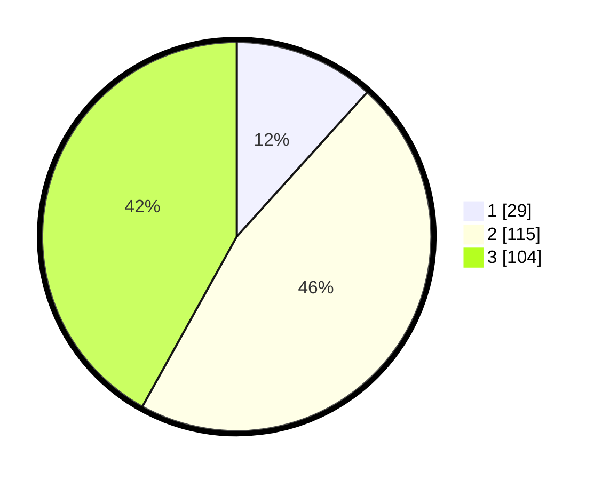

# Hasil

## Grafik

## Tabel

| No. | Nama Paslon    | Suara | Suara (raw) | Persentase |
|:--- |:-------------- | -----:| -----------:| ----------:|
| 1   | ANIES MUHAIMIN | 29    | [29][p-1]   | 11,69      |
| 2   | PRABOWO GIBRAN | 115   | [115][p-2]  | 46,37      |
| 3   | GANJAR MAHFUD  | 104   | [104][p-3]  | 41,94      |

[p-1]: https://github.com/gigit-pemilu/pemilu-2024/blob/main/pilpres/hitung-suara/sub/33-jawa-tengah/sub/02-banyumas/sub/17-cilongok/sub/2005-langgongsari/sub/004-tps/sub/paslon-1.txt
[p-2]: https://github.com/gigit-pemilu/pemilu-2024/blob/main/pilpres/hitung-suara/sub/33-jawa-tengah/sub/02-banyumas/sub/17-cilongok/sub/2005-langgongsari/sub/004-tps/sub/paslon-2.txt
[p-3]: https://github.com/gigit-pemilu/pemilu-2024/blob/main/pilpres/hitung-suara/sub/33-jawa-tengah/sub/02-banyumas/sub/17-cilongok/sub/2005-langgongsari/sub/004-tps/sub/paslon-3.txt

## Foto C Plano

https://sirekap-obj-formc.kpu.go.id/ed83/pemilu/ppwp/33/02/17/20/05/3302172005004-20240214-213758--c47102c6-ae88-4c67-b53d-280010a78855.jpg

https://sirekap-obj-formc.kpu.go.id/ed83/pemilu/ppwp/33/02/17/20/05/3302172005004-20240215-024557--820c9d44-cc2b-46c5-8993-738a4faf6d56.jpg

https://sirekap-obj-formc.kpu.go.id/ed83/pemilu/ppwp/33/02/17/20/05/3302172005004-20240215-024728--c15deb55-ce98-4d6f-9fdd-35dc4a402f46.jpg

## Metadata

| Key        | Value               |
| ---------- | ------------------- |
| Time Stamp | 2024-02-17 10:30:03 |

