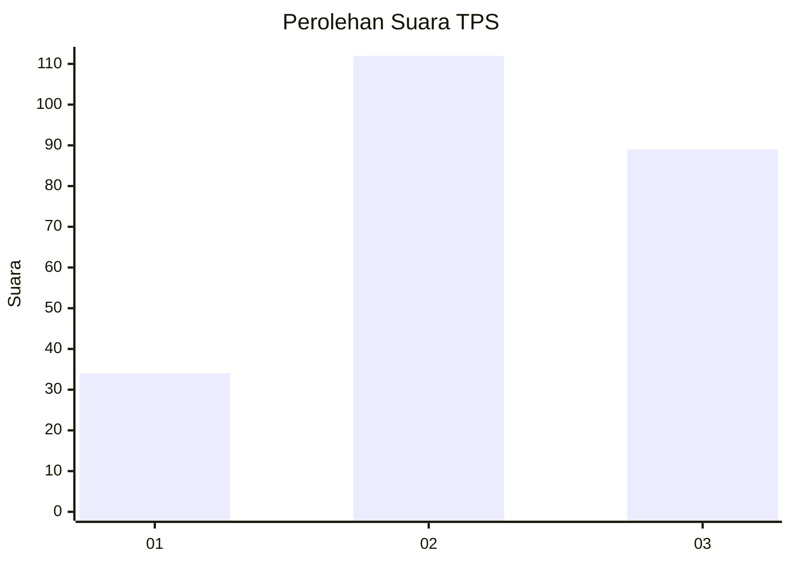
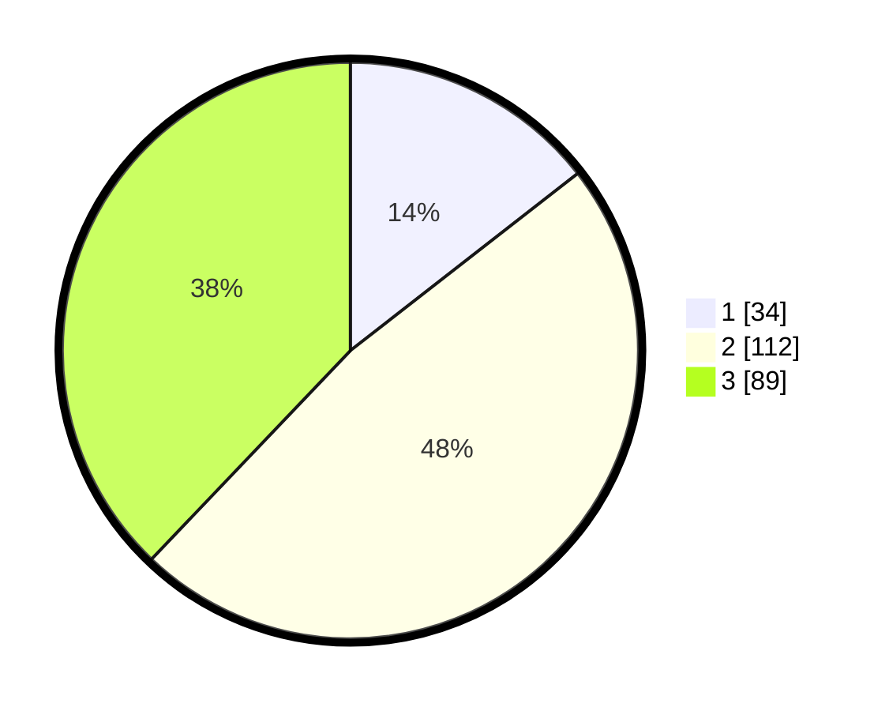

# Hasil

## Grafik

## Tabel

| No. | Nama Paslon    | Suara | Suara (raw) | Persentase |
|:--- |:-------------- | -----:| -----------:| ----------:|
| 1   | ANIES MUHAIMIN | 34    | [34][p-1]   | 14,47      |
| 2   | PRABOWO GIBRAN | 112   | [112][p-2]  | 47,66      |
| 3   | GANJAR MAHFUD  | 89    | [89][p-3]   | 37,87      |

[p-1]: https://github.com/gigit-pemilu/pemilu-2024/blob/main/pilpres/hitung-suara/sub/33-jawa-tengah/sub/02-banyumas/sub/17-cilongok/sub/2005-langgongsari/sub/023-tps/sub/paslon-1.txt
[p-2]: https://github.com/gigit-pemilu/pemilu-2024/blob/main/pilpres/hitung-suara/sub/33-jawa-tengah/sub/02-banyumas/sub/17-cilongok/sub/2005-langgongsari/sub/023-tps/sub/paslon-2.txt
[p-3]: https://github.com/gigit-pemilu/pemilu-2024/blob/main/pilpres/hitung-suara/sub/33-jawa-tengah/sub/02-banyumas/sub/17-cilongok/sub/2005-langgongsari/sub/023-tps/sub/paslon-3.txt

## Foto C Plano

https://sirekap-obj-formc.kpu.go.id/1fe0/pemilu/ppwp/33/02/17/20/05/3302172005023-20240214-213356--af6393ba-d985-4187-8e23-110dd787158c.jpg

https://sirekap-obj-formc.kpu.go.id/1fe0/pemilu/ppwp/33/02/17/20/05/3302172005023-20240215-003708--dfe8cf2b-d19c-4b34-8e44-e356b10bd31c.jpg

https://sirekap-obj-formc.kpu.go.id/1fe0/pemilu/ppwp/33/02/17/20/05/3302172005023-20240215-004014--b810fbab-7e7a-4bcd-95cc-8d8fcbd92605.jpg

## Metadata

| Key        | Value               |
| ---------- | ------------------- |
| Time Stamp | 2024-02-17 10:30:03 |

