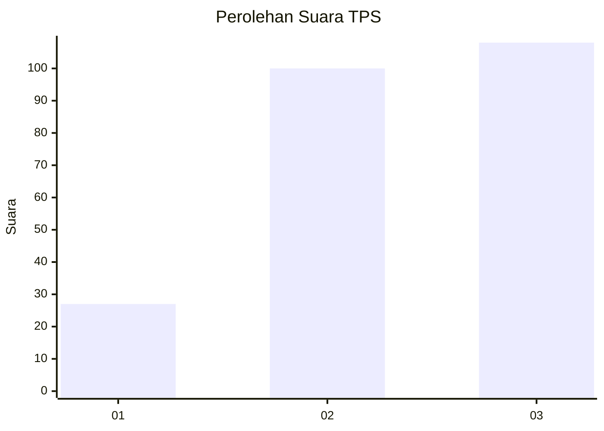
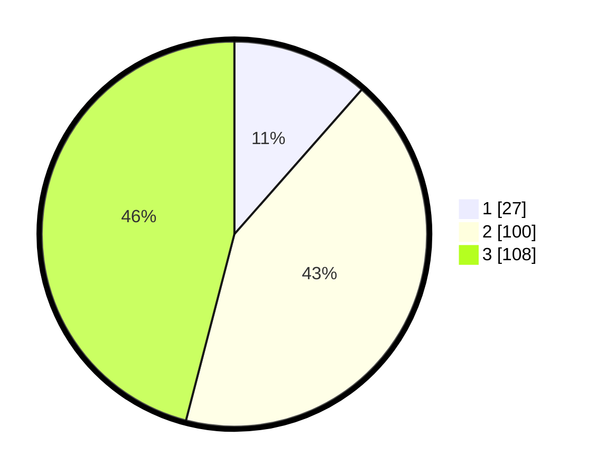

# Hasil

## Grafik

## Tabel

| No. | Nama Paslon    | Suara | Suara (raw) | Persentase |
|:--- |:-------------- | -----:| -----------:| ----------:|
| 1   | ANIES MUHAIMIN | 27    | [27][p-1]   | 11,49      |
| 2   | PRABOWO GIBRAN | 100   | [100][p-2]  | 42,55      |
| 3   | GANJAR MAHFUD  | 108   | [108][p-3]  | 45,96      |

[p-1]: https://github.com/gigit-pemilu/pemilu-2024-33-jawa-tengah/blob/main/pilpres/hitung-suara/sub/33-jawa-tengah/sub/02-banyumas/sub/17-cilongok/sub/2006-pageraji/sub/009-tps/sub/paslon-1.txt
[p-2]: https://github.com/gigit-pemilu/pemilu-2024-33-jawa-tengah/blob/main/pilpres/hitung-suara/sub/33-jawa-tengah/sub/02-banyumas/sub/17-cilongok/sub/2006-pageraji/sub/009-tps/sub/paslon-2.txt
[p-3]: https://github.com/gigit-pemilu/pemilu-2024-33-jawa-tengah/blob/main/pilpres/hitung-suara/sub/33-jawa-tengah/sub/02-banyumas/sub/17-cilongok/sub/2006-pageraji/sub/009-tps/sub/paslon-3.txt

## Foto C Plano

https://sirekap-obj-formc.kpu.go.id/f9e3/pemilu/ppwp/33/02/17/20/06/3302172006009-20240215-043857--11ea60b2-5d97-4397-984f-01742b3d2f5e.jpg

https://sirekap-obj-formc.kpu.go.id/f9e3/pemilu/ppwp/33/02/17/20/06/3302172006009-20240215-044343--ae9f37f6-a08e-4efb-b9a7-1318a036b19f.jpg

https://sirekap-obj-formc.kpu.go.id/f9e3/pemilu/ppwp/33/02/17/20/06/3302172006009-20240215-044526--4b71dc94-a867-42d1-931d-393adbdeb50d.jpg

## Metadata

| Key        | Value               |
| ---------- | ------------------- |
| Time Stamp | 2024-02-17 11:30:03 |

