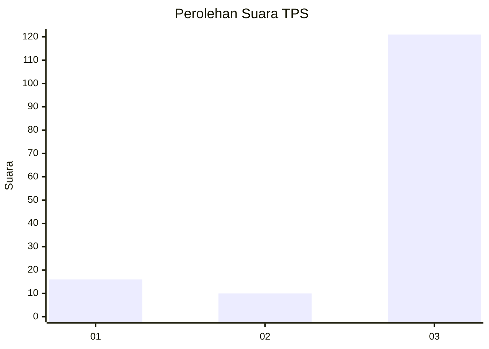
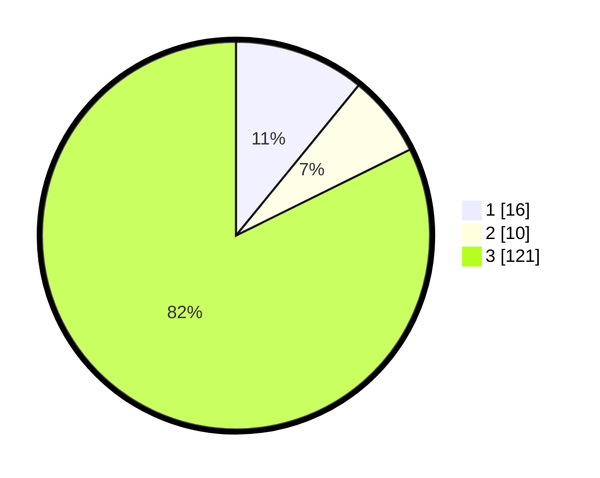

# Hasil

## Grafik

## Tabel

| No. | Nama Paslon    | Suara | Suara (raw) | Persentase |
|:--- |:-------------- | -----:| -----------:| ----------:|
| 1   | ANIES MUHAIMIN | 16    | [16][p-1]   | 10,88      |
| 2   | PRABOWO GIBRAN | 10    | [10][p-2]   | 6,80       |
| 3   | GANJAR MAHFUD  | 121   | [121][p-3]  | 82,31      |

[p-1]: https://github.com/gigit-pemilu/pemilu-2024-33-jawa-tengah/blob/main/pilpres/hitung-suara/sub/33-jawa-tengah/sub/02-banyumas/sub/17-cilongok/sub/2006-pageraji/sub/033-tps/sub/paslon-1.txt
[p-2]: https://github.com/gigit-pemilu/pemilu-2024-33-jawa-tengah/blob/main/pilpres/hitung-suara/sub/33-jawa-tengah/sub/02-banyumas/sub/17-cilongok/sub/2006-pageraji/sub/033-tps/sub/paslon-2.txt
[p-3]: https://github.com/gigit-pemilu/pemilu-2024-33-jawa-tengah/blob/main/pilpres/hitung-suara/sub/33-jawa-tengah/sub/02-banyumas/sub/17-cilongok/sub/2006-pageraji/sub/033-tps/sub/paslon-3.txt

## Foto C Plano

https://sirekap-obj-formc.kpu.go.id/c66a/pemilu/ppwp/33/02/17/20/06/3302172006033-20240215-014720--02e994ba-a44d-4e2e-b7b3-666c5c7d3002.jpg

https://sirekap-obj-formc.kpu.go.id/c66a/pemilu/ppwp/33/02/17/20/06/3302172006033-20240215-014622--4f327551-5f7c-4d54-bd9f-cc97508aa123.jpg

https://sirekap-obj-formc.kpu.go.id/c66a/pemilu/ppwp/33/02/17/20/06/3302172006033-20240215-014427--c78c0a78-d3cf-4b42-9a7c-535c642bb273.jpg

## Metadata

| Key        | Value               |
| ---------- | ------------------- |
| Time Stamp | 2024-02-16 00:30:27 |

