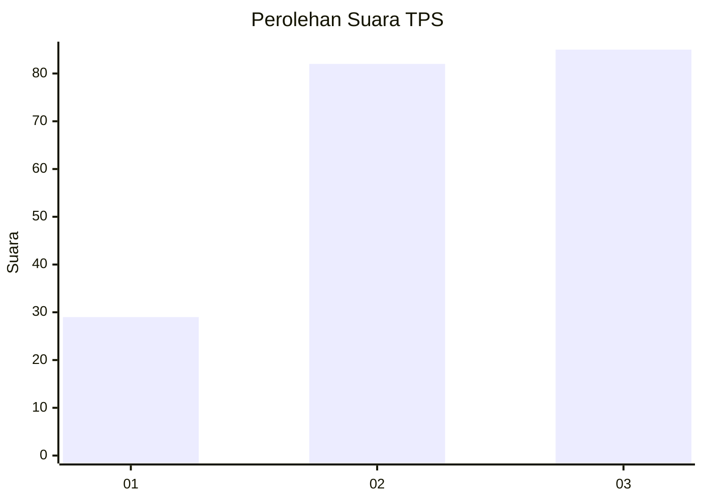
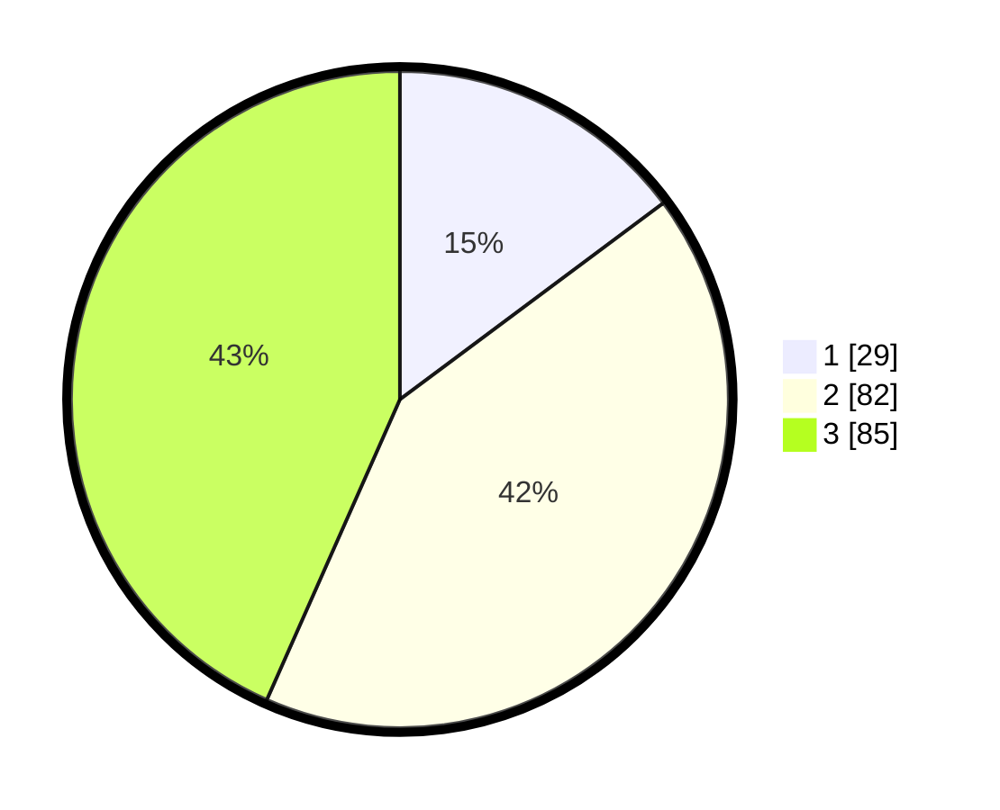

# Hasil

## Grafik

## Tabel

| No. | Nama Paslon    | Suara | Suara (raw) | Persentase |
|:--- |:-------------- | -----:| -----------:| ----------:|
| 1   | ANIES MUHAIMIN | 29    | [29][p-1]   | 14,80      |
| 2   | PRABOWO GIBRAN | 82    | [82][p-2]   | 41,84      |
| 3   | GANJAR MAHFUD  | 85    | [85][p-3]   | 43,37      |

[p-1]: https://github.com/gigit-pemilu/pemilu-2024/blob/main/pilpres/hitung-suara/sub/33-jawa-tengah/sub/02-banyumas/sub/17-cilongok/sub/2009-cipete/sub/007-tps/sub/paslon-1.txt
[p-2]: https://github.com/gigit-pemilu/pemilu-2024/blob/main/pilpres/hitung-suara/sub/33-jawa-tengah/sub/02-banyumas/sub/17-cilongok/sub/2009-cipete/sub/007-tps/sub/paslon-2.txt
[p-3]: https://github.com/gigit-pemilu/pemilu-2024/blob/main/pilpres/hitung-suara/sub/33-jawa-tengah/sub/02-banyumas/sub/17-cilongok/sub/2009-cipete/sub/007-tps/sub/paslon-3.txt

## Foto C Plano

https://sirekap-obj-formc.kpu.go.id/2982/pemilu/ppwp/33/02/17/20/09/3302172009007-20240215-032800--63aaa3bb-8a2e-44b5-b5c3-e9034256f4aa.jpg

https://sirekap-obj-formc.kpu.go.id/2982/pemilu/ppwp/33/02/17/20/09/3302172009007-20240215-032910--1ba85825-30ba-442f-a11c-0c395569a3ad.jpg

https://sirekap-obj-formc.kpu.go.id/2982/pemilu/ppwp/33/02/17/20/09/3302172009007-20240215-033426--ec5d4d2b-2ab3-4f8e-809d-50fbdc16ec1e.jpg

## Metadata

| Key        | Value               |
| ---------- | ------------------- |
| Time Stamp | 2024-02-16 01:00:27 |

