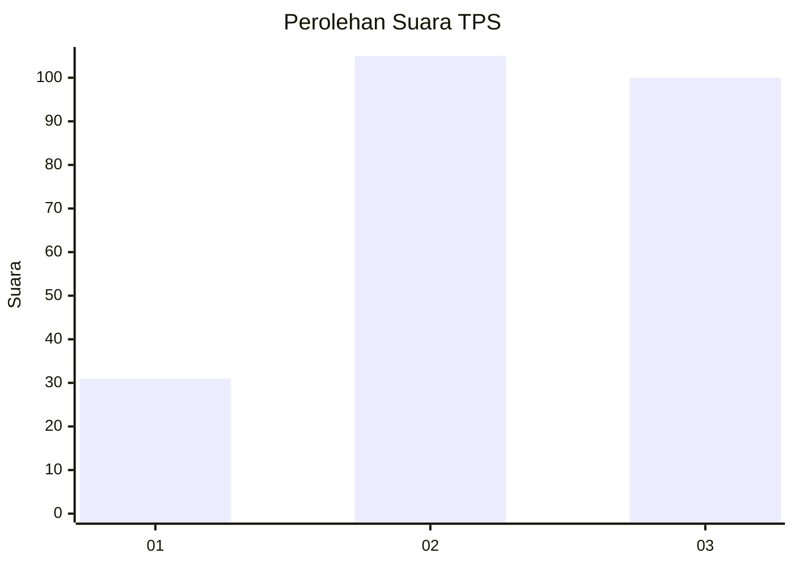
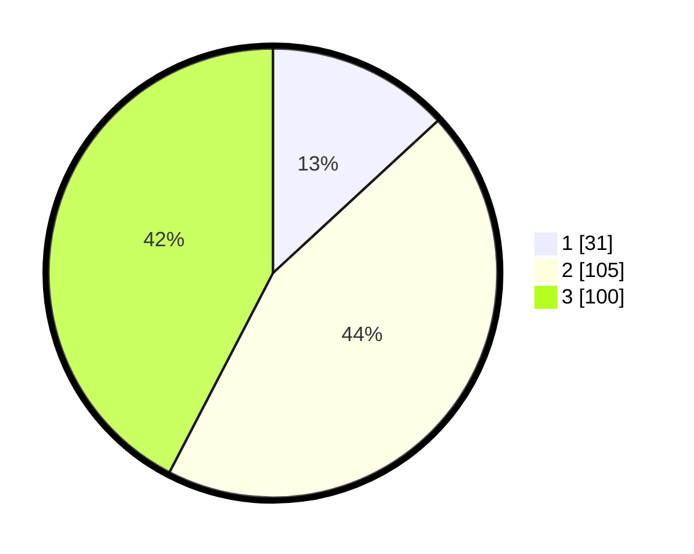

# Hasil

## Grafik

## Tabel

| No. | Nama Paslon    | Suara | Suara (raw) | Persentase |
|:--- |:-------------- | -----:| -----------:| ----------:|
| 1   | ANIES MUHAIMIN | 31    | [31][p-1]   | 13,14      |
| 2   | PRABOWO GIBRAN | 105   | [105][p-2]  | 44,49      |
| 3   | GANJAR MAHFUD  | 100   | [100][p-3]  | 42,37      |

[p-1]: https://github.com/gigit-pemilu/pemilu-2024-33-jawa-tengah/blob/main/pilpres/hitung-suara/sub/33-jawa-tengah/sub/02-banyumas/sub/17-cilongok/sub/2010-cilongok/sub/017-tps/sub/paslon-1.txt
[p-2]: https://github.com/gigit-pemilu/pemilu-2024-33-jawa-tengah/blob/main/pilpres/hitung-suara/sub/33-jawa-tengah/sub/02-banyumas/sub/17-cilongok/sub/2010-cilongok/sub/017-tps/sub/paslon-2.txt
[p-3]: https://github.com/gigit-pemilu/pemilu-2024-33-jawa-tengah/blob/main/pilpres/hitung-suara/sub/33-jawa-tengah/sub/02-banyumas/sub/17-cilongok/sub/2010-cilongok/sub/017-tps/sub/paslon-3.txt

## Foto C Plano

https://sirekap-obj-formc.kpu.go.id/52b1/pemilu/ppwp/33/02/17/20/10/3302172010017-20240214-220156--6b5941fc-d24d-499b-bd2c-f9c9641cd30b.jpg

https://sirekap-obj-formc.kpu.go.id/52b1/pemilu/ppwp/33/02/17/20/10/3302172010017-20240214-220341--6a7c2de7-8adc-4bef-9064-0b57adaa87d0.jpg

https://sirekap-obj-formc.kpu.go.id/52b1/pemilu/ppwp/33/02/17/20/10/3302172010017-20240214-220501--82797b53-a0bf-4fcc-b6ac-f259520f27f7.jpg

## Metadata

| Key        | Value               |
| ---------- | ------------------- |
| Time Stamp | 2024-02-17 10:30:03 |

