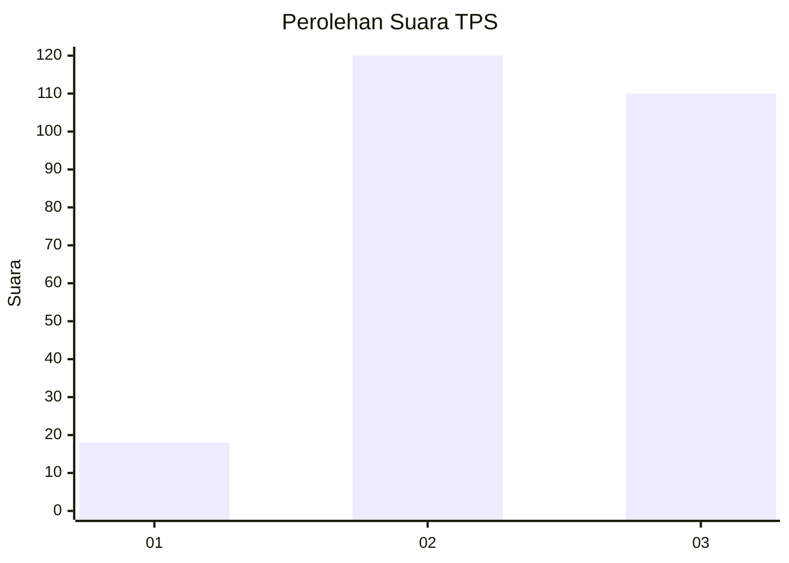
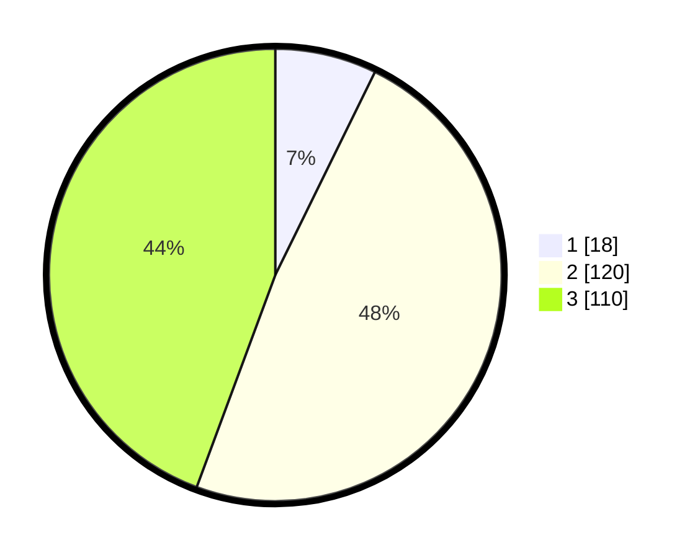

# Hasil

## Grafik

## Tabel

| No. | Nama Paslon    | Suara | Suara (raw) | Persentase |
|:--- |:-------------- | -----:| -----------:| ----------:|
| 1   | ANIES MUHAIMIN | 18    | [18][p-1]   | 7,26       |
| 2   | PRABOWO GIBRAN | 120   | [120][p-2]  | 48,39      |
| 3   | GANJAR MAHFUD  | 110   | [110][p-3]  | 44,35      |

[p-1]: https://github.com/gigit-pemilu/pemilu-2024/blob/main/pilpres/hitung-suara/sub/33-jawa-tengah/sub/02-banyumas/sub/17-cilongok/sub/2011-pernasidi/sub/001-tps/sub/paslon-1.txt
[p-2]: https://github.com/gigit-pemilu/pemilu-2024/blob/main/pilpres/hitung-suara/sub/33-jawa-tengah/sub/02-banyumas/sub/17-cilongok/sub/2011-pernasidi/sub/001-tps/sub/paslon-2.txt
[p-3]: https://github.com/gigit-pemilu/pemilu-2024/blob/main/pilpres/hitung-suara/sub/33-jawa-tengah/sub/02-banyumas/sub/17-cilongok/sub/2011-pernasidi/sub/001-tps/sub/paslon-3.txt

## Foto C Plano

https://sirekap-obj-formc.kpu.go.id/0797/pemilu/ppwp/33/02/17/20/11/3302172011001-20240214-220752--5e1bbb4f-39d8-4c49-9398-0a96bb8740ee.jpg

https://sirekap-obj-formc.kpu.go.id/0797/pemilu/ppwp/33/02/17/20/11/3302172011001-20240214-221040--2a49b73b-ed3b-4cc0-a5a6-407909895cef.jpg

https://sirekap-obj-formc.kpu.go.id/0797/pemilu/ppwp/33/02/17/20/11/3302172011001-20240214-221152--f840838f-ef27-4736-80c5-0801762fa312.jpg

## Metadata

| Key        | Value               |
| ---------- | ------------------- |
| Time Stamp | 2024-02-17 10:30:03 |

