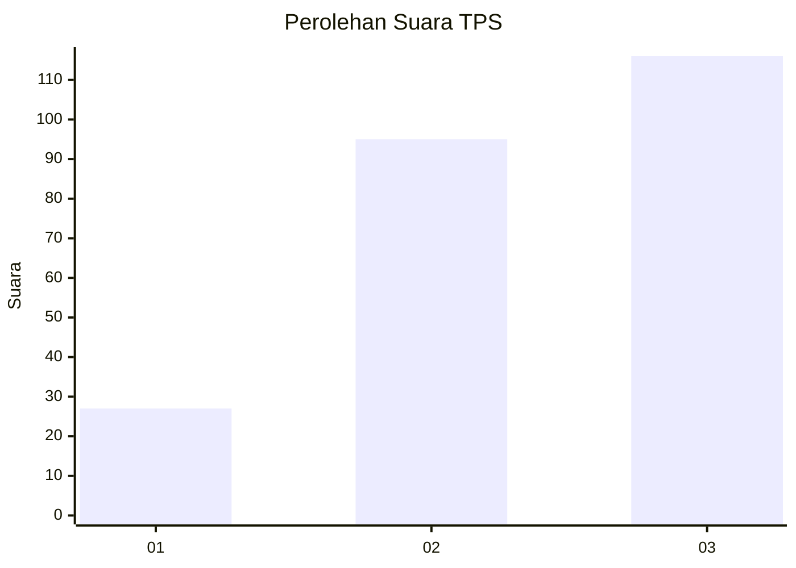
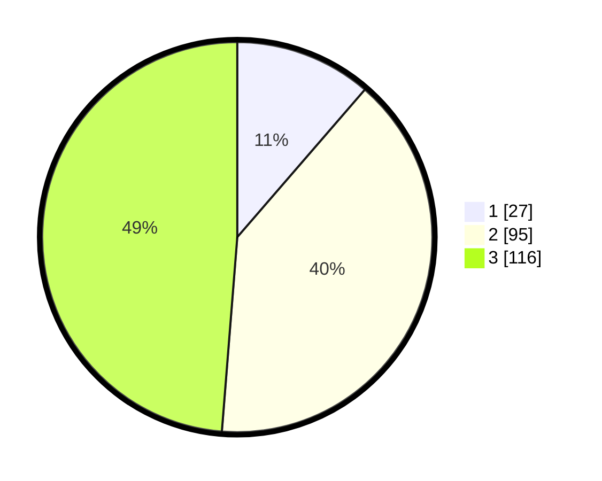

# Hasil

## Grafik

## Tabel

| No. | Nama Paslon    | Suara | Suara (raw) | Persentase |
|:--- |:-------------- | -----:| -----------:| ----------:|
| 1   | ANIES MUHAIMIN | 27    | [27][p-1]   | 11,34      |
| 2   | PRABOWO GIBRAN | 95    | [95][p-2]   | 39,92      |
| 3   | GANJAR MAHFUD  | 116   | [116][p-3]  | 48,74      |

[p-1]: https://github.com/gigit-pemilu/pemilu-2024/blob/main/pilpres/hitung-suara/sub/33-jawa-tengah/sub/02-banyumas/sub/17-cilongok/sub/2011-pernasidi/sub/003-tps/sub/paslon-1.txt
[p-2]: https://github.com/gigit-pemilu/pemilu-2024/blob/main/pilpres/hitung-suara/sub/33-jawa-tengah/sub/02-banyumas/sub/17-cilongok/sub/2011-pernasidi/sub/003-tps/sub/paslon-2.txt
[p-3]: https://github.com/gigit-pemilu/pemilu-2024/blob/main/pilpres/hitung-suara/sub/33-jawa-tengah/sub/02-banyumas/sub/17-cilongok/sub/2011-pernasidi/sub/003-tps/sub/paslon-3.txt

## Foto C Plano

https://sirekap-obj-formc.kpu.go.id/1a83/pemilu/ppwp/33/02/17/20/11/3302172011003-20240215-035126--7b9ac2b9-cb43-48f4-a52b-f66f282ba59f.jpg

https://sirekap-obj-formc.kpu.go.id/1a83/pemilu/ppwp/33/02/17/20/11/3302172011003-20240214-235850--0e937da2-02dd-4c7c-9213-e84225aa8ead.jpg

https://sirekap-obj-formc.kpu.go.id/1a83/pemilu/ppwp/33/02/17/20/11/3302172011003-20240214-224036--2836fc59-7ade-4818-b910-d5fa0ffbd09e.jpg

## Metadata

| Key        | Value               |
| ---------- | ------------------- |
| Time Stamp | 2024-02-16 12:51:22 |

