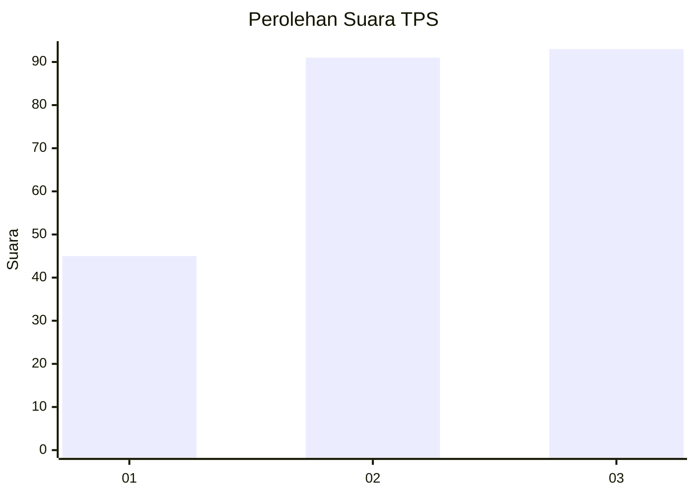
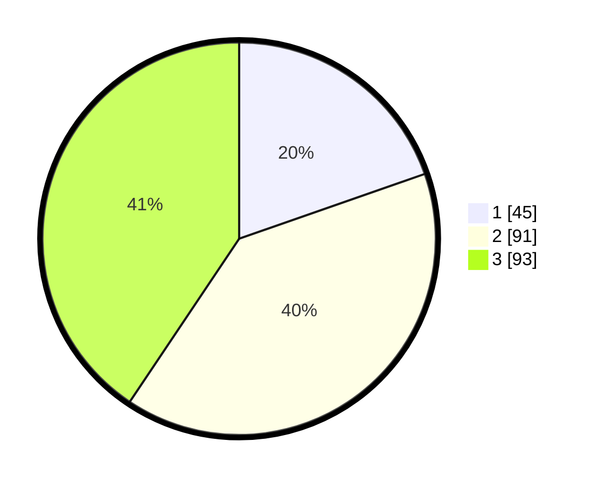

# Hasil

## Grafik

## Tabel

| No. | Nama Paslon    | Suara | Suara (raw) | Persentase |
|:--- |:-------------- | -----:| -----------:| ----------:|
| 1   | ANIES MUHAIMIN | 45    | [45][p-1]   | 19,65      |
| 2   | PRABOWO GIBRAN | 91    | [91][p-2]   | 39,74      |
| 3   | GANJAR MAHFUD  | 93    | [93][p-3]   | 40,61      |

[p-1]: https://github.com/gigit-pemilu/pemilu-2024-33-jawa-tengah/blob/main/pilpres/hitung-suara/sub/33-jawa-tengah/sub/02-banyumas/sub/17-cilongok/sub/2011-pernasidi/sub/010-tps/sub/paslon-1.txt
[p-2]: https://github.com/gigit-pemilu/pemilu-2024-33-jawa-tengah/blob/main/pilpres/hitung-suara/sub/33-jawa-tengah/sub/02-banyumas/sub/17-cilongok/sub/2011-pernasidi/sub/010-tps/sub/paslon-2.txt
[p-3]: https://github.com/gigit-pemilu/pemilu-2024-33-jawa-tengah/blob/main/pilpres/hitung-suara/sub/33-jawa-tengah/sub/02-banyumas/sub/17-cilongok/sub/2011-pernasidi/sub/010-tps/sub/paslon-3.txt

## Foto C Plano

https://sirekap-obj-formc.kpu.go.id/b01d/pemilu/ppwp/33/02/17/20/11/3302172011010-20240214-193752--202c6f4b-b8d4-49fe-930a-ca09c6459dab.jpg

https://sirekap-obj-formc.kpu.go.id/b01d/pemilu/ppwp/33/02/17/20/11/3302172011010-20240214-193755--d474ee20-d19b-44d0-8f82-6bc61fe52afe.jpg

https://sirekap-obj-formc.kpu.go.id/b01d/pemilu/ppwp/33/02/17/20/11/3302172011010-20240214-193758--a6c6a91e-2768-482c-a98a-27b9ab8b5110.jpg

## Metadata

| Key        | Value               |
| ---------- | ------------------- |
| Time Stamp | 2024-02-16 01:00:27 |

