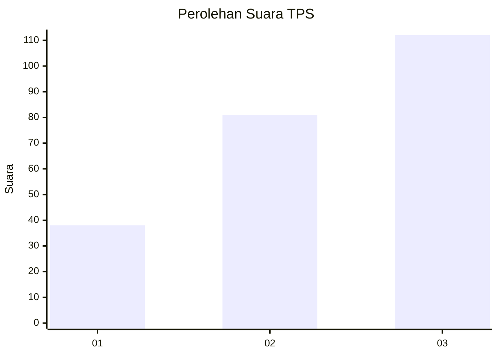
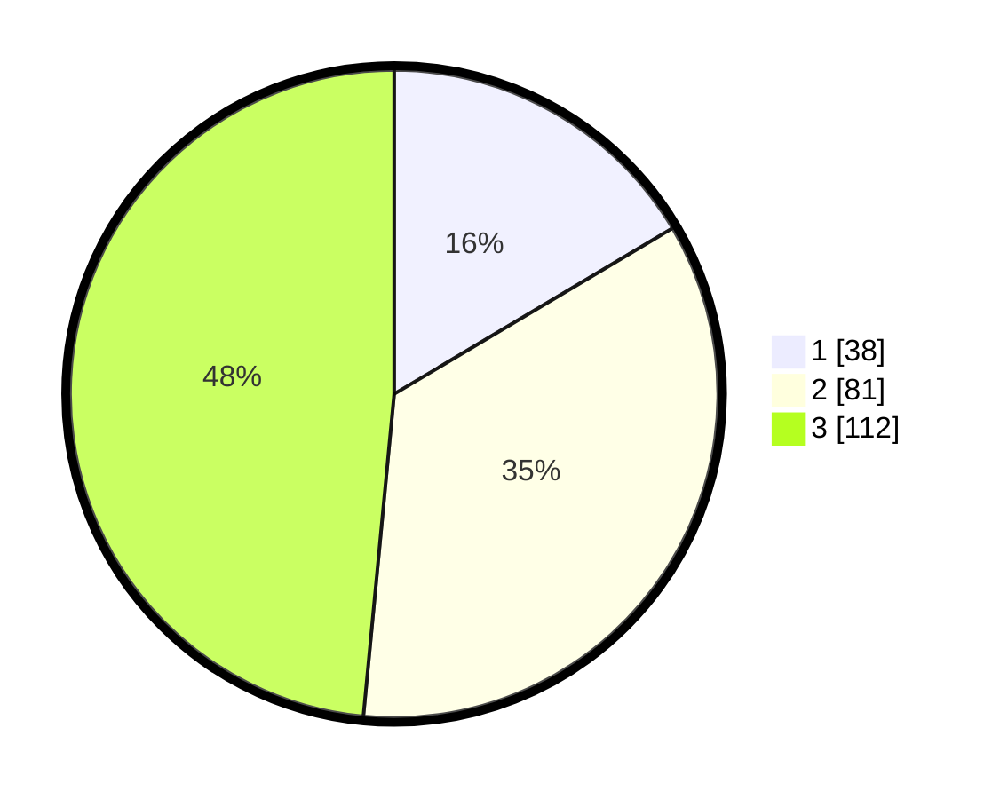

# Hasil

## Grafik

## Tabel

| No. | Nama Paslon    | Suara | Suara (raw) | Persentase |
|:--- |:-------------- | -----:| -----------:| ----------:|
| 1   | ANIES MUHAIMIN | 38    | [38][p-1]   | 16,45      |
| 2   | PRABOWO GIBRAN | 81    | [81][p-2]   | 35,06      |
| 3   | GANJAR MAHFUD  | 112   | [112][p-3]  | 48,48      |

[p-1]: https://github.com/gigit-pemilu/pemilu-2024-33-jawa-tengah/blob/main/pilpres/hitung-suara/sub/33-jawa-tengah/sub/02-banyumas/sub/17-cilongok/sub/2012-cikidang/sub/002-tps/sub/paslon-1.txt
[p-2]: https://github.com/gigit-pemilu/pemilu-2024-33-jawa-tengah/blob/main/pilpres/hitung-suara/sub/33-jawa-tengah/sub/02-banyumas/sub/17-cilongok/sub/2012-cikidang/sub/002-tps/sub/paslon-2.txt
[p-3]: https://github.com/gigit-pemilu/pemilu-2024-33-jawa-tengah/blob/main/pilpres/hitung-suara/sub/33-jawa-tengah/sub/02-banyumas/sub/17-cilongok/sub/2012-cikidang/sub/002-tps/sub/paslon-3.txt

## Foto C Plano

https://sirekap-obj-formc.kpu.go.id/730a/pemilu/ppwp/33/02/17/20/12/3302172012002-20240214-210705--c3ad6ae0-af5b-4612-a481-1f1dd597d9ce.jpg

https://sirekap-obj-formc.kpu.go.id/730a/pemilu/ppwp/33/02/17/20/12/3302172012002-20240214-232104--231ca37c-fcef-496c-ad02-4ba56a8e9fc7.jpg

https://sirekap-obj-formc.kpu.go.id/730a/pemilu/ppwp/33/02/17/20/12/3302172012002-20240214-231959--08ce6e7f-8910-41a7-948e-e5878ae9aa85.jpg

## Metadata

| Key        | Value               |
| ---------- | ------------------- |
| Time Stamp | 2024-02-15 21:30:27 |

