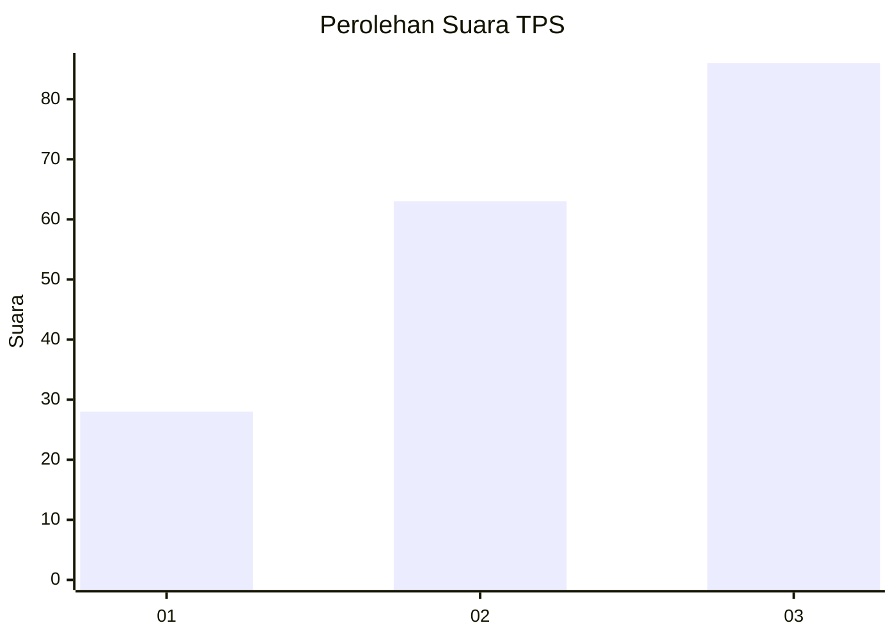
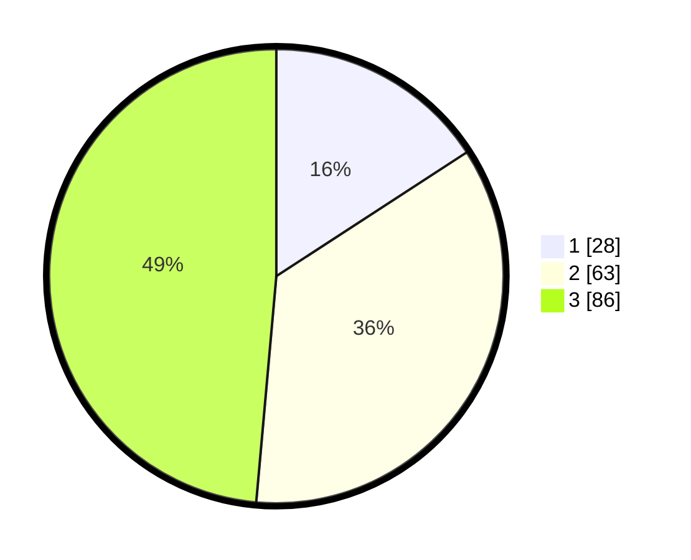

# Hasil

## Grafik

## Tabel

| No. | Nama Paslon    | Suara | Suara (raw) | Persentase |
|:--- |:-------------- | -----:| -----------:| ----------:|
| 1   | ANIES MUHAIMIN | 28    | [28][p-1]   | 15,82      |
| 2   | PRABOWO GIBRAN | 63    | [63][p-2]   | 35,59      |
| 3   | GANJAR MAHFUD  | 86    | [86][p-3]   | 48,59      |

[p-1]: https://github.com/gigit-pemilu/pemilu-2024-33-jawa-tengah/blob/main/pilpres/hitung-suara/sub/33-jawa-tengah/sub/02-banyumas/sub/17-cilongok/sub/2013-karanglo/sub/009-tps/sub/paslon-1.txt
[p-2]: https://github.com/gigit-pemilu/pemilu-2024-33-jawa-tengah/blob/main/pilpres/hitung-suara/sub/33-jawa-tengah/sub/02-banyumas/sub/17-cilongok/sub/2013-karanglo/sub/009-tps/sub/paslon-2.txt
[p-3]: https://github.com/gigit-pemilu/pemilu-2024-33-jawa-tengah/blob/main/pilpres/hitung-suara/sub/33-jawa-tengah/sub/02-banyumas/sub/17-cilongok/sub/2013-karanglo/sub/009-tps/sub/paslon-3.txt

## Foto C Plano

https://sirekap-obj-formc.kpu.go.id/345d/pemilu/ppwp/33/02/17/20/13/3302172013009-20240215-005605--ce91515f-a214-412e-96d3-dfdf45bc0cb2.jpg

https://sirekap-obj-formc.kpu.go.id/345d/pemilu/ppwp/33/02/17/20/13/3302172013009-20240215-023229--0b2c1054-878a-4cb6-bed0-f45edb028e4f.jpg

https://sirekap-obj-formc.kpu.go.id/345d/pemilu/ppwp/33/02/17/20/13/3302172013009-20240215-005823--7b7b73d0-ceb0-40db-bf30-123545398426.jpg

## Metadata

| Key        | Value               |
| ---------- | ------------------- |
| Time Stamp | 2024-02-15 15:00:29 |

