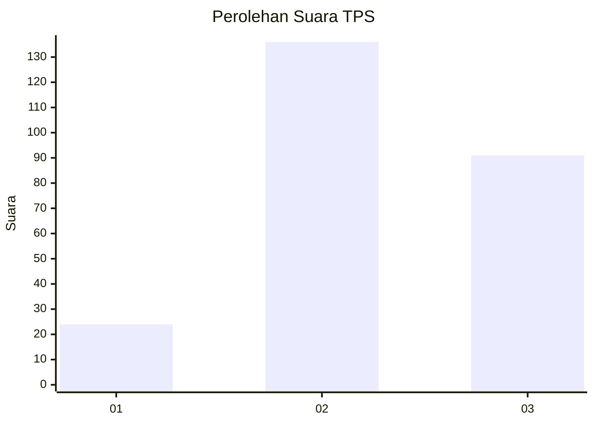
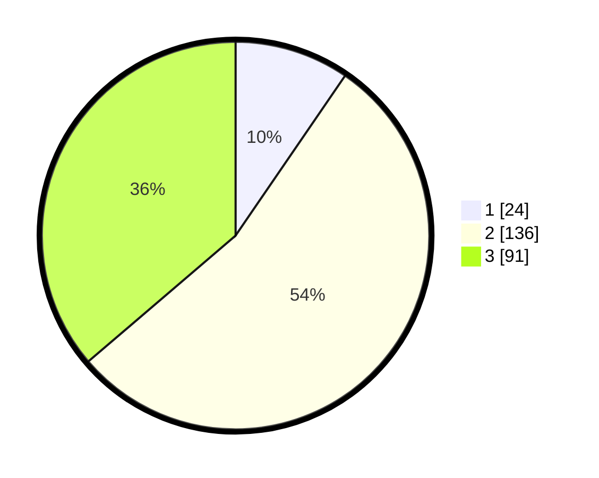

# Hasil

## Grafik

## Tabel

| No. | Nama Paslon    | Suara | Suara (raw) | Persentase |
|:--- |:-------------- | -----:| -----------:| ----------:|
| 1   | ANIES MUHAIMIN | 24    | [24][p-1]   | 9,56       |
| 2   | PRABOWO GIBRAN | 136   | [136][p-2]  | 54,18      |
| 3   | GANJAR MAHFUD  | 91    | [91][p-3]   | 36,25      |

[p-1]: https://github.com/gigit-pemilu/pemilu-2024-33-jawa-tengah/blob/main/pilpres/hitung-suara/sub/33-jawa-tengah/sub/02-banyumas/sub/17-cilongok/sub/2014-kalisari/sub/007-tps/sub/paslon-1.txt
[p-2]: https://github.com/gigit-pemilu/pemilu-2024-33-jawa-tengah/blob/main/pilpres/hitung-suara/sub/33-jawa-tengah/sub/02-banyumas/sub/17-cilongok/sub/2014-kalisari/sub/007-tps/sub/paslon-2.txt
[p-3]: https://github.com/gigit-pemilu/pemilu-2024-33-jawa-tengah/blob/main/pilpres/hitung-suara/sub/33-jawa-tengah/sub/02-banyumas/sub/17-cilongok/sub/2014-kalisari/sub/007-tps/sub/paslon-3.txt

## Foto C Plano

https://sirekap-obj-formc.kpu.go.id/e92b/pemilu/ppwp/33/02/17/20/14/3302172014007-20240214-220811--29d72f27-b7f4-4134-9171-e5c40e9fc5fc.jpg

https://sirekap-obj-formc.kpu.go.id/e92b/pemilu/ppwp/33/02/17/20/14/3302172014007-20240214-220937--41da6e9f-e03a-4c55-8a4a-accd183c833d.jpg

https://sirekap-obj-formc.kpu.go.id/e92b/pemilu/ppwp/33/02/17/20/14/3302172014007-20240214-221101--c9aa68b0-533b-4b78-9cb7-18c636b18f18.jpg

## Metadata

| Key        | Value               |
| ---------- | ------------------- |
| Time Stamp | 2024-02-15 03:06:03 |

