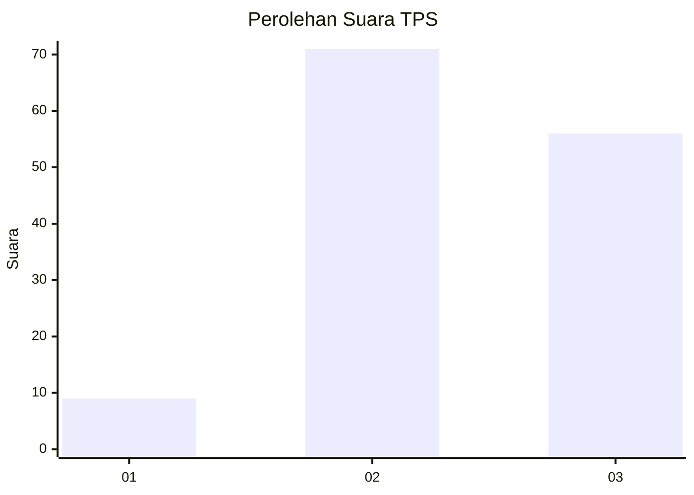
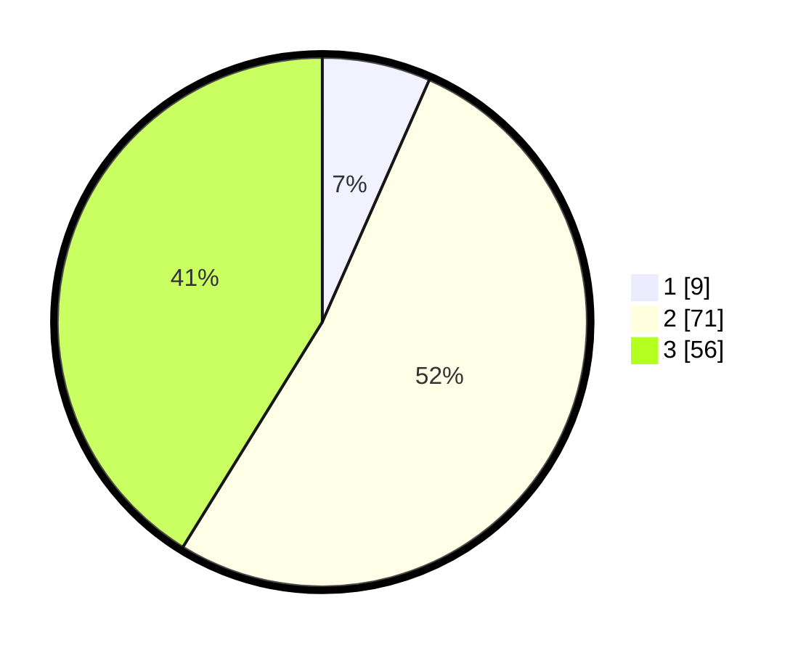

# Hasil

## Grafik

## Tabel

| No. | Nama Paslon    | Suara | Suara (raw) | Persentase |
|:--- |:-------------- | -----:| -----------:| ----------:|
| 1   | ANIES MUHAIMIN | 9     | [9][p-1]    | 6,62       |
| 2   | PRABOWO GIBRAN | 71    | [71][p-2]   | 52,21      |
| 3   | GANJAR MAHFUD  | 56    | [56][p-3]   | 41,18      |

[p-1]: https://github.com/gigit-pemilu/pemilu-2024-33-jawa-tengah/blob/main/pilpres/hitung-suara/sub/33-jawa-tengah/sub/02-banyumas/sub/17-cilongok/sub/2015-karangtengah/sub/022-tps/sub/paslon-1.txt
[p-2]: https://github.com/gigit-pemilu/pemilu-2024-33-jawa-tengah/blob/main/pilpres/hitung-suara/sub/33-jawa-tengah/sub/02-banyumas/sub/17-cilongok/sub/2015-karangtengah/sub/022-tps/sub/paslon-2.txt
[p-3]: https://github.com/gigit-pemilu/pemilu-2024-33-jawa-tengah/blob/main/pilpres/hitung-suara/sub/33-jawa-tengah/sub/02-banyumas/sub/17-cilongok/sub/2015-karangtengah/sub/022-tps/sub/paslon-3.txt

## Foto C Plano

https://sirekap-obj-formc.kpu.go.id/c482/pemilu/ppwp/33/02/17/20/15/3302172015022-20240215-071036--769fb40b-6638-4a61-8de2-9bba948fae82.jpg

https://sirekap-obj-formc.kpu.go.id/c482/pemilu/ppwp/33/02/17/20/15/3302172015022-20240215-071317--73aa8a9f-b723-49de-b393-4fa26d90a623.jpg

https://sirekap-obj-formc.kpu.go.id/c482/pemilu/ppwp/33/02/17/20/15/3302172015022-20240215-071514--69302b3f-f4a3-47ae-b82c-bcd824c6f385.jpg

## Metadata

| Key        | Value               |
| ---------- | ------------------- |
| Time Stamp | 2024-02-17 11:00:02 |

