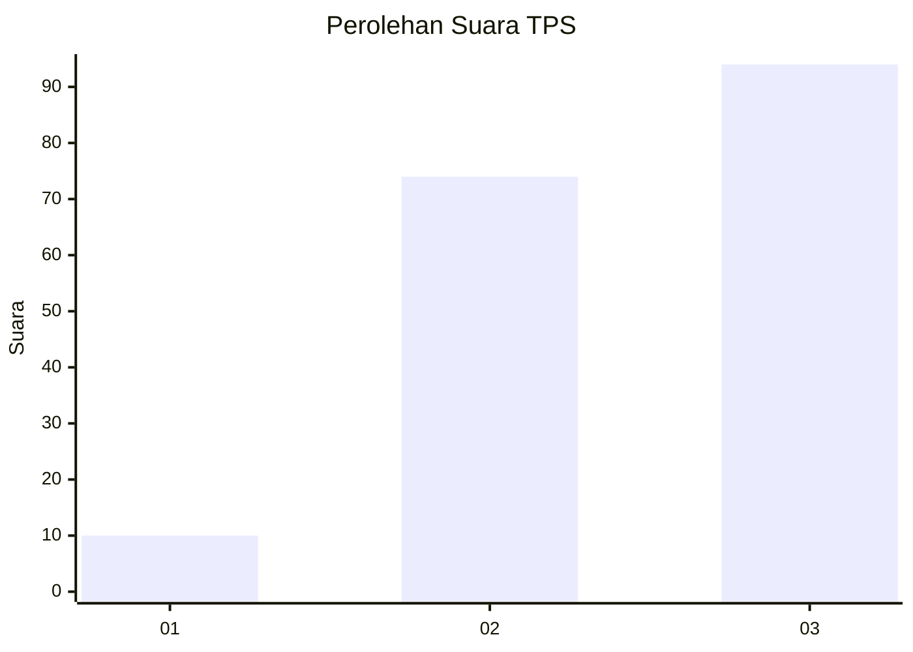
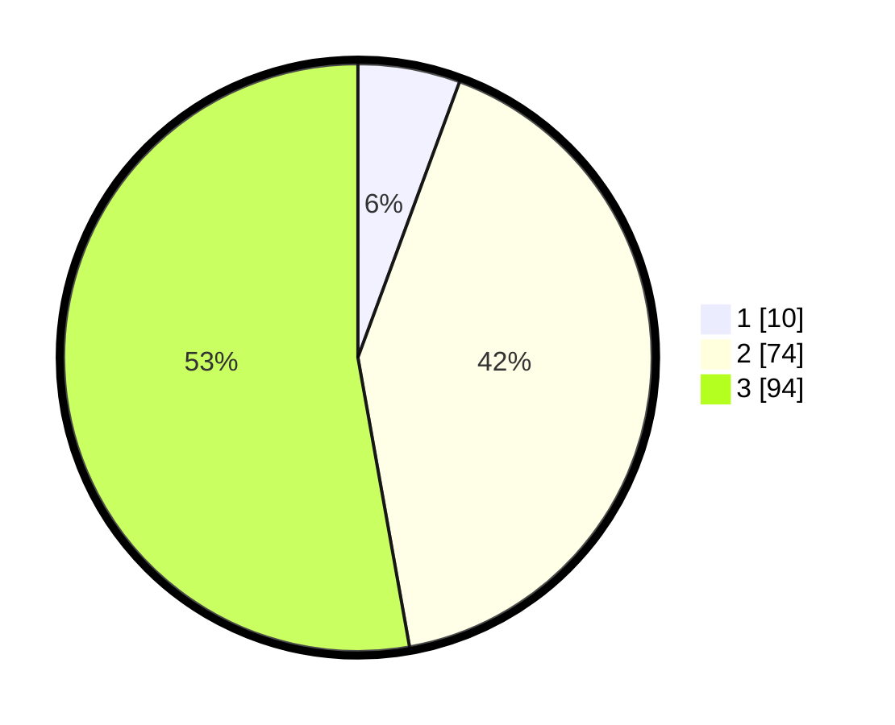

# Hasil

## Grafik

## Tabel

| No. | Nama Paslon    | Suara | Suara (raw) | Persentase |
|:--- |:-------------- | -----:| -----------:| ----------:|
| 1   | ANIES MUHAIMIN | 10    | [10][p-1]   | 5,62       |
| 2   | PRABOWO GIBRAN | 74    | [74][p-2]   | 41,57      |
| 3   | GANJAR MAHFUD  | 94    | [94][p-3]   | 52,81      |

[p-1]: https://github.com/gigit-pemilu/pemilu-2024-33-jawa-tengah/blob/main/pilpres/hitung-suara/sub/33-jawa-tengah/sub/02-banyumas/sub/17-cilongok/sub/2015-karangtengah/sub/023-tps/sub/paslon-1.txt
[p-2]: https://github.com/gigit-pemilu/pemilu-2024-33-jawa-tengah/blob/main/pilpres/hitung-suara/sub/33-jawa-tengah/sub/02-banyumas/sub/17-cilongok/sub/2015-karangtengah/sub/023-tps/sub/paslon-2.txt
[p-3]: https://github.com/gigit-pemilu/pemilu-2024-33-jawa-tengah/blob/main/pilpres/hitung-suara/sub/33-jawa-tengah/sub/02-banyumas/sub/17-cilongok/sub/2015-karangtengah/sub/023-tps/sub/paslon-3.txt

## Foto C Plano

https://sirekap-obj-formc.kpu.go.id/fa31/pemilu/ppwp/33/02/17/20/15/3302172015023-20240215-000253--e94a8aea-6d9d-49f2-b62d-9067ffe2f3a6.jpg

https://sirekap-obj-formc.kpu.go.id/fa31/pemilu/ppwp/33/02/17/20/15/3302172015023-20240215-004142--c8da101c-a945-4542-ad26-26807d6894e8.jpg

https://sirekap-obj-formc.kpu.go.id/fa31/pemilu/ppwp/33/02/17/20/15/3302172015023-20240215-000209--3c233130-6e5b-47d1-b2c0-3170f093f889.jpg

## Metadata

| Key        | Value               |
| ---------- | ------------------- |
| Time Stamp | 2024-02-16 01:00:27 |

