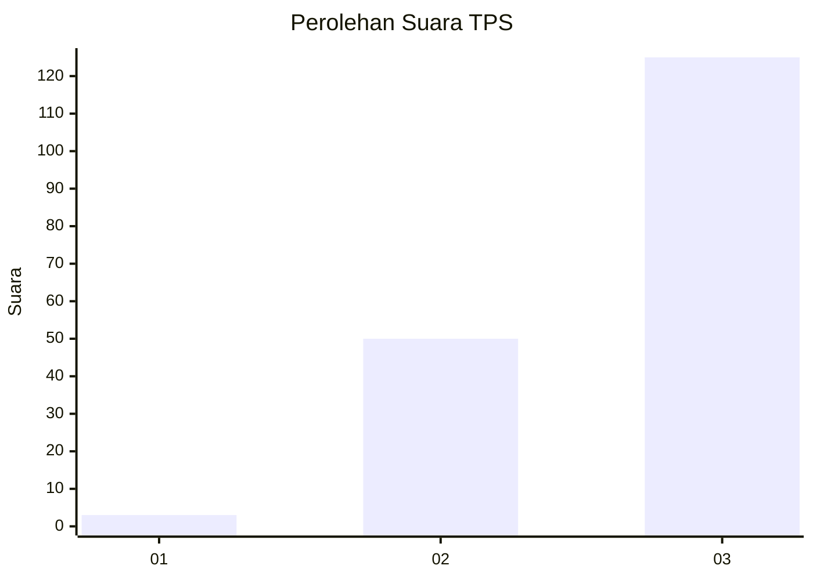
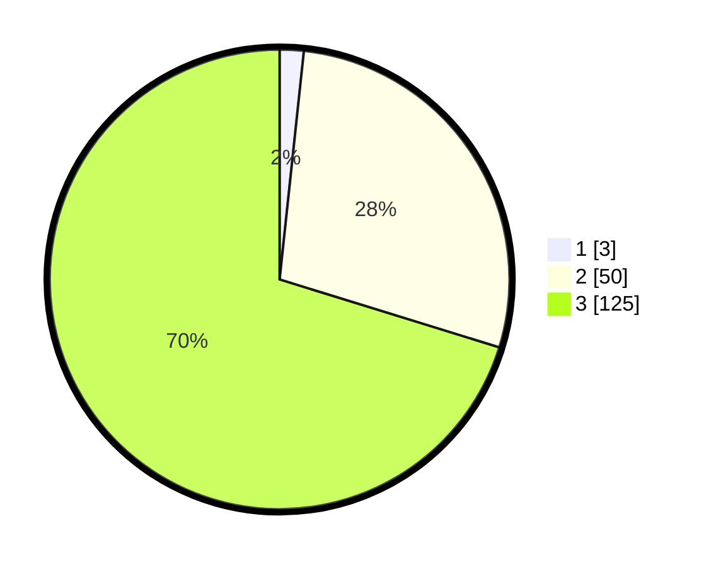

# Hasil

## Grafik

## Tabel

| No. | Nama Paslon    | Suara | Suara (raw) | Persentase |
|:--- |:-------------- | -----:| -----------:| ----------:|
| 1   | ANIES MUHAIMIN | 3     | [3][p-1]    | 1,69       |
| 2   | PRABOWO GIBRAN | 50    | [50][p-2]   | 28,09      |
| 3   | GANJAR MAHFUD  | 125   | [125][p-3]  | 70,22      |

[p-1]: https://github.com/gigit-pemilu/pemilu-2024/blob/main/pilpres/hitung-suara/sub/33-jawa-tengah/sub/02-banyumas/sub/17-cilongok/sub/2015-karangtengah/sub/025-tps/sub/paslon-1.txt
[p-2]: https://github.com/gigit-pemilu/pemilu-2024/blob/main/pilpres/hitung-suara/sub/33-jawa-tengah/sub/02-banyumas/sub/17-cilongok/sub/2015-karangtengah/sub/025-tps/sub/paslon-2.txt
[p-3]: https://github.com/gigit-pemilu/pemilu-2024/blob/main/pilpres/hitung-suara/sub/33-jawa-tengah/sub/02-banyumas/sub/17-cilongok/sub/2015-karangtengah/sub/025-tps/sub/paslon-3.txt

## Foto C Plano

https://sirekap-obj-formc.kpu.go.id/ba51/pemilu/ppwp/33/02/17/20/15/3302172015025-20240215-173127--cc4f2449-70df-4841-a6cf-ec574fc4fa8f.jpg

https://sirekap-obj-formc.kpu.go.id/ba51/pemilu/ppwp/33/02/17/20/15/3302172015025-20240215-173145--9a460609-efc8-4d8a-9068-e4a58746de15.jpg

https://sirekap-obj-formc.kpu.go.id/ba51/pemilu/ppwp/33/02/17/20/15/3302172015025-20240215-173155--2beccfa5-8ac9-4750-8357-067ea517a24e.jpg

## Metadata

| Key        | Value               |
| ---------- | ------------------- |
| Time Stamp | 2024-02-15 22:30:27 |

