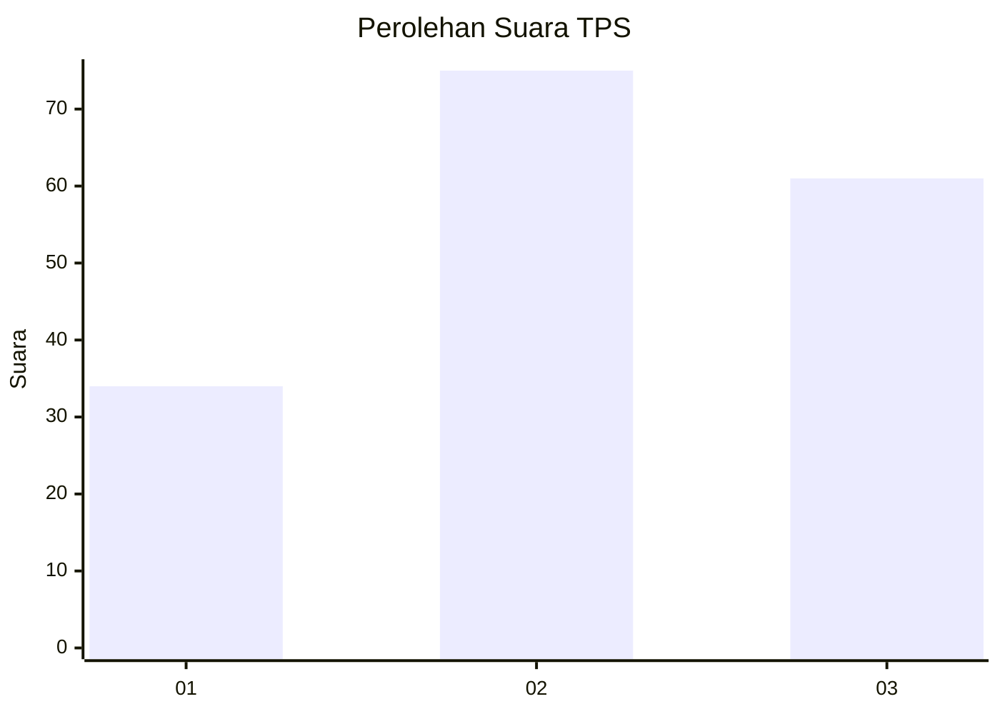
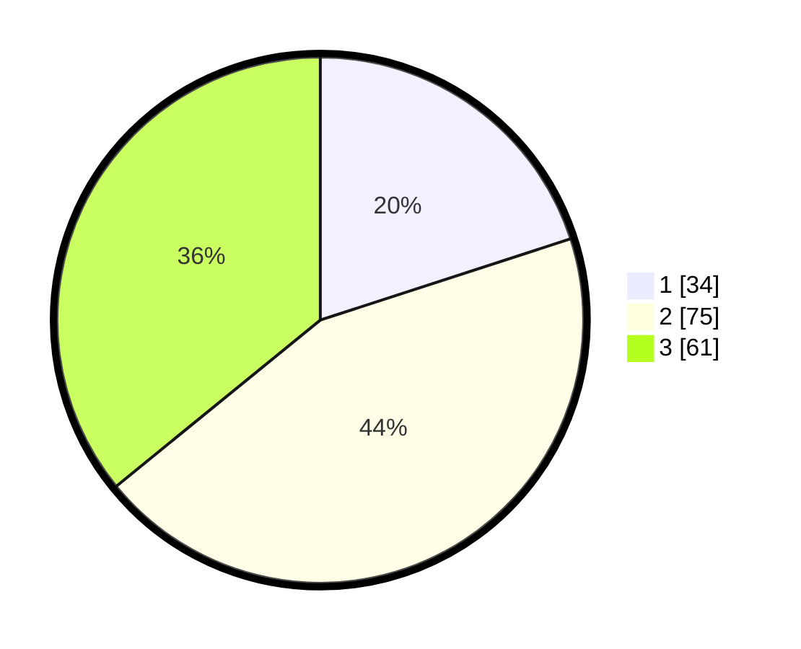

# Hasil

## Grafik

## Tabel

| No. | Nama Paslon    | Suara | Suara (raw) | Persentase |
|:--- |:-------------- | -----:| -----------:| ----------:|
| 1   | ANIES MUHAIMIN | 34    | [34][p-1]   | 20,00      |
| 2   | PRABOWO GIBRAN | 75    | [75][p-2]   | 44,12      |
| 3   | GANJAR MAHFUD  | 61    | [61][p-3]   | 35,88      |

[p-1]: https://github.com/gigit-pemilu/pemilu-2024/blob/main/pilpres/hitung-suara/sub/33-jawa-tengah/sub/02-banyumas/sub/17-cilongok/sub/2019-gununglurah/sub/016-tps/sub/paslon-1.txt
[p-2]: https://github.com/gigit-pemilu/pemilu-2024/blob/main/pilpres/hitung-suara/sub/33-jawa-tengah/sub/02-banyumas/sub/17-cilongok/sub/2019-gununglurah/sub/016-tps/sub/paslon-2.txt
[p-3]: https://github.com/gigit-pemilu/pemilu-2024/blob/main/pilpres/hitung-suara/sub/33-jawa-tengah/sub/02-banyumas/sub/17-cilongok/sub/2019-gununglurah/sub/016-tps/sub/paslon-3.txt

## Foto C Plano

https://sirekap-obj-formc.kpu.go.id/7892/pemilu/ppwp/33/02/17/20/19/3302172019016-20240214-205145--d8f9bef3-52ec-483d-8a1a-9fe7fbfaad82.jpg

https://sirekap-obj-formc.kpu.go.id/7892/pemilu/ppwp/33/02/17/20/19/3302172019016-20240214-205339--781af599-a137-4a3f-b656-3965127de867.jpg

https://sirekap-obj-formc.kpu.go.id/7892/pemilu/ppwp/33/02/17/20/19/3302172019016-20240214-205600--3282f2b4-ce08-43e3-96d3-4388416af1d6.jpg

## Metadata

| Key        | Value               |
| ---------- | ------------------- |
| Time Stamp | 2024-02-15 03:06:03 |

