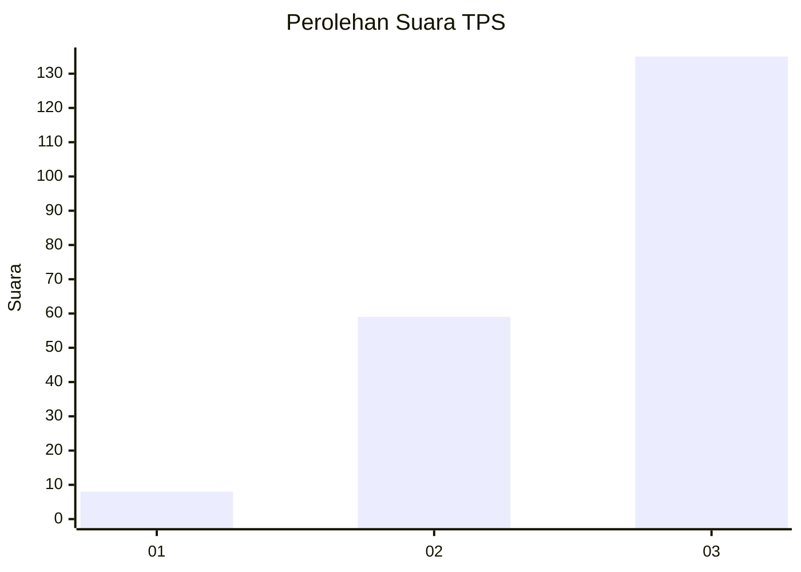
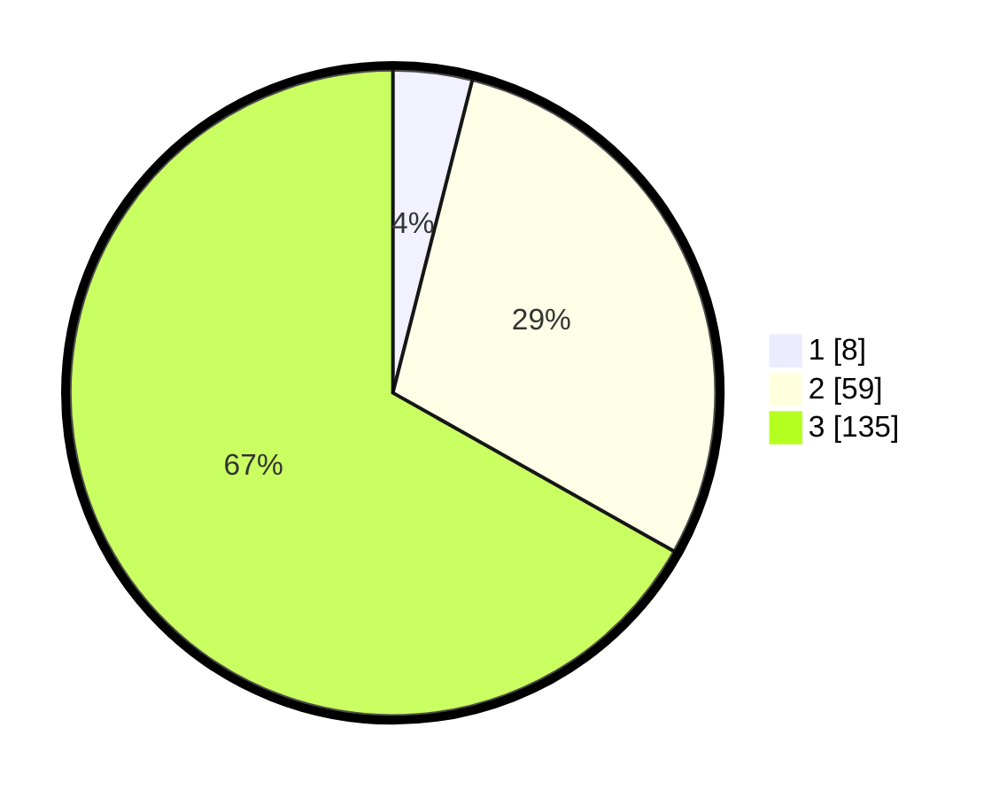

# Hasil

## Grafik

## Tabel

| No. | Nama Paslon    | Suara | Suara (raw) | Persentase |
|:--- |:-------------- | -----:| -----------:| ----------:|
| 1   | ANIES MUHAIMIN | 8     | [8][p-1]    | 3,96       |
| 2   | PRABOWO GIBRAN | 59    | [59][p-2]   | 29,21      |
| 3   | GANJAR MAHFUD  | 135   | [135][p-3]  | 66,83      |

[p-1]: https://github.com/gigit-pemilu/pemilu-2024-33-jawa-tengah/blob/main/pilpres/hitung-suara/sub/33-jawa-tengah/sub/02-banyumas/sub/17-cilongok/sub/2019-gununglurah/sub/021-tps/sub/paslon-1.txt
[p-2]: https://github.com/gigit-pemilu/pemilu-2024-33-jawa-tengah/blob/main/pilpres/hitung-suara/sub/33-jawa-tengah/sub/02-banyumas/sub/17-cilongok/sub/2019-gununglurah/sub/021-tps/sub/paslon-2.txt
[p-3]: https://github.com/gigit-pemilu/pemilu-2024-33-jawa-tengah/blob/main/pilpres/hitung-suara/sub/33-jawa-tengah/sub/02-banyumas/sub/17-cilongok/sub/2019-gununglurah/sub/021-tps/sub/paslon-3.txt

## Foto C Plano

https://sirekap-obj-formc.kpu.go.id/5f37/pemilu/ppwp/33/02/17/20/19/3302172019021-20240214-221851--a526adc0-c831-4077-a8ec-ad27db372179.jpg

https://sirekap-obj-formc.kpu.go.id/5f37/pemilu/ppwp/33/02/17/20/19/3302172019021-20240214-211323--46c0aeb8-a9b8-4d25-810c-fe681c4005b1.jpg

https://sirekap-obj-formc.kpu.go.id/5f37/pemilu/ppwp/33/02/17/20/19/3302172019021-20240214-211430--c1cd3a61-93f9-4728-921b-905a9dec40be.jpg

## Metadata

| Key        | Value               |
| ---------- | ------------------- |
| Time Stamp | 2024-02-17 11:00:02 |

