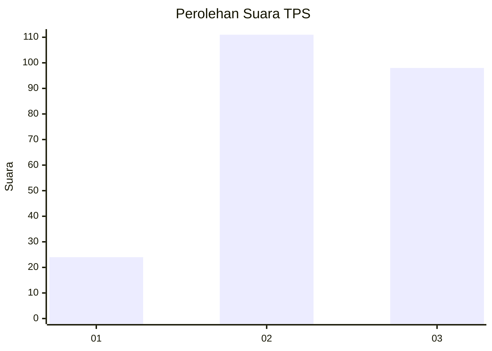
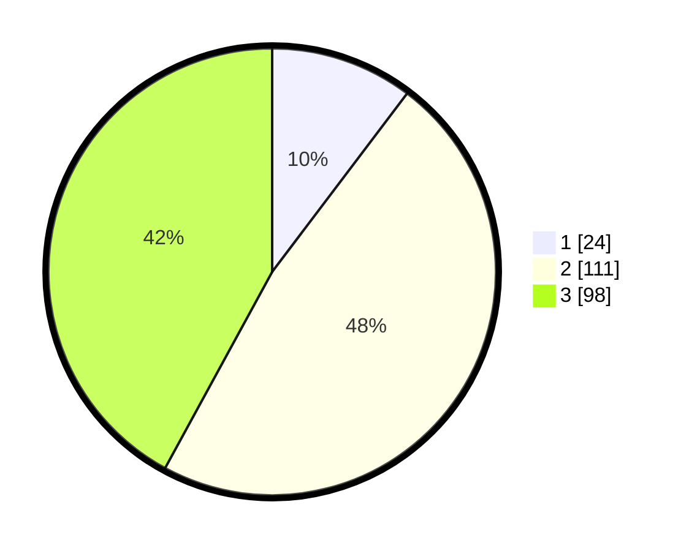

# Hasil

## Grafik

## Tabel

| No. | Nama Paslon    | Suara | Suara (raw) | Persentase |
|:--- |:-------------- | -----:| -----------:| ----------:|
| 1   | ANIES MUHAIMIN | 24    | [24][p-1]   | 10,30      |
| 2   | PRABOWO GIBRAN | 111   | [111][p-2]  | 47,64      |
| 3   | GANJAR MAHFUD  | 98    | [98][p-3]   | 42,06      |

[p-1]: https://github.com/gigit-pemilu/pemilu-2024/blob/main/pilpres/hitung-suara/sub/33-jawa-tengah/sub/02-banyumas/sub/18-karanglewas/sub/2001-kediri/sub/001-tps/sub/paslon-1.txt
[p-2]: https://github.com/gigit-pemilu/pemilu-2024/blob/main/pilpres/hitung-suara/sub/33-jawa-tengah/sub/02-banyumas/sub/18-karanglewas/sub/2001-kediri/sub/001-tps/sub/paslon-2.txt
[p-3]: https://github.com/gigit-pemilu/pemilu-2024/blob/main/pilpres/hitung-suara/sub/33-jawa-tengah/sub/02-banyumas/sub/18-karanglewas/sub/2001-kediri/sub/001-tps/sub/paslon-3.txt

## Foto C Plano

https://sirekap-obj-formc.kpu.go.id/ae40/pemilu/ppwp/33/02/18/20/01/3302182001001-20240214-230846--2ce62dc9-138b-41b1-95b9-7d262c38c9cb.jpg

https://sirekap-obj-formc.kpu.go.id/ae40/pemilu/ppwp/33/02/18/20/01/3302182001001-20240214-231933--339ad012-1d43-4d27-bd52-11274bfda85e.jpg

https://sirekap-obj-formc.kpu.go.id/ae40/pemilu/ppwp/33/02/18/20/01/3302182001001-20240214-232232--755697b3-5b24-4018-a175-1195e8082c5d.jpg

## Metadata

| Key        | Value               |
| ---------- | ------------------- |
| Time Stamp | 2024-02-17 10:00:02 |

