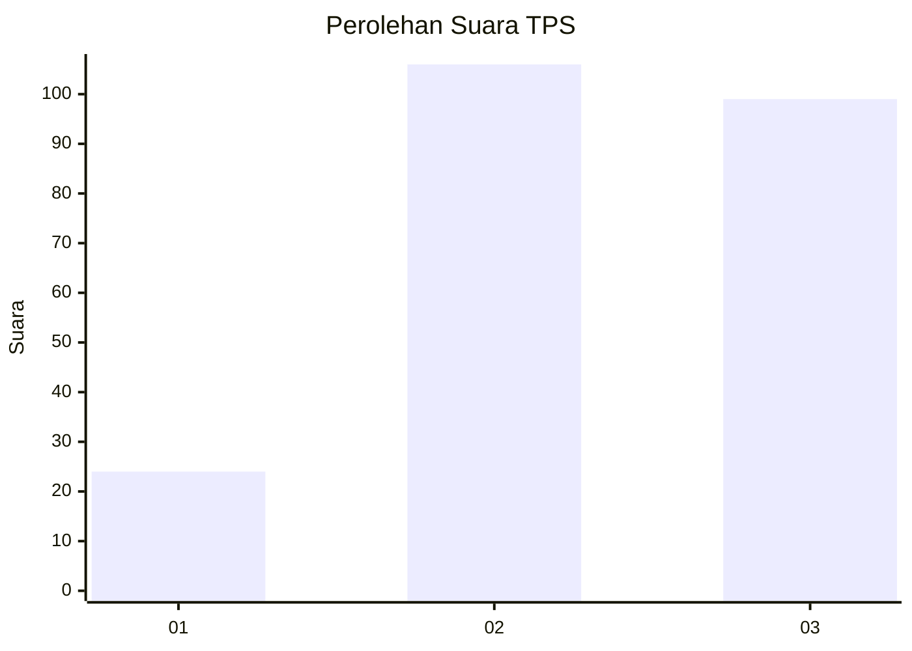
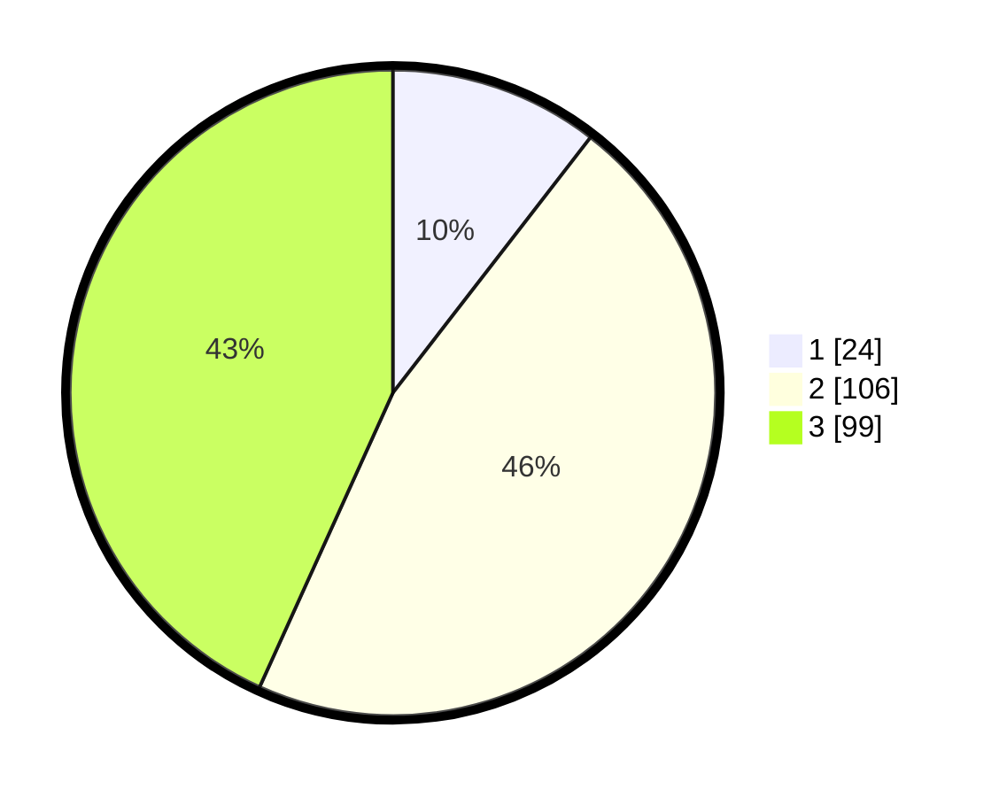

# Hasil

## Grafik

## Tabel

| No. | Nama Paslon    | Suara | Suara (raw) | Persentase |
|:--- |:-------------- | -----:| -----------:| ----------:|
| 1   | ANIES MUHAIMIN | 24    | [24][p-1]   | 10,48      |
| 2   | PRABOWO GIBRAN | 106   | [106][p-2]  | 46,29      |
| 3   | GANJAR MAHFUD  | 99    | [99][p-3]   | 43,23      |

[p-1]: https://github.com/gigit-pemilu/pemilu-2024-33-jawa-tengah/blob/main/pilpres/hitung-suara/sub/33-jawa-tengah/sub/02-banyumas/sub/18-karanglewas/sub/2001-kediri/sub/002-tps/sub/paslon-1.txt
[p-2]: https://github.com/gigit-pemilu/pemilu-2024-33-jawa-tengah/blob/main/pilpres/hitung-suara/sub/33-jawa-tengah/sub/02-banyumas/sub/18-karanglewas/sub/2001-kediri/sub/002-tps/sub/paslon-2.txt
[p-3]: https://github.com/gigit-pemilu/pemilu-2024-33-jawa-tengah/blob/main/pilpres/hitung-suara/sub/33-jawa-tengah/sub/02-banyumas/sub/18-karanglewas/sub/2001-kediri/sub/002-tps/sub/paslon-3.txt

## Foto C Plano

https://sirekap-obj-formc.kpu.go.id/6d86/pemilu/ppwp/33/02/18/20/01/3302182001002-20240214-202124--fa2eeb3f-c798-455a-8fcd-f67089fe4eee.jpg

https://sirekap-obj-formc.kpu.go.id/6d86/pemilu/ppwp/33/02/18/20/01/3302182001002-20240214-202137--5258a57b-4098-4fe0-9e3e-a2f21eec3ead.jpg

https://sirekap-obj-formc.kpu.go.id/6d86/pemilu/ppwp/33/02/18/20/01/3302182001002-20240214-202149--50f77f2f-95e2-4c98-91e0-c3053a8531d4.jpg

## Metadata

| Key        | Value               |
| ---------- | ------------------- |
| Time Stamp | 2024-02-17 10:00:02 |

