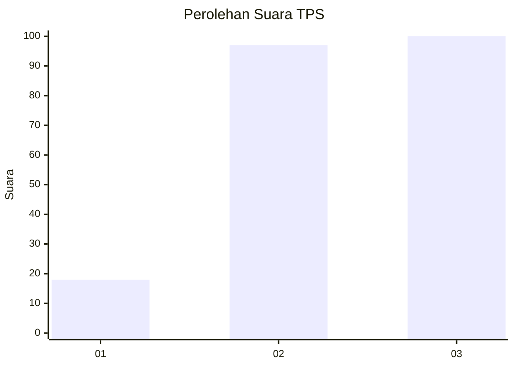
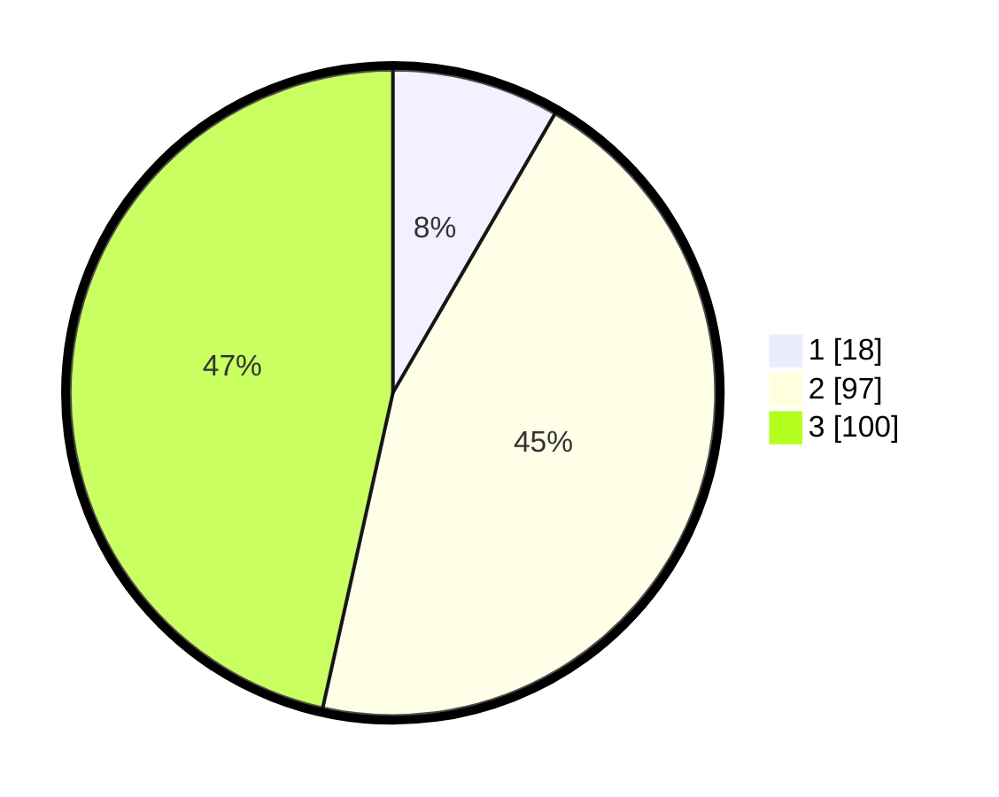

# Hasil

## Grafik

## Tabel

| No. | Nama Paslon    | Suara | Suara (raw) | Persentase |
|:--- |:-------------- | -----:| -----------:| ----------:|
| 1   | ANIES MUHAIMIN | 18    | [18][p-1]   | 8,37       |
| 2   | PRABOWO GIBRAN | 97    | [97][p-2]   | 45,12      |
| 3   | GANJAR MAHFUD  | 100   | [100][p-3]  | 46,51      |

[p-1]: https://github.com/gigit-pemilu/pemilu-2024-33-jawa-tengah/blob/main/pilpres/hitung-suara/sub/33-jawa-tengah/sub/02-banyumas/sub/18-karanglewas/sub/2001-kediri/sub/005-tps/sub/paslon-1.txt
[p-2]: https://github.com/gigit-pemilu/pemilu-2024-33-jawa-tengah/blob/main/pilpres/hitung-suara/sub/33-jawa-tengah/sub/02-banyumas/sub/18-karanglewas/sub/2001-kediri/sub/005-tps/sub/paslon-2.txt
[p-3]: https://github.com/gigit-pemilu/pemilu-2024-33-jawa-tengah/blob/main/pilpres/hitung-suara/sub/33-jawa-tengah/sub/02-banyumas/sub/18-karanglewas/sub/2001-kediri/sub/005-tps/sub/paslon-3.txt

## Foto C Plano

https://sirekap-obj-formc.kpu.go.id/3a5c/pemilu/ppwp/33/02/18/20/01/3302182001005-20240214-203126--beab9915-e69a-4fd2-9dec-09286b059ffe.jpg

https://sirekap-obj-formc.kpu.go.id/3a5c/pemilu/ppwp/33/02/18/20/01/3302182001005-20240214-203521--91bec7be-3561-4a1e-82e8-72695a8d380a.jpg

https://sirekap-obj-formc.kpu.go.id/3a5c/pemilu/ppwp/33/02/18/20/01/3302182001005-20240214-231157--eaa2e2ab-3641-4ac3-8b6f-bec05a2b34a2.jpg

## Metadata

| Key        | Value               |
| ---------- | ------------------- |
| Time Stamp | 2024-02-16 23:00:00 |

