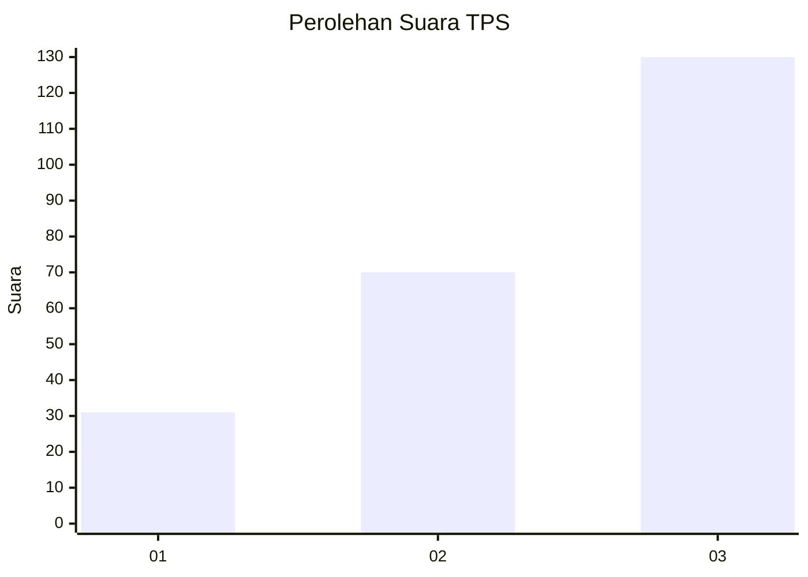
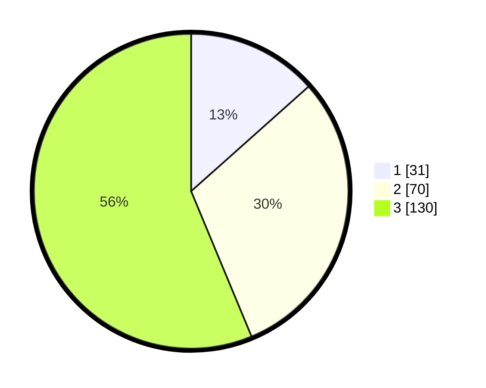

# Hasil

## Grafik

## Tabel

| No. | Nama Paslon    | Suara | Suara (raw) | Persentase |
|:--- |:-------------- | -----:| -----------:| ----------:|
| 1   | ANIES MUHAIMIN | 31    | [31][p-1]   | 13,42      |
| 2   | PRABOWO GIBRAN | 70    | [70][p-2]   | 30,30      |
| 3   | GANJAR MAHFUD  | 130   | [130][p-3]  | 56,28      |

[p-1]: https://github.com/gigit-pemilu/pemilu-2024-33-jawa-tengah/blob/main/pilpres/hitung-suara/sub/33-jawa-tengah/sub/02-banyumas/sub/18-karanglewas/sub/2005-karangkemiri/sub/002-tps/sub/paslon-1.txt
[p-2]: https://github.com/gigit-pemilu/pemilu-2024-33-jawa-tengah/blob/main/pilpres/hitung-suara/sub/33-jawa-tengah/sub/02-banyumas/sub/18-karanglewas/sub/2005-karangkemiri/sub/002-tps/sub/paslon-2.txt
[p-3]: https://github.com/gigit-pemilu/pemilu-2024-33-jawa-tengah/blob/main/pilpres/hitung-suara/sub/33-jawa-tengah/sub/02-banyumas/sub/18-karanglewas/sub/2005-karangkemiri/sub/002-tps/sub/paslon-3.txt

## Foto C Plano

https://sirekap-obj-formc.kpu.go.id/7d3b/pemilu/ppwp/33/02/18/20/05/3302182005002-20240218-144458--0561e618-5c1d-4f77-981f-ea752c416d1d.jpg

https://sirekap-obj-formc.kpu.go.id/7d3b/pemilu/ppwp/33/02/18/20/05/3302182005002-20240218-144530--8b757ef2-f364-4fc3-a8bc-14c12aa733c1.jpg

https://sirekap-obj-formc.kpu.go.id/7d3b/pemilu/ppwp/33/02/18/20/05/3302182005002-20240218-144610--50c85d4a-4810-4a76-97ea-1df7c695969d.jpg

## Metadata

| Key        | Value               |
| ---------- | ------------------- |
| Time Stamp | 2024-02-25 18:00:00 |

