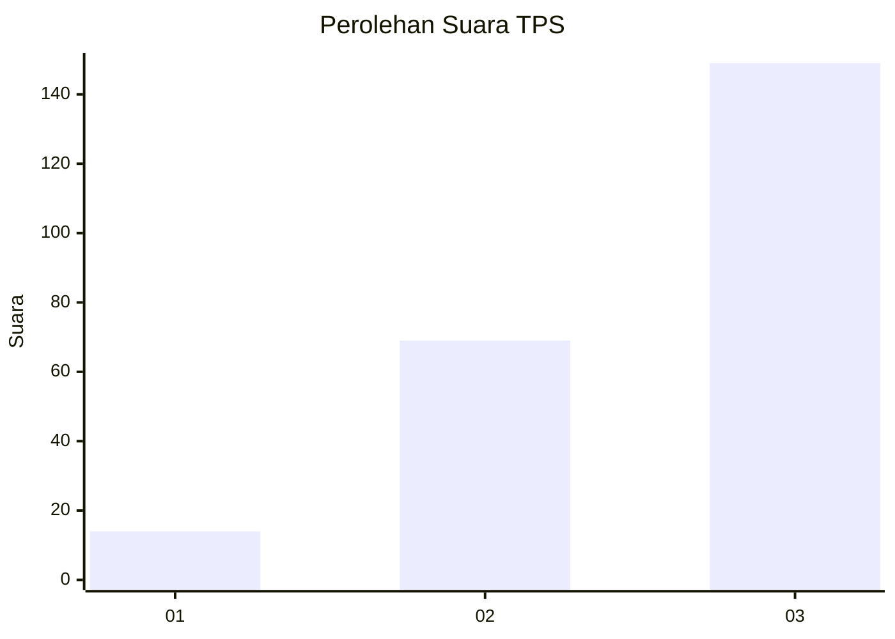
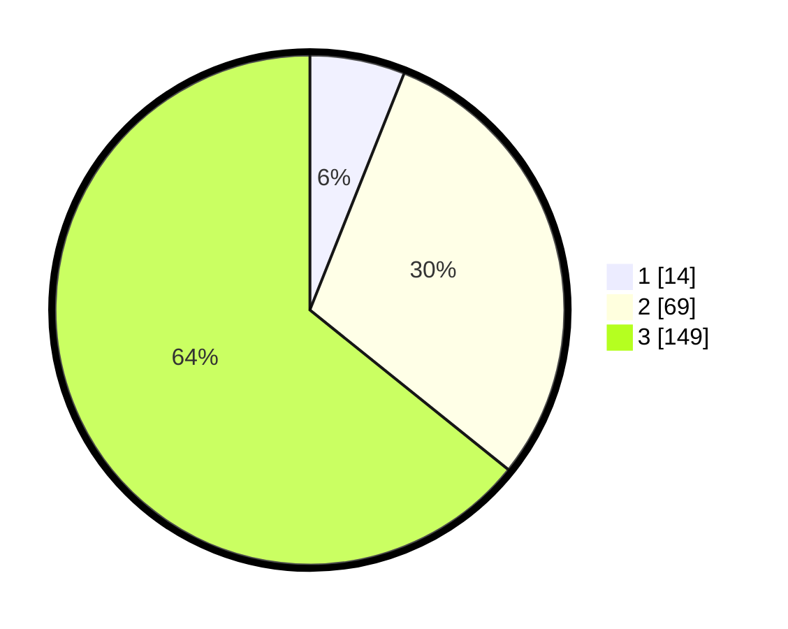

# Hasil

## Grafik

## Tabel

| No. | Nama Paslon    | Suara | Suara (raw) | Persentase |
|:--- |:-------------- | -----:| -----------:| ----------:|
| 1   | ANIES MUHAIMIN | 14    | [14][p-1]   | 6,03       |
| 2   | PRABOWO GIBRAN | 69    | [69][p-2]   | 29,74      |
| 3   | GANJAR MAHFUD  | 149   | [149][p-3]  | 64,22      |

[p-1]: https://github.com/gigit-pemilu/pemilu-2024-33-jawa-tengah/blob/main/pilpres/hitung-suara/sub/33-jawa-tengah/sub/02-banyumas/sub/18-karanglewas/sub/2005-karangkemiri/sub/005-tps/sub/paslon-1.txt
[p-2]: https://github.com/gigit-pemilu/pemilu-2024-33-jawa-tengah/blob/main/pilpres/hitung-suara/sub/33-jawa-tengah/sub/02-banyumas/sub/18-karanglewas/sub/2005-karangkemiri/sub/005-tps/sub/paslon-2.txt
[p-3]: https://github.com/gigit-pemilu/pemilu-2024-33-jawa-tengah/blob/main/pilpres/hitung-suara/sub/33-jawa-tengah/sub/02-banyumas/sub/18-karanglewas/sub/2005-karangkemiri/sub/005-tps/sub/paslon-3.txt

## Foto C Plano

https://sirekap-obj-formc.kpu.go.id/0018/pemilu/ppwp/33/02/18/20/05/3302182005005-20240215-025925--2f2eed7d-1ccd-4eba-83fc-e6210633cd9e.jpg

https://sirekap-obj-formc.kpu.go.id/0018/pemilu/ppwp/33/02/18/20/05/3302182005005-20240215-031216--771772e8-fcfa-4f3c-bc36-202c8dcad8a8.jpg

https://sirekap-obj-formc.kpu.go.id/0018/pemilu/ppwp/33/02/18/20/05/3302182005005-20240215-031502--f229e23a-ba2a-41cf-b7fd-9c06030a5d15.jpg

## Metadata

| Key        | Value               |
| ---------- | ------------------- |
| Time Stamp | 2024-02-15 17:30:25 |

