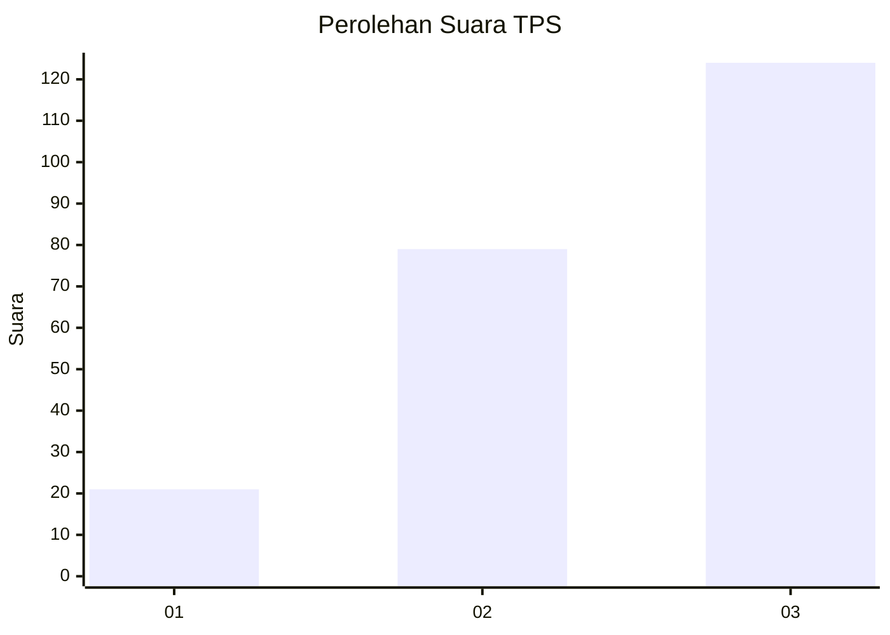
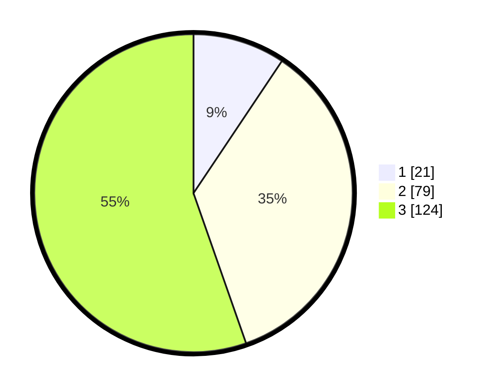

# Hasil

## Grafik

## Tabel

| No. | Nama Paslon    | Suara | Suara (raw) | Persentase |
|:--- |:-------------- | -----:| -----------:| ----------:|
| 1   | ANIES MUHAIMIN | 21    | [21][p-1]   | 9,38       |
| 2   | PRABOWO GIBRAN | 79    | [79][p-2]   | 35,27      |
| 3   | GANJAR MAHFUD  | 124   | [124][p-3]  | 55,36      |

[p-1]: https://github.com/gigit-pemilu/pemilu-2024/blob/main/pilpres/hitung-suara/sub/33-jawa-tengah/sub/02-banyumas/sub/18-karanglewas/sub/2005-karangkemiri/sub/012-tps/sub/paslon-1.txt
[p-2]: https://github.com/gigit-pemilu/pemilu-2024/blob/main/pilpres/hitung-suara/sub/33-jawa-tengah/sub/02-banyumas/sub/18-karanglewas/sub/2005-karangkemiri/sub/012-tps/sub/paslon-2.txt
[p-3]: https://github.com/gigit-pemilu/pemilu-2024/blob/main/pilpres/hitung-suara/sub/33-jawa-tengah/sub/02-banyumas/sub/18-karanglewas/sub/2005-karangkemiri/sub/012-tps/sub/paslon-3.txt

## Foto C Plano

https://sirekap-obj-formc.kpu.go.id/5b4b/pemilu/ppwp/33/02/18/20/05/3302182005012-20240218-162921--02327ea0-1b52-483e-9c94-6806e1c486c2.jpg

https://sirekap-obj-formc.kpu.go.id/5b4b/pemilu/ppwp/33/02/18/20/05/3302182005012-20240218-163025--85d02225-bd7d-4643-b1c4-5f9a5f3a6d8e.jpg

https://sirekap-obj-formc.kpu.go.id/5b4b/pemilu/ppwp/33/02/18/20/05/3302182005012-20240218-163114--a76f64aa-8d15-4a31-bf33-897accbf3cb8.jpg

## Metadata

| Key        | Value               |
| ---------- | ------------------- |
| Time Stamp | 2024-02-25 13:00:00 |

