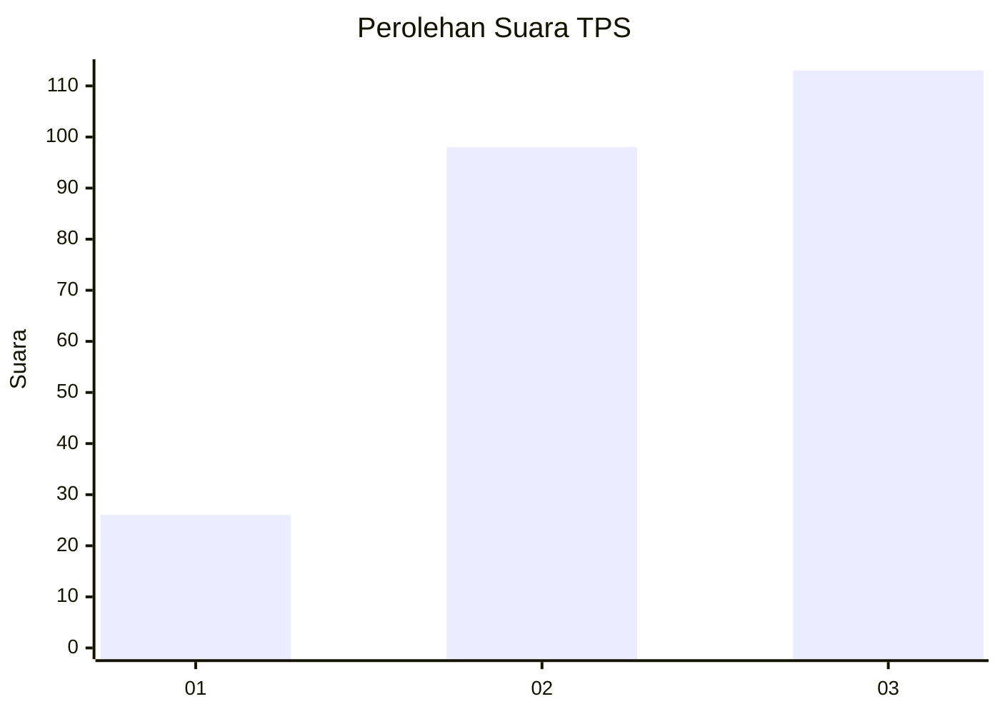
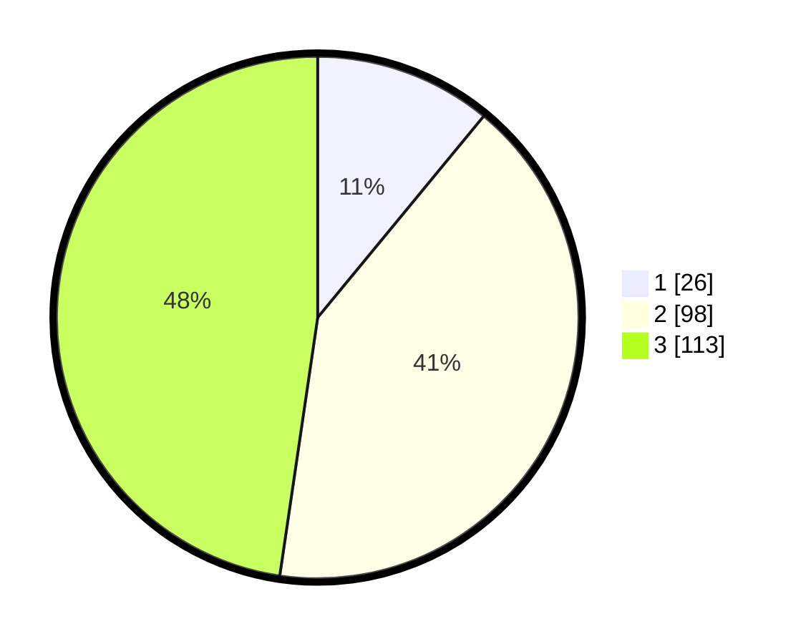

# Hasil

## Grafik

## Tabel

| No. | Nama Paslon    | Suara | Suara (raw) | Persentase |
|:--- |:-------------- | -----:| -----------:| ----------:|
| 1   | ANIES MUHAIMIN | 26    | [26][p-1]   | 10,97      |
| 2   | PRABOWO GIBRAN | 98    | [98][p-2]   | 41,35      |
| 3   | GANJAR MAHFUD  | 113   | [113][p-3]  | 47,68      |

[p-1]: https://github.com/gigit-pemilu/pemilu-2024/blob/main/pilpres/hitung-suara/sub/33-jawa-tengah/sub/02-banyumas/sub/18-karanglewas/sub/2007-pasir-lor/sub/003-tps/sub/paslon-1.txt
[p-2]: https://github.com/gigit-pemilu/pemilu-2024/blob/main/pilpres/hitung-suara/sub/33-jawa-tengah/sub/02-banyumas/sub/18-karanglewas/sub/2007-pasir-lor/sub/003-tps/sub/paslon-2.txt
[p-3]: https://github.com/gigit-pemilu/pemilu-2024/blob/main/pilpres/hitung-suara/sub/33-jawa-tengah/sub/02-banyumas/sub/18-karanglewas/sub/2007-pasir-lor/sub/003-tps/sub/paslon-3.txt

## Foto C Plano

https://sirekap-obj-formc.kpu.go.id/c624/pemilu/ppwp/33/02/18/20/07/3302182007003-20240217-211730--abf410a8-5b34-4a7a-b095-fb2567bc6828.jpg

https://sirekap-obj-formc.kpu.go.id/c624/pemilu/ppwp/33/02/18/20/07/3302182007003-20240217-210413--75cb0427-3cd6-4920-a057-33c81d60e9e2.jpg

https://sirekap-obj-formc.kpu.go.id/c624/pemilu/ppwp/33/02/18/20/07/3302182007003-20240217-210544--053e8b68-7879-467f-afa8-c79575977500.jpg

## Metadata

| Key        | Value               |
| ---------- | ------------------- |
| Time Stamp | 2024-02-25 15:00:00 |

