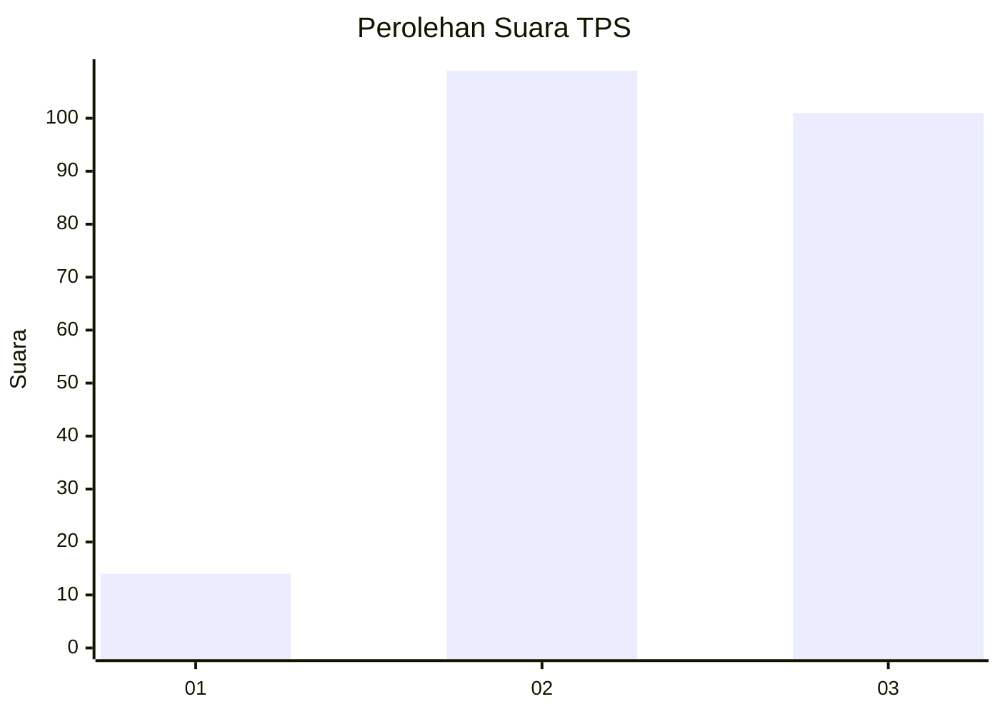
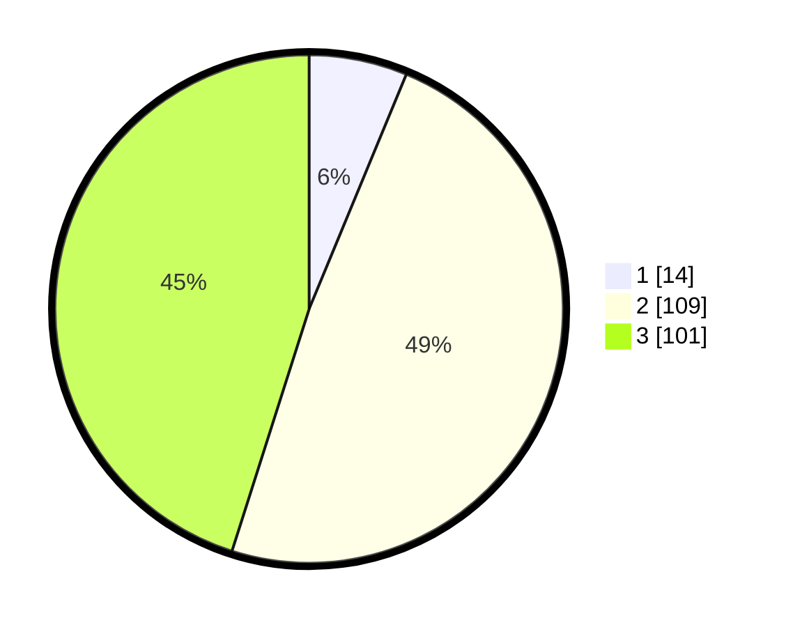

# Hasil

## Grafik

## Tabel

| No. | Nama Paslon    | Suara | Suara (raw) | Persentase |
|:--- |:-------------- | -----:| -----------:| ----------:|
| 1   | ANIES MUHAIMIN | 14    | [14][p-1]   | 6,25       |
| 2   | PRABOWO GIBRAN | 109   | [109][p-2]  | 48,66      |
| 3   | GANJAR MAHFUD  | 101   | [101][p-3]  | 45,09      |

[p-1]: https://github.com/gigit-pemilu/pemilu-2024/blob/main/pilpres/hitung-suara/sub/33-jawa-tengah/sub/02-banyumas/sub/18-karanglewas/sub/2009-jipang/sub/001-tps/sub/paslon-1.txt
[p-2]: https://github.com/gigit-pemilu/pemilu-2024/blob/main/pilpres/hitung-suara/sub/33-jawa-tengah/sub/02-banyumas/sub/18-karanglewas/sub/2009-jipang/sub/001-tps/sub/paslon-2.txt
[p-3]: https://github.com/gigit-pemilu/pemilu-2024/blob/main/pilpres/hitung-suara/sub/33-jawa-tengah/sub/02-banyumas/sub/18-karanglewas/sub/2009-jipang/sub/001-tps/sub/paslon-3.txt

## Foto C Plano

https://sirekap-obj-formc.kpu.go.id/8fe4/pemilu/ppwp/33/02/18/20/09/3302182009001-20240215-004359--f4cc0d04-593d-4f1c-aed8-f70a409998aa.jpg

https://sirekap-obj-formc.kpu.go.id/8fe4/pemilu/ppwp/33/02/18/20/09/3302182009001-20240214-213503--6f9a5d9f-a870-42fa-80fc-3e7b311d27e2.jpg

https://sirekap-obj-formc.kpu.go.id/8fe4/pemilu/ppwp/33/02/18/20/09/3302182009001-20240215-002033--009159ae-0cd0-492c-8d28-58872ccf2eef.jpg

## Metadata

| Key        | Value               |
| ---------- | ------------------- |
| Time Stamp | 2024-02-16 23:30:00 |

