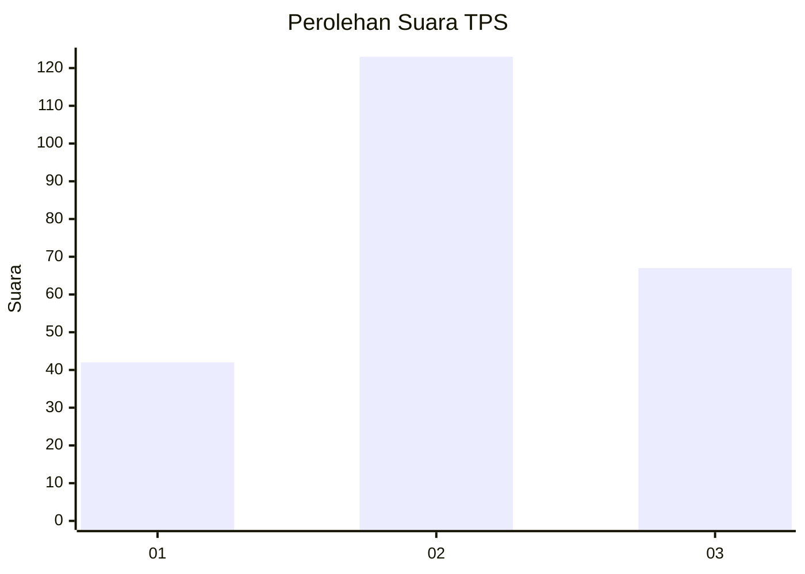
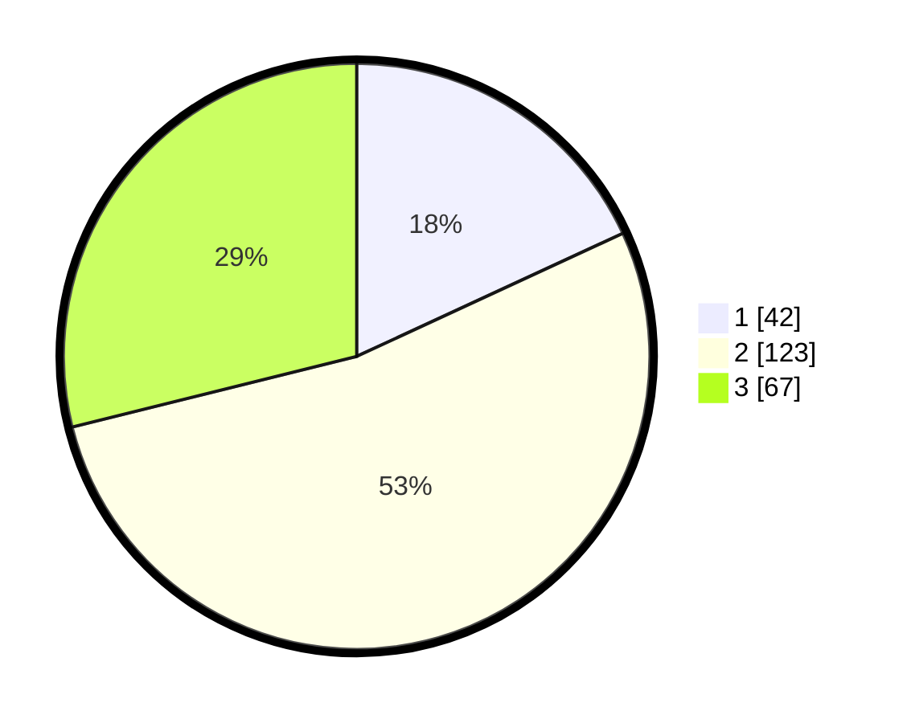

# Hasil

## Grafik

## Tabel

| No. | Nama Paslon    | Suara | Suara (raw) | Persentase |
|:--- |:-------------- | -----:| -----------:| ----------:|
| 1   | ANIES MUHAIMIN | 42    | [42][p-1]   | 18,10      |
| 2   | PRABOWO GIBRAN | 123   | [123][p-2]  | 53,02      |
| 3   | GANJAR MAHFUD  | 67    | [67][p-3]   | 28,88      |

[p-1]: https://github.com/gigit-pemilu/pemilu-2024/blob/main/pilpres/hitung-suara/sub/33-jawa-tengah/sub/02-banyumas/sub/18-karanglewas/sub/2010-karanggude-kulon/sub/002-tps/sub/paslon-1.txt
[p-2]: https://github.com/gigit-pemilu/pemilu-2024/blob/main/pilpres/hitung-suara/sub/33-jawa-tengah/sub/02-banyumas/sub/18-karanglewas/sub/2010-karanggude-kulon/sub/002-tps/sub/paslon-2.txt
[p-3]: https://github.com/gigit-pemilu/pemilu-2024/blob/main/pilpres/hitung-suara/sub/33-jawa-tengah/sub/02-banyumas/sub/18-karanglewas/sub/2010-karanggude-kulon/sub/002-tps/sub/paslon-3.txt

## Foto C Plano

https://sirekap-obj-formc.kpu.go.id/c1aa/pemilu/ppwp/33/02/18/20/10/3302182010002-20240215-042841--fb01dfe6-58df-4de0-9e79-3e3e29beacf8.jpg

https://sirekap-obj-formc.kpu.go.id/c1aa/pemilu/ppwp/33/02/18/20/10/3302182010002-20240215-042921--8c1b40b2-fe06-44ef-9aa8-a3fac756625b.jpg

https://sirekap-obj-formc.kpu.go.id/c1aa/pemilu/ppwp/33/02/18/20/10/3302182010002-20240215-043000--c1f0c05d-70a2-4468-9b5f-426da11e7376.jpg

## Metadata

| Key        | Value               |
| ---------- | ------------------- |
| Time Stamp | 2024-02-16 23:30:00 |

