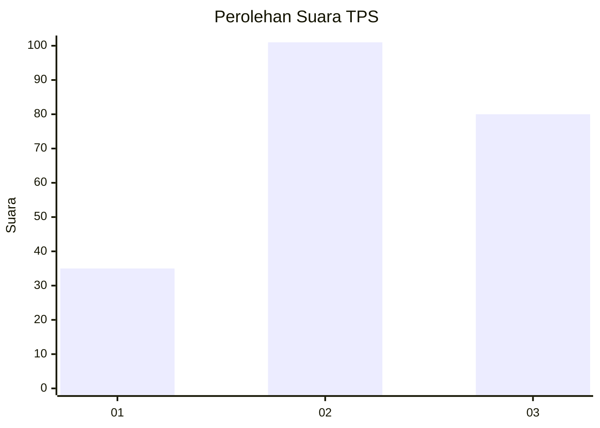
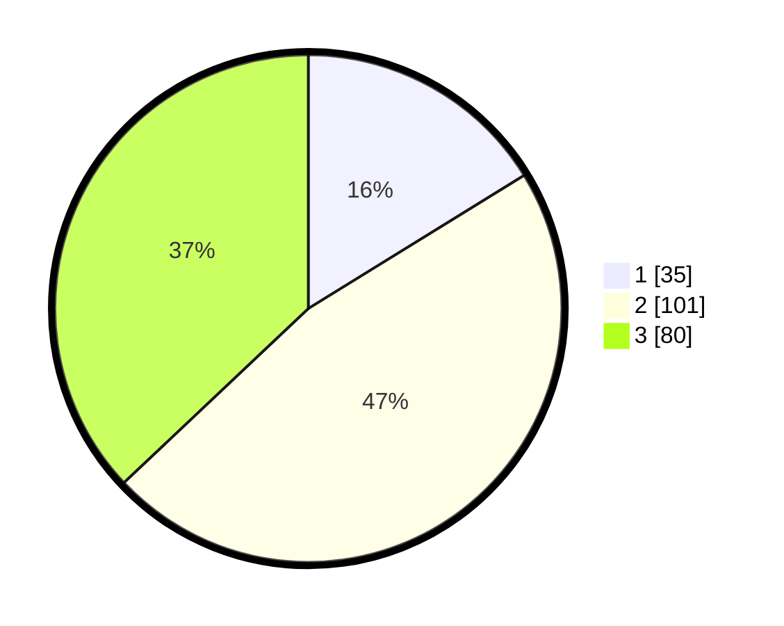

# Hasil

## Grafik

## Tabel

| No. | Nama Paslon    | Suara | Suara (raw) | Persentase |
|:--- |:-------------- | -----:| -----------:| ----------:|
| 1   | ANIES MUHAIMIN | 35    | [35][p-1]   | 16,20      |
| 2   | PRABOWO GIBRAN | 101   | [101][p-2]  | 46,76      |
| 3   | GANJAR MAHFUD  | 80    | [80][p-3]   | 37,04      |

[p-1]: https://github.com/gigit-pemilu/pemilu-2024/blob/main/pilpres/hitung-suara/sub/33-jawa-tengah/sub/02-banyumas/sub/18-karanglewas/sub/2010-karanggude-kulon/sub/003-tps/sub/paslon-1.txt
[p-2]: https://github.com/gigit-pemilu/pemilu-2024/blob/main/pilpres/hitung-suara/sub/33-jawa-tengah/sub/02-banyumas/sub/18-karanglewas/sub/2010-karanggude-kulon/sub/003-tps/sub/paslon-2.txt
[p-3]: https://github.com/gigit-pemilu/pemilu-2024/blob/main/pilpres/hitung-suara/sub/33-jawa-tengah/sub/02-banyumas/sub/18-karanglewas/sub/2010-karanggude-kulon/sub/003-tps/sub/paslon-3.txt

## Foto C Plano

https://sirekap-obj-formc.kpu.go.id/ca58/pemilu/ppwp/33/02/18/20/10/3302182010003-20240215-003925--a0b9b4c7-3894-475d-b891-3c83ad0ff2eb.jpg

https://sirekap-obj-formc.kpu.go.id/ca58/pemilu/ppwp/33/02/18/20/10/3302182010003-20240215-004026--fdc2e7cd-7c0b-4ee1-81ac-5dac176670b8.jpg

https://sirekap-obj-formc.kpu.go.id/ca58/pemilu/ppwp/33/02/18/20/10/3302182010003-20240215-004109--d9a6453d-a5f8-419a-89ac-182b6355b852.jpg

## Metadata

| Key        | Value               |
| ---------- | ------------------- |
| Time Stamp | 2024-02-24 22:31:28 |

