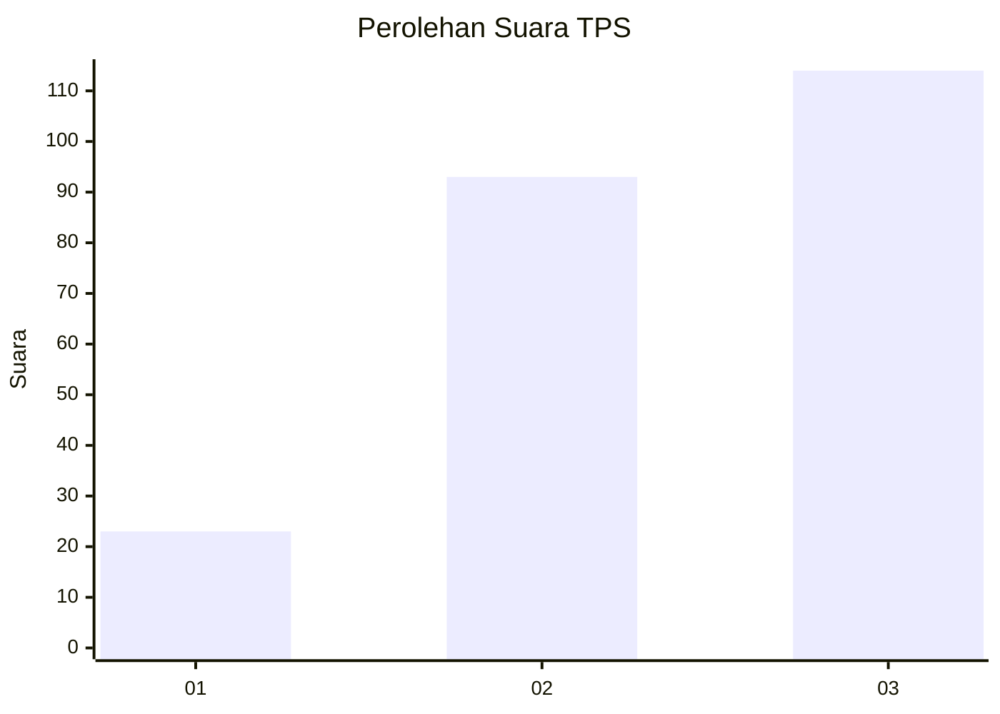
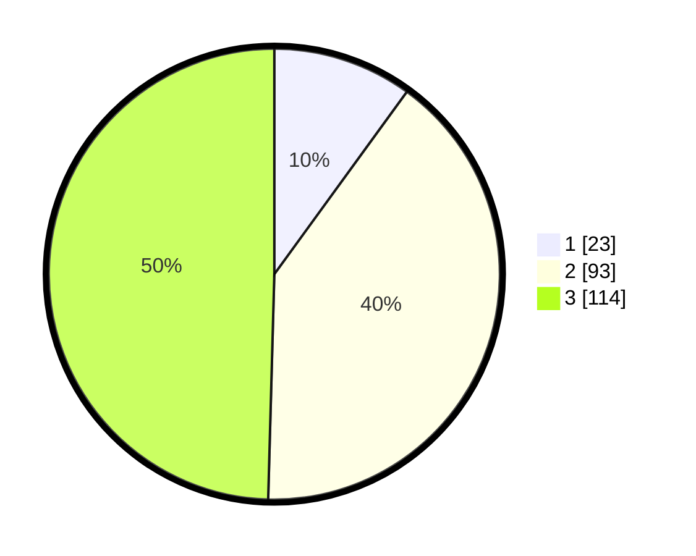

# Hasil

## Grafik

## Tabel

| No. | Nama Paslon    | Suara | Suara (raw) | Persentase |
|:--- |:-------------- | -----:| -----------:| ----------:|
| 1   | ANIES MUHAIMIN | 23    | [23][p-1]   | 10,00      |
| 2   | PRABOWO GIBRAN | 93    | [93][p-2]   | 40,43      |
| 3   | GANJAR MAHFUD  | 114   | [114][p-3]  | 49,57      |

[p-1]: https://github.com/gigit-pemilu/pemilu-2024/blob/main/pilpres/hitung-suara/sub/33-jawa-tengah/sub/02-banyumas/sub/18-karanglewas/sub/2012-babakan/sub/005-tps/sub/paslon-1.txt
[p-2]: https://github.com/gigit-pemilu/pemilu-2024/blob/main/pilpres/hitung-suara/sub/33-jawa-tengah/sub/02-banyumas/sub/18-karanglewas/sub/2012-babakan/sub/005-tps/sub/paslon-2.txt
[p-3]: https://github.com/gigit-pemilu/pemilu-2024/blob/main/pilpres/hitung-suara/sub/33-jawa-tengah/sub/02-banyumas/sub/18-karanglewas/sub/2012-babakan/sub/005-tps/sub/paslon-3.txt

## Foto C Plano

https://sirekap-obj-formc.kpu.go.id/9d0c/pemilu/ppwp/33/02/18/20/12/3302182012005-20240214-220042--a6f655e2-602e-46af-95e3-f5746a33a4d2.jpg

https://sirekap-obj-formc.kpu.go.id/9d0c/pemilu/ppwp/33/02/18/20/12/3302182012005-20240214-220158--2c158a87-a993-451f-b3fb-de04973e3d6e.jpg

https://sirekap-obj-formc.kpu.go.id/9d0c/pemilu/ppwp/33/02/18/20/12/3302182012005-20240214-205715--8b1234c2-88d7-41c4-aec2-2ccdf0aadaf4.jpg

## Metadata

| Key        | Value               |
| ---------- | ------------------- |
| Time Stamp | 2024-02-16 23:45:47 |

