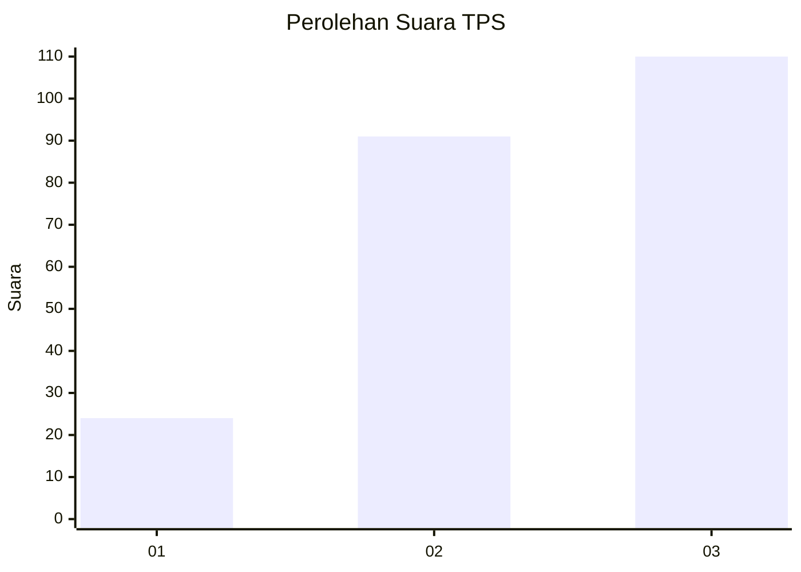
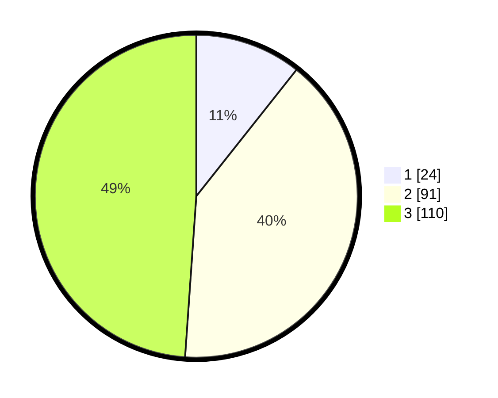

# Hasil

## Grafik

## Tabel

| No. | Nama Paslon    | Suara | Suara (raw) | Persentase |
|:--- |:-------------- | -----:| -----------:| ----------:|
| 1   | ANIES MUHAIMIN | 24    | [24][p-1]   | 10,67      |
| 2   | PRABOWO GIBRAN | 91    | [91][p-2]   | 40,44      |
| 3   | GANJAR MAHFUD  | 110   | [110][p-3]  | 48,89      |

[p-1]: https://github.com/gigit-pemilu/pemilu-2024/blob/main/pilpres/hitung-suara/sub/33-jawa-tengah/sub/02-banyumas/sub/19-sokaraja/sub/2002-wiradadi/sub/007-tps/sub/paslon-1.txt
[p-2]: https://github.com/gigit-pemilu/pemilu-2024/blob/main/pilpres/hitung-suara/sub/33-jawa-tengah/sub/02-banyumas/sub/19-sokaraja/sub/2002-wiradadi/sub/007-tps/sub/paslon-2.txt
[p-3]: https://github.com/gigit-pemilu/pemilu-2024/blob/main/pilpres/hitung-suara/sub/33-jawa-tengah/sub/02-banyumas/sub/19-sokaraja/sub/2002-wiradadi/sub/007-tps/sub/paslon-3.txt

## Foto C Plano

https://sirekap-obj-formc.kpu.go.id/8760/pemilu/ppwp/33/02/19/20/02/3302192002007-20240218-195432--faaf4910-ced7-4f7d-a905-de5e96208cf4.jpg

https://sirekap-obj-formc.kpu.go.id/8760/pemilu/ppwp/33/02/19/20/02/3302192002007-20240218-195623--1a18fd4f-07db-4659-bfec-fc74aeedffd3.jpg

https://sirekap-obj-formc.kpu.go.id/8760/pemilu/ppwp/33/02/19/20/02/3302192002007-20240218-200140--31605f19-4508-4261-8607-45deca2b84a2.jpg

## Metadata

| Key        | Value               |
| ---------- | ------------------- |
| Time Stamp | 2024-02-19 06:16:00 |

## DATA PEMILIH TETAP

Jumlah pemilih dalam DPT: **252**.
 * L: **130**.
 * P: **122**.

## DATA PENGGUNA HAK PILIH

Jumlah pengguna hak pilih dalam DPT: **224**.
 * L: **557**.
 * P: **517**.

Jumlah pengguna hak pilih dalam DPTb: **206**.
 * L: **52**.
 * P: **224**.

Jumlah pengguna hak pilih dalam DPK: **0**.
 * L: **0**.
 * P: **0**.

Jumlah pengguna hak pilih: **230**.
 * L: **609**.
 * P: **121**.

## JUMLAH SUARA SAH DAN TIDAK SAH

JUMLAH SELURUH SUARA SAH: **225**.

JUMLAH SUARA TIDAK SAH: **505**.

JUMLAH SELURUH SUARA SAH DAN SUARA TIDAK SAH: **730**.

