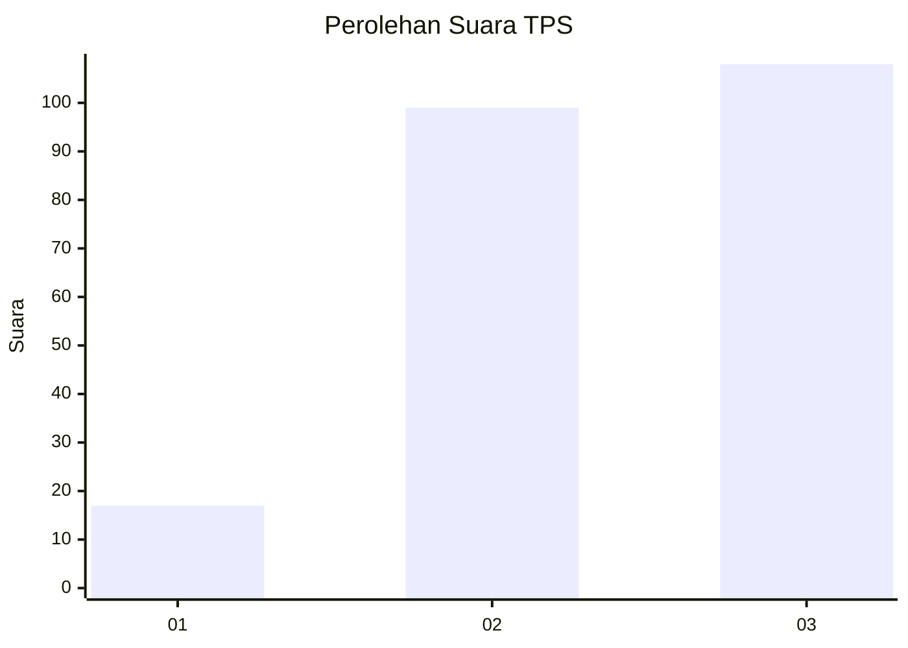
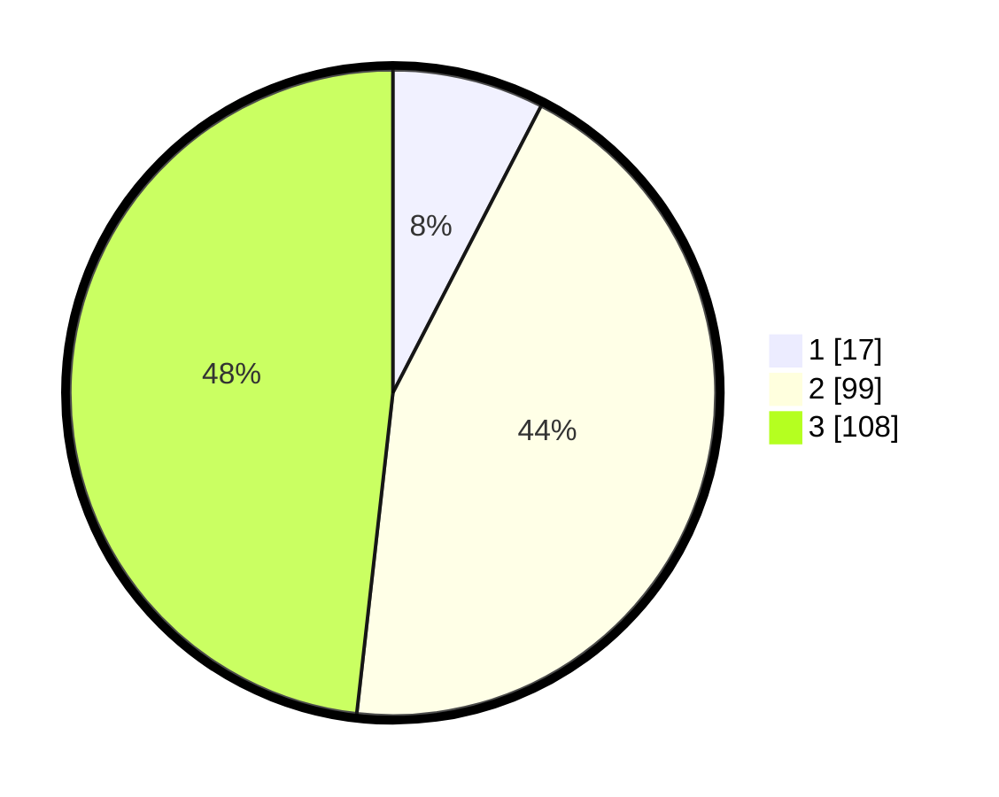

# Hasil

## Grafik

## Tabel

| No. | Nama Paslon    | Suara | Suara (raw) | Persentase |
|:--- |:-------------- | -----:| -----------:| ----------:|
| 1   | ANIES MUHAIMIN | 17    | [17][p-1]   | 7,59       |
| 2   | PRABOWO GIBRAN | 99    | [99][p-2]   | 44,20      |
| 3   | GANJAR MAHFUD  | 108   | [108][p-3]  | 48,21      |

[p-1]: https://github.com/gigit-pemilu/pemilu-2024-33-jawa-tengah/blob/main/pilpres/hitung-suara/sub/33-jawa-tengah/sub/02-banyumas/sub/19-sokaraja/sub/2002-wiradadi/sub/012-tps/sub/paslon-1.txt
[p-2]: https://github.com/gigit-pemilu/pemilu-2024-33-jawa-tengah/blob/main/pilpres/hitung-suara/sub/33-jawa-tengah/sub/02-banyumas/sub/19-sokaraja/sub/2002-wiradadi/sub/012-tps/sub/paslon-2.txt
[p-3]: https://github.com/gigit-pemilu/pemilu-2024-33-jawa-tengah/blob/main/pilpres/hitung-suara/sub/33-jawa-tengah/sub/02-banyumas/sub/19-sokaraja/sub/2002-wiradadi/sub/012-tps/sub/paslon-3.txt

## Foto C Plano

https://sirekap-obj-formc.kpu.go.id/4b61/pemilu/ppwp/33/02/19/20/02/3302192002012-20240215-014235--8e4bf027-cced-4fed-abdf-951f9d68ef6b.jpg

https://sirekap-obj-formc.kpu.go.id/4b61/pemilu/ppwp/33/02/19/20/02/3302192002012-20240215-014430--9defafe3-f2d9-446b-8cce-267899b51e2b.jpg

https://sirekap-obj-formc.kpu.go.id/4b61/pemilu/ppwp/33/02/19/20/02/3302192002012-20240215-014529--b52553c6-58b9-4c00-ad0c-ce2687549b84.jpg

## Metadata

| Key        | Value               |
| ---------- | ------------------- |
| Time Stamp | 2024-02-17 10:30:03 |

