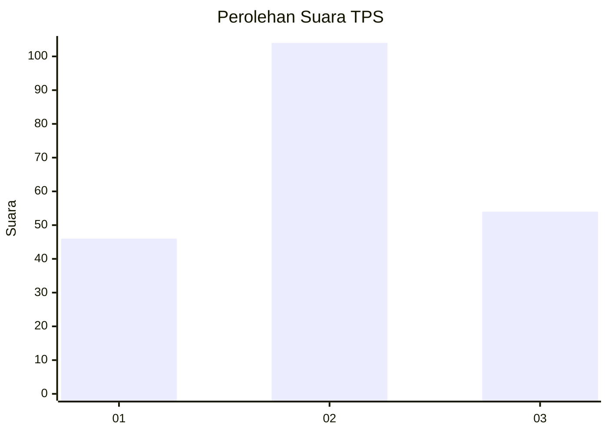
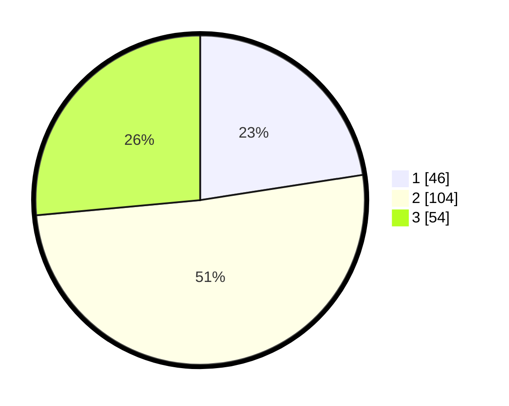

# Hasil

## Grafik

## Tabel

| No. | Nama Paslon    | Suara | Suara (raw) | Persentase |
|:--- |:-------------- | -----:| -----------:| ----------:|
| 1   | ANIES MUHAIMIN | 46    | [46][p-1]   | 22,55      |
| 2   | PRABOWO GIBRAN | 104   | [104][p-2]  | 50,98      |
| 3   | GANJAR MAHFUD  | 54    | [54][p-3]   | 26,47      |

[p-1]: https://github.com/gigit-pemilu/pemilu-2024/blob/main/pilpres/hitung-suara/sub/33-jawa-tengah/sub/02-banyumas/sub/19-sokaraja/sub/2004-sokaraja-tengah/sub/002-tps/sub/paslon-1.txt
[p-2]: https://github.com/gigit-pemilu/pemilu-2024/blob/main/pilpres/hitung-suara/sub/33-jawa-tengah/sub/02-banyumas/sub/19-sokaraja/sub/2004-sokaraja-tengah/sub/002-tps/sub/paslon-2.txt
[p-3]: https://github.com/gigit-pemilu/pemilu-2024/blob/main/pilpres/hitung-suara/sub/33-jawa-tengah/sub/02-banyumas/sub/19-sokaraja/sub/2004-sokaraja-tengah/sub/002-tps/sub/paslon-3.txt

## Foto C Plano

https://sirekap-obj-formc.kpu.go.id/543f/pemilu/ppwp/33/02/19/20/04/3302192004002-20240218-084802--f65703af-74ce-4b31-b8b1-f73b569ed191.jpg

https://sirekap-obj-formc.kpu.go.id/543f/pemilu/ppwp/33/02/19/20/04/3302192004002-20240218-085102--05a07684-5dd6-4e0f-8621-c487ce413a89.jpg

https://sirekap-obj-formc.kpu.go.id/543f/pemilu/ppwp/33/02/19/20/04/3302192004002-20240218-085225--f86ede66-d93a-463d-b27c-1e7144cca272.jpg

## Metadata

| Key        | Value               |
| ---------- | ------------------- |
| Time Stamp | 2024-02-19 12:00:00 |

## DATA PEMILIH TETAP

Jumlah pemilih dalam DPT: **622**.
 * L: **544**.
 * P: **135**.

## DATA PENGGUNA HAK PILIH

Jumlah pengguna hak pilih dalam DPT: **444**.
 * L: **93**.
 * P: **114**.

Jumlah pengguna hak pilih dalam DPTb: **444**.
 * L: **0**.
 * P: **60**.

Jumlah pengguna hak pilih dalam DPK: **444**.
 * L: **1**.
 * P: **0**.

Jumlah pengguna hak pilih: **644**.
 * L: **94**.
 * P: **284**.

## JUMLAH SUARA SAH DAN TIDAK SAH

JUMLAH SELURUH SUARA SAH: **204**.

JUMLAH SUARA TIDAK SAH: **4**.

JUMLAH SELURUH SUARA SAH DAN SUARA TIDAK SAH: **208**.

