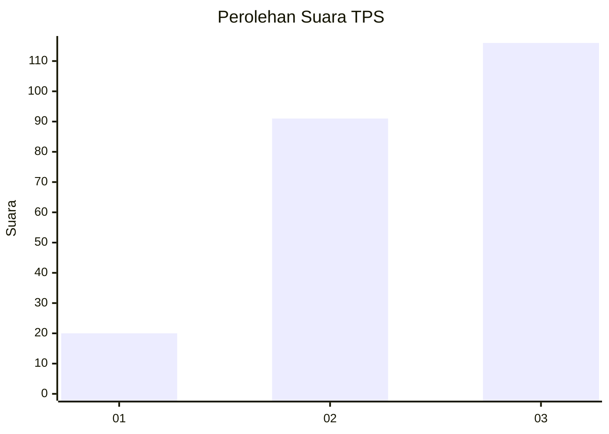
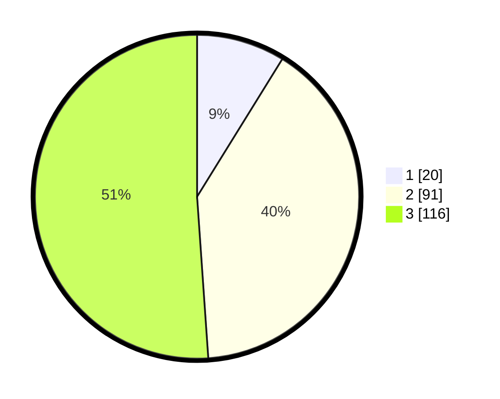

# Hasil

## Grafik

## Tabel

| No. | Nama Paslon    | Suara | Suara (raw) | Persentase |
|:--- |:-------------- | -----:| -----------:| ----------:|
| 1   | ANIES MUHAIMIN | 20    | [20][p-1]   | 8,81       |
| 2   | PRABOWO GIBRAN | 91    | [91][p-2]   | 40,09      |
| 3   | GANJAR MAHFUD  | 116   | [116][p-3]  | 51,10      |

[p-1]: https://github.com/gigit-pemilu/pemilu-2024-33-jawa-tengah/blob/main/pilpres/hitung-suara/sub/33-jawa-tengah/sub/02-banyumas/sub/19-sokaraja/sub/2012-karangduren/sub/005-tps/sub/paslon-1.txt
[p-2]: https://github.com/gigit-pemilu/pemilu-2024-33-jawa-tengah/blob/main/pilpres/hitung-suara/sub/33-jawa-tengah/sub/02-banyumas/sub/19-sokaraja/sub/2012-karangduren/sub/005-tps/sub/paslon-2.txt
[p-3]: https://github.com/gigit-pemilu/pemilu-2024-33-jawa-tengah/blob/main/pilpres/hitung-suara/sub/33-jawa-tengah/sub/02-banyumas/sub/19-sokaraja/sub/2012-karangduren/sub/005-tps/sub/paslon-3.txt

## Foto C Plano

https://sirekap-obj-formc.kpu.go.id/b7e6/pemilu/ppwp/33/02/19/20/12/3302192012005-20240215-013712--30da1893-4467-477f-a749-41645e026c5a.jpg

https://sirekap-obj-formc.kpu.go.id/b7e6/pemilu/ppwp/33/02/19/20/12/3302192012005-20240215-013230--a4df720d-82f0-470f-8965-05d04a64fc81.jpg

https://sirekap-obj-formc.kpu.go.id/b7e6/pemilu/ppwp/33/02/19/20/12/3302192012005-20240215-013509--6e777486-6c43-49b2-b204-df09d8f58ffd.jpg

## Metadata

| Key        | Value               |
| ---------- | ------------------- |
| Time Stamp | 2024-02-17 10:30:03 |

