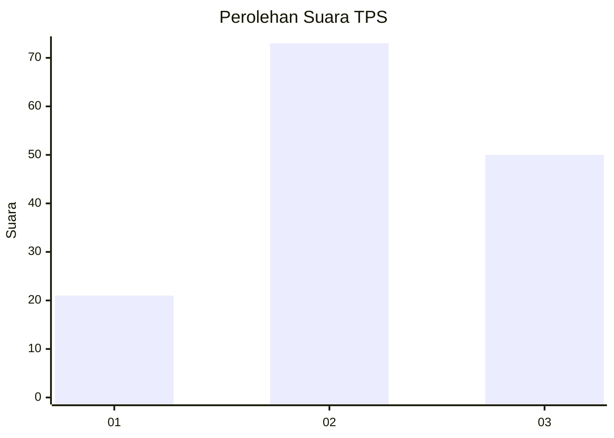
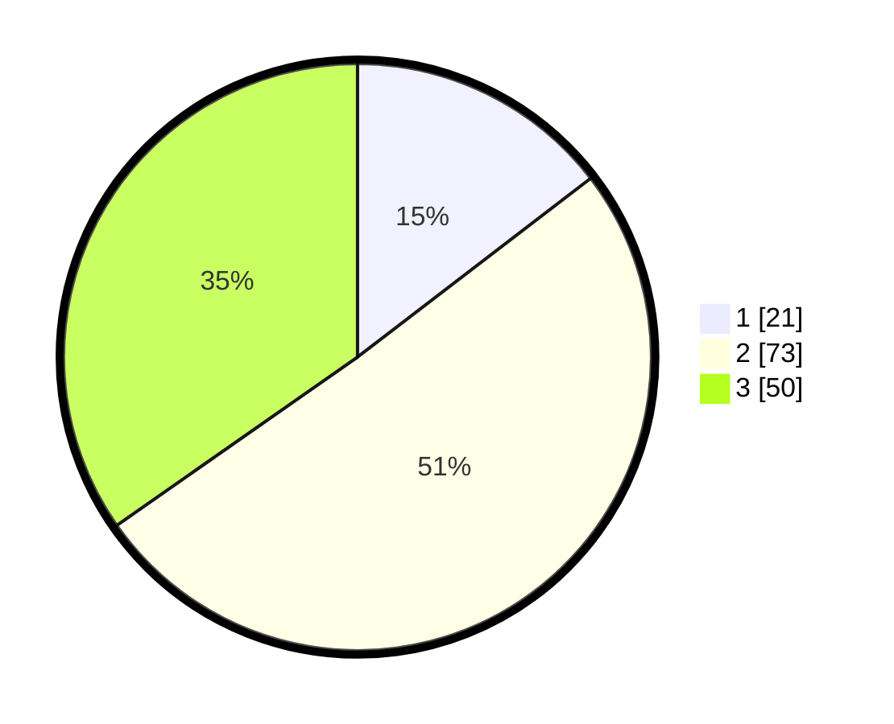

# Hasil

## Grafik

## Tabel

| No. | Nama Paslon    | Suara | Suara (raw) | Persentase |
|:--- |:-------------- | -----:| -----------:| ----------:|
| 1   | ANIES MUHAIMIN | 21    | [21][p-1]   | 14,58      |
| 2   | PRABOWO GIBRAN | 73    | [73][p-2]   | 50,69      |
| 3   | GANJAR MAHFUD  | 50    | [50][p-3]   | 34,72      |

[p-1]: https://github.com/gigit-pemilu/pemilu-2024-33-jawa-tengah/blob/main/pilpres/hitung-suara/sub/33-jawa-tengah/sub/02-banyumas/sub/19-sokaraja/sub/2015-pamijen/sub/011-tps/sub/paslon-1.txt
[p-2]: https://github.com/gigit-pemilu/pemilu-2024-33-jawa-tengah/blob/main/pilpres/hitung-suara/sub/33-jawa-tengah/sub/02-banyumas/sub/19-sokaraja/sub/2015-pamijen/sub/011-tps/sub/paslon-2.txt
[p-3]: https://github.com/gigit-pemilu/pemilu-2024-33-jawa-tengah/blob/main/pilpres/hitung-suara/sub/33-jawa-tengah/sub/02-banyumas/sub/19-sokaraja/sub/2015-pamijen/sub/011-tps/sub/paslon-3.txt

## Foto C Plano

https://sirekap-obj-formc.kpu.go.id/9ad2/pemilu/ppwp/33/02/19/20/15/3302192015011-20240214-235334--445fbb7f-85e0-4401-b1cd-be1e37073e83.jpg

https://sirekap-obj-formc.kpu.go.id/9ad2/pemilu/ppwp/33/02/19/20/15/3302192015011-20240214-235445--54eebed2-e6d3-4d3a-8883-c5b8e37b4639.jpg

https://sirekap-obj-formc.kpu.go.id/9ad2/pemilu/ppwp/33/02/19/20/15/3302192015011-20240215-211953--8e7ba6c9-8e25-4255-a6ed-d64f5bf28423.jpg

## Metadata

| Key        | Value               |
| ---------- | ------------------- |
| Time Stamp | 2024-02-15 21:30:27 |

